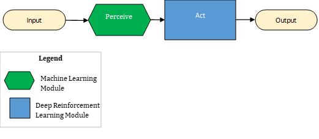

The perception pattern contains one or more modules that perceive, and one or more modules that act. In the following brain design diagram, the perception pattern is depicted as a flow chart. The flowchart is read from left to right.

- The yellow oval labeled as **Input** contains the sensor that defines the state of the environment.
- It passes the information to the green hexagon labeled as **Perceive**.
- The green **Perceive** hexagon flows into the blue **Act** rectangle implemented with DRL. The brain receives the perception transformed features and decides on the values of the control actions to control the system.
- The control actions are included in the yellow oval labeled **Output**.

This is a Machine Learning (ML) module that processes sensor information into perception. Examples of perception are vision, hearing, prediction, classification, and filtering. Perception modules transform the raw data into the metrics of interest towards decision making, such as transforming images into shape and size features.

Perception and action are different skills in separate modules. The reason is learning perception and decision-making simultaneously, although possible, is challenging. We're forcing the AI to learn what it's looking at, and what it should do at the same time. In addition, separating perception and action provides explainability. You get visibility into what the AI perceives and what decisions it makes separately.

Separating perception and action facilitates troubleshooting. An ML black box can be challenging to troubleshoot. Separate perception and decision modules make it easier to tell whether the problem lies with bad perception or bad decisions.
