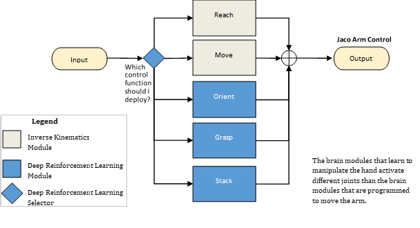
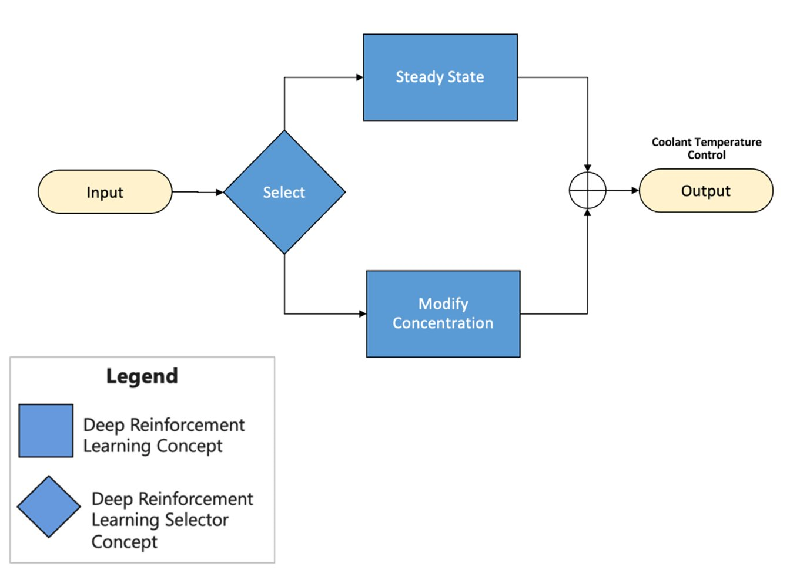

The functional pattern separates control actions into groups. For example, you might decide to control the accelerator and brake pedals of a car separately from the steering wheel. If so, you can use the functional design pattern to organize the skills in your AI brain.

- The yellow oval labeled as **Input** contains the sensor that defines the state of the environment. 
- It passes the information to the selector diamond that selects the best control function. 
- In the legend, white represents programmed Inverse Kinematics modules and blue represents Deep Reinforcement Learning modules. Based on the status of the environment and the objective at hand, the selector decides on the strategy to execute. 
- That decision determines the control actions to control the system. The control actions are the **Output** of the brain.

An example of functional decomposition is the optimization of the oil refining process. Oil refining, like any chemical manufacturing processes, is continuous. This means the inputs are constantly flowing in, and the outputs are constantly flowing out.

Then, there's a discrete process where you're making individual products. Each stage of the oil refinery process is interdependent. What you do in one part of the process affects everything downstream. Typically, you need to make hundreds of decisions. However, there's partitioning of these decisions into groups that are functionally independent in practice and based on expert knowledge.

Functionally independent means that they depend on each other, but practically you can treat them separately. The stages of the process are separated by buffers. For example, storage tanks act as buffers from one stage to another. 

Functional decomposition allows you to separate each group of actions in the oil refinery that are separated by the physical buffer of the tanks into a separate skill or concept. Instead of a brain with one skill that takes hundreds of actions throughout the end-to-end process, you now have a smaller set of skills that focus on a subset of the process. Each module now takes a more manageable number of actions. We validate this decomposition through the knowledge of subject matter experts.

If we had three chemical reactors, the brain design would look like this:

