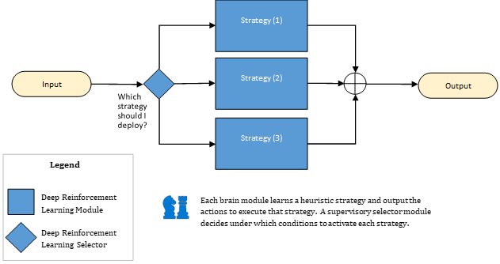

The strategy pattern activates different skills in different scenarios using the same control actions.

The functional decomposition paradigm separates different actions into different skills. The strategy decomposition paradigm uses the same actions for all skills, and it separates skills by scenarios where each strategy is most effective.

Consider the analogy of chess. In the first phase of chess, the goal is to survive and move on to the next phase. In mid game, the goal is to gain an advantage over the opponent. The end game has a goal of checkmate, which is to trap or pin the opponent's king.

Because each of these scenarios has different goals, each of these phases has a different set of strategies that are used during each scenario. Typically, you'd use opening strategies for the opening phase, mid game strategies for the mid game, and checkmating strategies for the end game. Each strategy shares the same control actions, which is moving the chess pieces on the chess board.

The strategies are heuristic because they match scenarios with evidence from learned experience. For example, you slow down the car (control action) before you drive into a sharp turn (scenario). Heuristics strategies are important to discover from subject matter experts because they'll be the skills or modules of your brain design.

The *three-column exercise* is a method to interview subject matter experts. You ask questions to extract heuristic strategies from their expertise that you can build into your AI brain designs.

- The first column describes the scenario when you should use the strategy.
- The second column describes what the expert operator thinks it means when the scenario happens.
- The third column lists the strategy or action to take in that particular scenario.

The following table includes a few examples of the three-column exercise.

| Customer | When the environment looks like this:                   | It means this:                                           | Do this:                                                    |
| -------- | -------------------------------------------------------- | ---------------------------------------------------------- | ------------------------------------------------------------ |
| Steel    | The steel is narrow, and the coating is thick.              | Zinc coating is likely to be uneven.                        | Adjust the air knives (skew clockwise or counter-clockwise). |
| Airlines | Bags need to be delivered quickly to departing flight.   | The bags are in danger of missing their flights.            | Run those bags through the tail-to-tail method.              |
| Rail     | The yard is dirty with misplaced containers.            | Trains can't be loaded until containers are moved.         | Allocate more drivers to move containers within the yard.    |
| Rail     | The containers are well placed in relation to the train.  | Trains can be loaded immediately.                           | Allocate more drivers to load containers on trains.          |
| HVAC     | If energy is expensive or temperatures are extreme.        | Heating cold air or cooling hot air will be more expensive. | Recycle more air.                                             |
| HVAC     | High occupancy makes energy inexpensive. | Air quality is priority with heating/cooling inexpensive.    | Let in fresh outside air.                                     |