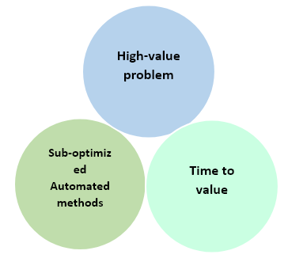

Identifying winning use cases is key to successfully using Machine Teaching to solve problems with large business value, aligned with the needs and strategy of the company.

To select a winning use case for Autonomous AI, we'll consider the following factors:

- It solves a high-value problem
- The level of suboptimization of the current automation
- Time to value

When one or more of these factors are applicable, we’ll have a winning use case for Autonomous AI, and Machine Teaching will help you unlock the business value.

## Solving a high-value problem

Selecting a high-value problem is key to identifying a good use case for Autonomous AI. The rule of thumb is that a single digit percentage improvement of a key performance indicator (KPI) per year leads to over $1 million USD in savings or increased revenue per facility.

Examples of a single digit KPI are: 5% improvement in throughput, 6% reduction in operation costs, or 9% waste reduction.

Financial return on investment is the most obvious way to identify a high-value problem. But it isn't the only way. There are other benefits including social change, justice or safety.

The reason why we recommend a single digit percentage improvement of a KPI leading to $1 million USD return of investment is because designing and building an AI brain requires resources. Developing the simulator is especially costly and time consuming. Executives and business owners need to see the value for the project to succeed.

## Sub-optimized automated methods

The second factor to consider when selecting use cases is the level of sub-optimization of the existing automated methods. Here we’ll consider the limitations of the current methods and how much Autonomous AI can help improve the process.

There are several situations that will help us identify when a challenge is a good fit to be solved with Autonomous AI, having a winning use case:

- **Dynamic highly variable systems**: Traditional systems control a narrow range of scenarios effectively.  When you have a large set of possible environmental conditions, it's challenging to find optimal solutions using traditional engineering approaches, especially if those conditions are changing constantly.  Engineers and operators often turn to intuition and heuristics in such situations. Autonomous AI can deal with that complexity and learn how to optimize for all conditions. It can learn from historical data or via simulations to analyze competing situations, being able to deliver live the best optimization strategy in a short time.
- **Competing optimization goals or strategies**: Traditional systems can't trade off goals and strategies. For instance, we’ll be able to improve throughput but not efficiency or vice versa. However, Autonomous AI can learn these tradeoffs strategies and improve both.
- **Unforeseen system conditions**: Traditional systems can't respond to unknown inputs or changing system behavior.  In these situations, it's very difficult for an operator to decide. However, Autonomous AI can learn to handle unforeseen changes to system conditions and lead the process to the steady state. 
- **When the process still relies on human decision making**: Often there’s an automated system that works well most of the time, but people still have to step in when it makes bad decisions. Alternatively, the process might even need constant supervision for each action suggested by the automated system. If the existing automation can’t perform better than what it already does with the existing automated methods, it's a sign that we have a winning use case.

## Time to value

The third factor in selecting a winning use case has to do with the time to value. Here we’ll consider how much resources (time and money) will take to develop the AI brain. The most important risk factor is the difficulty of developing a simulator for your machine or process.

Most of the large companies have large machines and complex processes. In the best-case scenario, the company will have a simulator to control that part of the process or the machine. However, most commonly these simulations aren't prepared to close the loop of identifying the impact of control actions on the environment, required to train the deep reinforcement learning. The simulation will have to be updated to include that loop.

When the company doesn't have a simulation for that part of the process or machine, it will have to be developed to take advantage of Machine Teaching for Autonomous AI. How precise and difficult it's to develop the simulation has a direct impact on the cost of the project and on the balance cost / time to value to select your use case.

## The art of storytelling

Once you have identified use cases where Autonomous AI will likely produce groundbreaking results, you need to be able to communicate the challenge that you want to solve, its business value and how you're planning on solving it, to several stakeholders, including business owners, expert operators, engineers, and AI brain builders.

Storytelling is how humans consume persuasion through stories. Data is important, facts are important, but persuasive arguments aren't delivered as dry facts and data. For this reason, storytelling is an important technique for communicating the value of the AI that you design.

Your story should include the following components:

- What is the challenge that you're going to solve?
- What is the business value of the decision?
- What are the limitations of the current methods?
- How will Autonomous AI lead to groundbreaking results?

Here you can find examples of presentation for Autonomous AI winning use cases:

- [Coffee Roasting with Project Bonsai](https://github.com/MicrosoftDocs/mslearn-machine-teaching-for-autonomous-ai/blob/main/Coffee%20Roasting%20with%20Bonsai%20presentation.pptx?raw=true)
- [MineCo Gyratory Crusher Optimization with Project Bonsai](https://github.com/MicrosoftDocs/mslearn-machine-teaching-for-autonomous-ai/blob/main/MineCo%20Gyratory%20Crusher%20Optimization%20presentation.pptx)
