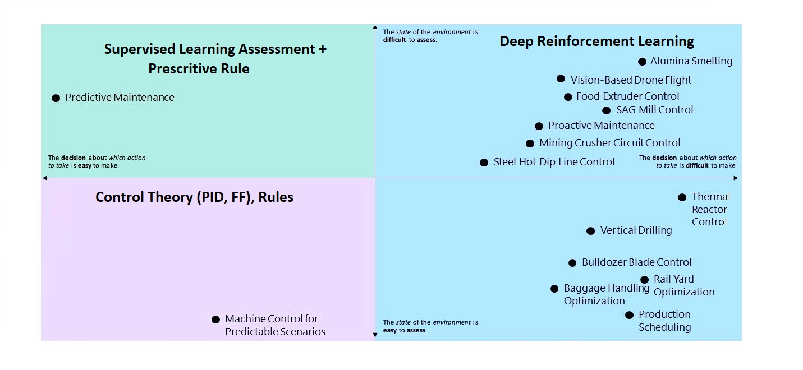

We've reviewed the three core ideas behind finding a good use-case fit for Autonomous AI. Here's a list of situations that also constitute good candidates to use Machine Teaching for Autonomous AI:

- Existing control systems are fragile when deployed.
- Machine Learning logic doesn't adequately cover all scenarios.
- Describing the desired system behavior requires subject matter experts who understand the problem domain.
- Generating sufficient real-world data to cover all scenarios is difficult or impossible.
- Traditional control systems are difficult to deploy and scale to the real world.

Machine Teaching bridges Data Science with traditional engineering and domain expertise.

Example applications include:

- Motion control
- Machine calibration
- Smart buildings
- Industrial robotics
- Process control

Most manufacturing scenarios fall into one of the four categories in the following diagram. The Y-axis goes from the state of the environment that's easy to assess (bottom) to the state that's difficult to assess (top). The X-axis goes from the easy decision about which action to take to make (left) to the decision that's difficult to make (right). In the left–top quadrant (green) we have the challenges solved using supervised learning plus a prescriptive rule: predictive maintenance. In the bottom-left quadrant, we have the challenges that are suited to be solved using control theory: machine control for predictable scenarios. On the right-side quadrants, we have the set of challenges that are a good fit to be solved using Deep Reinforcement Learning: production scheduling, baggage handling optimization, bulldozer blade control, oil vertical drilling, proactive maintenance, vision-based drone flight, and so on.

The preceding diagram shows division of manufacturing use cases (X axes: how difficult the decision on the next action is to make; Y axes: how difficult the state of the environment is to assess).
