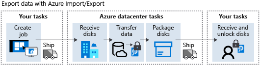
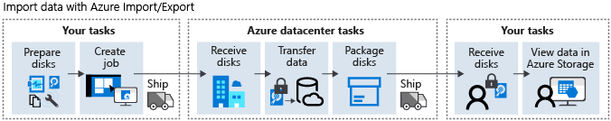

To use Azure Import/Export, you create a job that specifies the data that you want to import or export. You then prepare the disks to use to transfer the data. For an import job, you write your data to these disks and ship them to an Azure datacenter. Microsoft uploads the data for you. For an export job, you prepare a set of blank disks and ship them to an Azure datacenter. Microsoft copies the data to these disks and ships them back to you.

In the film-production company scenario, you've decided that using the Azure Import/Export service meets your requirements. Now you need to understand how to create an export job.

In this unit, you learn how to use your own disk drives to export data between your on-premises storage and Azure Storage. You see how to create import and export jobs, and how to monitor the progress of an import or export job.

## Export data from Azure

You can use the Import/Export service to export data from Azure Blob storage only. You can't export data that's stored in Azure Files.

You must have the following items to support the export process:

- An active Azure subscription and an Azure Storage account holding your data in Azure Blob storage.
- A system running a supported version of Windows.
- BitLocker enabled on the Windows system.
- WAImportExport version 1 downloaded and installed from the Microsoft Download Center.
- An active account with a shipping carrier like FedEx or DHL for shipping drives to an Azure datacenter.
- A set of disks that you can send to an Azure datacenter on which to copy the data from Azure Storage.

The following diagram summarizes the export process:



To export data, complete the following steps:

1. **Create job**

   Create an export job by using the Azure portal or the REST API. Provide the following information:

      - Name for the job
      - Storage account that holds the blobs to export
      - Blobs in the account that contain the data to export
      - Shipping carrier
      - Return shipping information for the disks

1. **Ship**

   Send your disks to the Azure datacenter identified by the export job. The datacenter is assigned based on the location of your storage account. You can check the number of disks required for the export job by using the *PreviewExport* argument of the WAImportExport command. You provide the details of your export job as parameters to this command.

1. **Check job status**

   - Receive disks: When the datacenter receives the disks, Microsoft updates the status of the job to indicate that the disks have arrived.
   - Transfer data: Microsoft copies the data from Azure Blob storage to your disks. The job status is changed to show that data is in the process of being transferred. When the transfer is complete, the job status is updated again. It can take several days to transfer the data to your disks, depending on the size of the export job.
   - Package disks: Microsoft prepares the disks for shipping. The drives are encrypted through BitLocker.
   - Ship: Microsoft sends the disks back to the return address specified in the export job and updates the status of the job again.

1. **Receive and unlock disks**

   When you receive the disks, you can mount them and use them locally. The data is encrypted. You can find the BitLocker keys for each drive with the export job details in the Azure portal.

## Import data to Azure

Before you import data to Azure Storage, you must have the following items:

- An active Azure subscription.
- Minimum of one Azure Storage account.
- A system running a supported version of Windows.
- BitLocker enabled on the Windows system.
- The correct version of the WAImportExport tool. Install version 1 to import data to Azure Blob storage or version 2 to import to Azure Files. Download this tool from the Microsoft Download Center.
- An active shipping carrier account like FedEx or DHL for shipping drives to an Azure datacenter.
  
The following diagram summarizes the steps involved in importing data:

.

To import data, complete the following steps:

1. **Prepare disks**

   1. Connect each disk to your Windows system and create a single NTFS volume on each disk. Each disk must use a SATA connector.
   1. Enable BitLocker on the NTFS volumes.
   1. Copy the data to the encrypted disks by using a tool like Robocopy.
   1. Open a command prompt window. Go to the folder where you installed the WAImportExport tool. Run the following command to retrieve the BitLocker key for the drive:

      ```cmd
      manage-bde -protectors -get <DriveLetter>:
      ```

   1. Prepare the disks by running the WAImportExport command. This command can take a significant amount of time to complete (hours, or possibly days) depending on the amount of data:

      ```cmd
      WAImportExport.exe PrepImport /j:<journal file name> /id:session#<session number> / t:<Drive letter> /bk:<BitLocker key> /srcdir:<Drive letter>:\ /dstdir:<Container name>/ /blobtype:<BlockBlob or PageBlob> /skipwrite /enablecontentmd5
      ```

1. **Create job**

   Create an import job by using the Azure portal or the REST API. Provide the following information:
    - Name for the job
    - Storage account in which to import the data
    - Shipping address of the Azure datacenter for the storage account
    - Return address, where Microsoft should send the drive back to
    - List of drives that contain the data for the job
    - BitLocker key used to encrypt the data for each drive

1. **Ship**

   Use a supported carrier like DHL or FedEx to ship the drives to the Azure datacenter. The carrier provides a tracking number. You add this tracking number to the import job.

1. **Check job status**

   - Receive disks: The disks are received at the Azure datacenter. Microsoft updates the import job to indicate that the disks have arrived. You can track the job status from your import job page in the Azure portal.
   - Transfer data: Microsoft copies the data from the disks into the specified storage account. This transfer can take some time, depending on the volume of data and number of disks. There's no SLA for this process, but it should be complete in 7 to 10 days after receipt of the disks. Microsoft updates the job status to indicate that the data is being transferred. When the transfer is complete, Microsoft changes the job status to indicate that the data is now available in Azure Storage.
   - Package disks: After the data has been uploaded to Azure Storage, Microsoft repackages your disks. The job status is updated.
   - Ship: Microsoft sends the disks back to you using your selected carrier. The job status is changed to indicate that the job is now completed.

1. **Receive disks**

   Receive your encrypted disks from the Azure datacenter.

1. **View data in Azure Storage**

   Verify that the data has been copied to your storage account.
