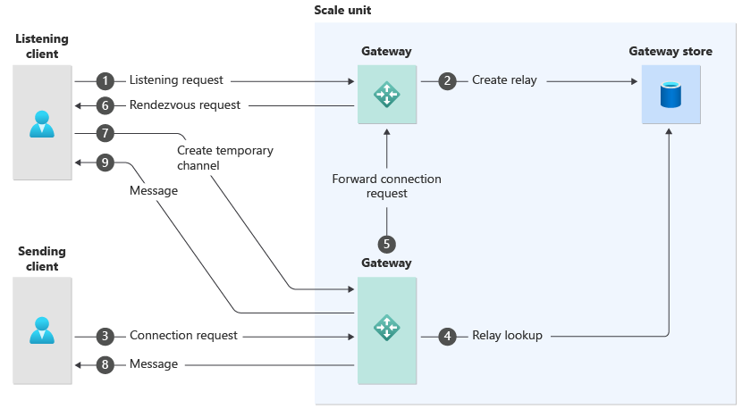

Azure Relay provides a way to connect services across network boundaries and firewalls, without reconfiguring your security setup.

You'd like to move all the systems in your financial organization into the cloud. However, regulations in your jurisdiction prevent you from migrating your credit-checking service. This service must remain on-premises for data protection purposes. You need a way to connect the cloud services to the credit-checking service. Ideally, you'd prefer not to open extra ports on your on-premises firewall or to build a virtual private network.

Here, you'll learn how Azure Relay can provide this connection.

## What is Azure Relay?

Many organizations are migrating their systems into the cloud. This process is often done component-by-component, in a phased approach, and not all at once. Such an approach limits the impact of problems that may arise during the migration, but has its own challenges. For example, a newly migrated cloud component often needs to communicate with another that remains on-premises, but is protected by a firewall or other security systems. 

In other cases, you may find that an on-premises service cannot be migrated into the cloud. For example, your jurisdiction might impose extra security requirements on financial systems, which you can't comply with in a cloud system. 

In situations like these, you need on-premises services to be addressable from internet clients or cloud components. You could open a firewall port to enable this communication, but that might have unintended consequences. For example, you may accidentally expose other services than the one you had in mind. In large organizations, you may not be in charge of the firewall. An alteration to the security regime might require high-level authorization that takes time to obtain.

Azure Relay addresses these kinds of problems by providing a connection point in the cloud where on-premises and internet-based components can connect. Because the on-premises system initiates this connection, you don't need to open any firewall ports or reconfigure the on-premises network in any way. 

## Hybrid connections and Windows Communication Foundation connections

Azure Relay establishes a connection between two components, such as an Azure Function and an on-premises service. When the connection is established, requests and responses can be exchanged through the relay, as if there was a direct connection. You can make two types of connection in Azure Relay:

- **Hybrid Connections**. Hybrid connections are two-way streams of binary data that use either WebSockets or HTTP standards. Because these connections are based on open standards, you can use them from almost any language or coding framework. For example, you could use them to connect an on-premises Node.JS server to an Azure Web Job written in C# and the .NET Framework.
- **WCF Connections**. Some developers use the Windows Communication Foundation (WCF) to enable remote procedure calls. WCF was commonly used for network communications with older versions of the .NET Framework. WCF is now considered a legacy protocol but remains in common use in older applications. Because Azure Relay supports WCF, you can use it with existing .NET Framework components that use this standard, without rewriting them. 

Use hybrid connections unless you're supporting existing .NET Framework components that use WCF.

## WebSockets connections and HTTP connections

Hybrid connections can use one of these protocols:

- **HTTP**. This stateless protocol consists of requests such as GET and POST, and is used to transfer web pages between web servers and browsers. Usually, HTTP uses TCP port 80 or 443, when the request is secured with Secure Sockets Layer. This protocol is widely supported and easy to code for. However, as this protocol is stateless, it's less efficient for persistent communications.
- **WebSockets**. This protocol creates a full duplex communication channel over port 80 or 443, which is more efficient than the stateless HTTP protocol. A WebSocket is especially efficient when the communication consists of many messages, not just a single request and response.

In this module, because the process is a simple request for a credit check, followed by a single response, you'll use a hybrid connection and the HTTP protocol.

## How Azure Relay works

Because both the cloud-hosted and on-premises components initiate the connection to Azure Relay, on-premises firewalls don't intervene. When the connection is established, communications can be sent in both directions. 

This diagram shows how the connection is made:

1. A listener requests a connection to Azure Relay. The request is sent to a Relay gateway by the Azure Load Balancer.
1. The gateway creates an Azure Relay in the Gateway Store. At this point, the listener is ready to receive messages.
1. A sender requests a connection, which may be received by a different gateway.
1. The gateway obtains information for the relay from the Gateway Store.
1. The sender's gateway sends the connection request to the listener's gateway.
1. The listener's gateway forwards the connection request to the listener. This request includes the identity of the sender's gateway.
1. The listener makes a connection to the sender's gateway. At this point, the sender and listener can exchange messages.
1. The sender's gateway forwards messages from the listener to the sender.
1. It also forwards messages from the sender to the listener. 

## How to create a relay

To create a relay, you need a namespace that's unique within the **servicebus.windows.net** domain. You also specify a subscription, resource group, and location for the relay, which should be close to most of your clients.

To control what clients can do when they connect, use shared access policies. You use these policies to permit whether clients can send messages to, or read messages from, the relay. Each shared access policy has primary and secondary keys. To connect to the relay, each client must supply one of these keys.

Finally, you should create a connection in the namespace. It can be either a hybrid connection or a WCF connection.