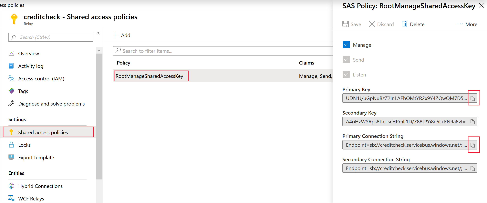

Before your apps can use Azure Relay to exchange messages, you must create and configure a namespace.

In your financial organization, for the credit-checking service, your developers use hybrid connections. You want to create a relay that supports these connections. You also want to obtain the security credentials that your apps need to connect.

In this unit, you'll create an Azure Relay namespace and then store the primary key and connection string for later use in your app code.

## Create a namespace in Azure Relay

Let's start by creating a new Azure Relay namespace.

1. In the [Azure portal](https://portal.azure.com/learn.docs.microsoft.com?azure-portal=true), in the left pane, select **Create a resource**.
1. In the **Search the Marketplace** search box, search for and select **Relay**. The **Relay** panel appears.

1. Read the information, and then select **Create**. The **Create namespace** panel appears.

1. On the **Basics** tab, enter the following values for each setting.

    | Setting | Value |
    | --- | --- |
    | **PROJECT DETAILS** |
    | Subscription | *Concierge Subscription* |
    | Resource group | From the dropdown, select <rgn>[sandbox resource group name]</rgn>. |
    | **INSTANCE DETAILS** |
    | Name | Use a name that's unique within the *servicebus.windows.net* domain. For example, use **creditcheckrelay-xx**, replacing *xx* with your initials or another text string. |
    | Location | Choose a location near you. |
    | | |

1. Select **Review + create**. After validation succeeds, select **Create**.

Azure creates and deploys the new namespace. This deployment might take several minutes.

## Get the primary key and primary connection string

Azure Relay helps maintain security by requiring applications to supply an access key when they connect. Get and store that key now, so that you can use it in the app code later in the module.

1. When the namespace deployment successfully completes, select **Go to resource**. Your **Relay** panel appears.

1. In the left menu pane, under **Settings**, select **Shared access policies**, and then select the **RootManageSharedAccessKey** policy. The **SAS Policy: RootManageSharedAccessKey** panel appears.

    

1. To save the primary key and primary connection string, do the following:
  
   a. On the **Primary Key** box, select the **Copy to clipboard** button.  
   b. In Notepad or another text editor, paste the key.  
   c. On the **Primary Connection String** box, select the **Copy to clipboard** button.  
   d. In the text editor, paste the connection string on a new line.  
   e. Name the text file *AccessKeys.txt*, and save it to a local folder.

## Create a new hybrid connection in the namespace

For your credit-checking web service, you want to use hybrid connections, not Windows Communication Foundation (WCF) connections. Let's add that capability to the relay.

1. In the Azure portal, from the upper left top pathway, select the relay you created earlier.

1. In the left menu pane, under **Entities**, select **Hybrid Connections**, and from the upper menu bar, select **Hybrid Connection**. The **Create Hybrid Connection** panel appears.

1. In the **Name** box, enter **creditcheckconnection**. Leave **Requires Client Authentication** selected, and then select **Create**.

You've completed the configuration of the relay in Azure. Apps can exchange messages through the relay when they make the right connection to it.
