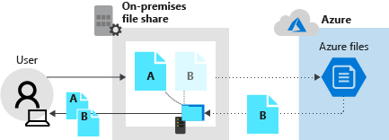

Azure File Sync allows you to extend your on-premises file shares into Azure. It works with your existing on-premises file shares to expand your storage capacity and provide redundancy in the cloud. It requires Windows Server 2012 R2 or later versions, including both the full server and core deployment options. You can access your on-premises file share with any supported file sharing protocol that Windows Server supports like SMB, NFS, or FTPS.

You're researching the tools available to extend your on-premises file share capacity into Azure. You wish to understand Azure File Sync, how it works, and how it can help increase your file share capacity.

In this unit, you'll explore what Azure File Sync is, how it works, and what you need to do to support it.

## Extend storage capacity

Azure File Sync uses your on-premises file server as a local cache for your Azure file share. With cloud tiering, you can cache the files your organization uses the most locally on your file server. The files that are used less frequently are accessible from the same local share but only a pointer to the data is stored there. When a user goes to open the file, the rest of the file data is pulled from Azure Files.

The following diagram shows what happens when a user requests two files. File *A* is used frequently so the entire file is available on the local file share. File *B* isn't used often so the rest of the file is retrieved from the Azure file share.

With cloud tiering, you're only storing a small set of data locally for files that aren't used frequently. So you have more local storage space for the files your organization uses more often.

By default, cloud tiering is off. You enable it when you create the server endpoint.

## Terminology

There are some terms you need to understand to use Azure File Sync.

- *Storage Sync Service* is the high-level Azure resource for Azure File Sync. The service is a peer of the storage account, and can also be deployed to Azure resource groups.

- *Sync group* outlines the replication topology for a set of files or folders. All endpoints located in the same sync group are kept in sync with each other. Different sets of files that must be in sync and managed with Azure File Sync would each need the creation of two sync groups and different endpoints.

- *Registered server* represents the trust relationship between the on-premises server and the Storage Sync Service. Multiple servers can be registered to the Storage Sync Service as required. However, a server can only be registered with one Storage Sync Service at a time.

- *Azure File Sync agent* is a downloadable package that enables Windows Server to be synced with an Azure file share. The agent has three components: *FileSyncSvc.exe* is the service that monitors changes on endpoints; *StorageSync.sys* is the Azure File system filter driver; and *PowerShell management cmdlets*.

- *Server endpoint* represents a specific location on a registered server, such as a folder on a local disk. Multiple server endpoints can exist on the same volume if their paths don't overlap.

- *Cloud endpoint* is the Azure file share that's part of a sync group. The whole file share syncs and can be a member of only one cloud endpoint. An Azure file share can only be a member of one sync group at a time.

- *Cloud tiering* is an optional feature of Azure File Sync that allows frequently accessed files to be cached locally on the server. Files are cached or tiered according to the cloud tiering policy you create.

## How does it work?

Azure File Sync uses a software-based agent that's installed on the on-premises servers that you want to replicate. This agent communicate with the Storage Sync Service.

Azure File Sync uses Windows USN journaling on the Windows Server to automatically initiate a sync session when files change on the server endpoint. So changes made to the on-premises file share are immediately detected and replicated to the Azure file share.

Azure Files doesn't yet have change notification or journaling. So Azure File Sync has a scheduled job called a *change detection job*. This job is initiated every 24 hours. So if you change a file on the Azure file share, you may not see the change on the on-premises file share for at least 24 hours.

## Deployment process

The following steps describe the high level process you use to set up Azure File Sync. 

1. *Evaluate your on-premises system* - Run the evaluation cmdlet on your on-premises server to check that your OS and file system are supported.
1. *Create Azure resources* - You need a storage account to contain the file share, a file share, a storage sync service, and a sync group. Create the resources in that order.
1. *Install the Azure File Sync agent* - Install the agent on each file server that's taking part in replication to the Storage Sync Service.
1. *Register the Windows Server with the Storage Sync Service* - After you install the sync agent, you're automatically prompted to register the server with the Storage Sync Service.
1. *Create the server endpoint* - After the server is registered, you add it as an endpoint in the sync group.

We'll cover these steps in the following units.
