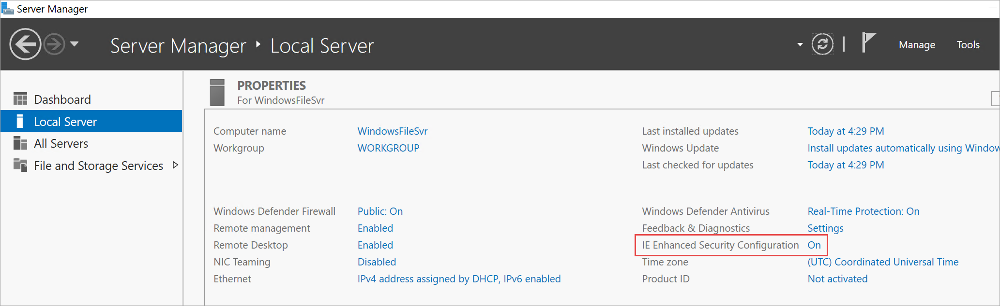
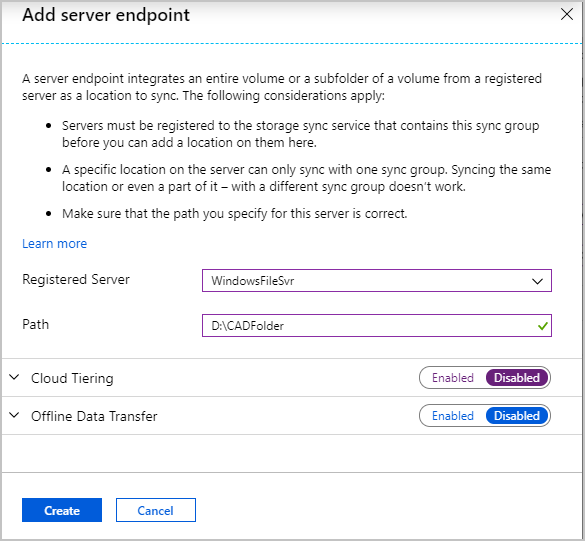
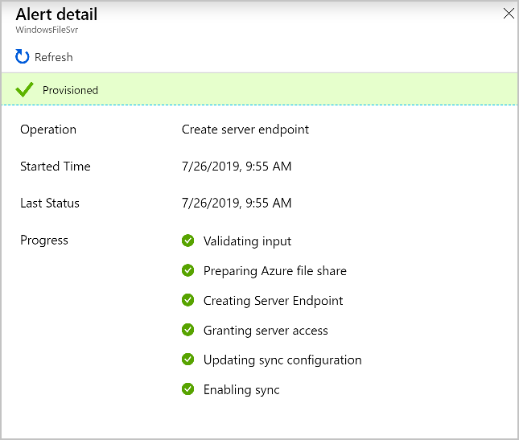

After you have all the Azure resources deployed, you need to register your on-premises Windows file server with the sync group. Then you connect to your Windows Server computer and install the Azure File Sync agent. After your server is registered, you add it as a server endpoint in your Azure subscription.

In this exercise, you'll change the security setting so it allows you to download the Azure File Sync agent. You'll then install and run the agent to register the server with the Azure sync group.

The following video shows you how set up your on-premises server to work with Azure File Sync. Complete the steps in this exercise to continue following along in your Azure subscription.

> [!VIDEO https://www.microsoft.com/videoplayer/embed/RE4LBP1]

### Disable IE Enhanced Security Configuration

1. If you closed your Remote Desktop connection, use these steps to connect to the virtual machine (VM):
    1. Sign in to the [Azure portal](https://portal.azure.com?azure-portal=true). 
    1. Go to **Virtual machines** > **FileServerLocal**.
    1. Select **Connect** > **Download RDP File**, and then open the RDP file.
    1. In the **Windows Security** window, select **More choices** > **Use a different account**.
    1. Enter the user name **learnadmin** and the password you used when you created the VM.
1. In your Remote Desktop connection, on the toolbar, select **Server Manager** > **Local Server**.
1. In the **Properties** pane, under **IE Enhanced Security Configuration**, select **On**.
    
1. Select **Off** for **Administrators** and **Users**.

### Install Azure File Sync agent

1. From the toolbar in the VM, open Internet Explorer.
1. Open the Microsoft Download Center  page for Azure File Sync by going to https://go.microsoft.com/fwlink/?linkid=858257.
1. Select **Download**.
1. Choose **StorageSyncAgent_WS2019.msi** and select **Next**.
1. Allow the pop-up and select **Run**.
1. In **Storage Sync Agent Setup**, accept the defaults to complete the setup.
1. The agent automatically runs and shows the **Azure File Sync - Agent Update** window. Complete any updates that are necessary. 

### Register Windows Server

1. On **Azure File Sync - Server Registration**, select **Sign in**. If the server registration process doesn't start automatically, open the app from C:\Program Files\Azure\StorageSyncAgent\ServerRegistration.exe.
1. Sign in by using your Azure credentials.
1. Use these values:

   |Box |Value  |
   |---------|---------|
   |Azure Subscription     | Subscription where you created the Azure File Sync resources       |
   |Resource Group    |  **learn-file-sync-rg**       |
   |Storage Sync Service     |  **CADSyncService**       |

1. Select **Register**.
1. You should see that the registration is successful. Select **OK** to close the window.
    
1. Leave your Remote Desktop connection open for the next exercise.

### Add the server endpoint

1. On your local computer, sign in to the [Azure portal](https://portal.azure.com?azure-portal=true). 
1. Go to the sync group CADFiles. Select **All resources** > **CADSyncService** > **CADFiles**.
1. Select **Add server endpoint**.
1. Use these values:

   |Box |Value  |
   |---------|---------|
   |Registered Server    | **FileServerLocal**        |
   |Path    |    **D:\CADFolder**     |

   

1. For **Cloud Tiering**, select **Enabled**.
1. Accept the defaults for the rest of the values.
1. Select **Create**.
1. When the endpoint is created, the file sync process begins. This process might take a couple minutes.

    
