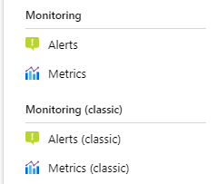
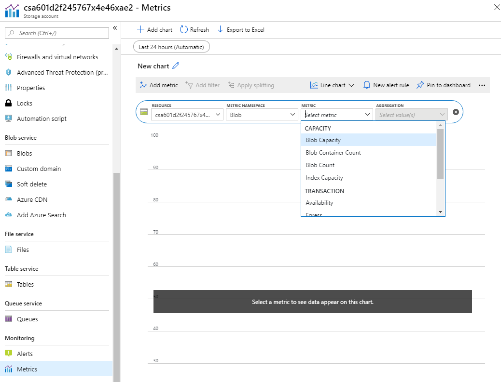
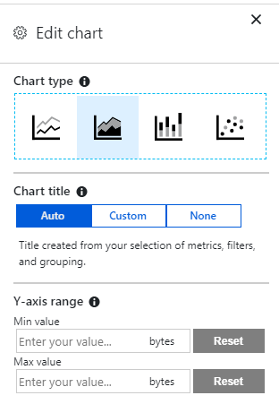

In preparation for moving your customers' proof files to Azure Blob Storage, you want to identify what metrics are available for the platform. You also want to see if it's easy to display metric information on an unplanned basis.  For example, you might want to know how much storage is being used in Azure, or how much latency is involved when customers retrieve files for review.

In this unit, we focus on using the Azure portal to view available metrics on demand. So that by the end of this unit, you're able to identify, select, and display Blob Storage metrics and display those metrics in the Azure portal.

## Azure Storage and Blob Storage

Azure Storage provides cloud-based storage for a range of data types with nearly unlimited capacity. The facilities that Azure Storage provides include:

- A cloud-based data object store.
- A file system service for objects stored in the cloud.
- A reliable messaging service.
- A NoSQL store for unstructured data.

This module focuses on Azure Blob Storage, which is Microsoft's object storage solution for the cloud. Blob Storage provides a solution for storing large amounts of unstructured data, so it's useful for:

- Serving images to a browser.
- Distributing unstructured files.
- Hosting audio and video streams.
- Storing backup, archive, and disaster recovery data.
- Providing storage for data analysis, either on-premises or in Azure.

You can access Blob Storage over HTTP or HTTPS from any global internet connection. Your options for accessing blob data include URLs, the Azure Storage REST API, Azure PowerShell, the Azure CLI, or one of the many Azure Storage client libraries. The client libraries can be in multiple languages such as .NET, Java, Node.js, and Python.

> [!NOTE]
> Blob Storage supports Azure Data Lake Storage Gen2. Fore more information, see [Introduction to Azure Data Lake Storage Gen2](/azure/storage/blobs/data-lake-storage-introduction).

### Resource types

Blob Storage includes the following resources:

| Resource types | Description |
|-----|-----|
| A storage account | A unique namespace for your data in Azure |
| A container | Analogous to a folder in a file system |
| One or more blobs in that container | Analogous to files in a file system |

A storage account can have an unlimited number of containers, and a container can hold an unlimited number of blobs.

### Blob types

Blob Storage supports three types of blobs:

| Blob type | Description |
|-----|-----|
| Block blobs | Best for storing text and binary data with a maximum size of about 190.7 TiB. Block blobs consist of blocks of data that are managed individually.|
| Append blobs | This blob type consists of blocks, just like block blobs, but is optimized for append operations. Append blobs are ideal for scenarios such as logging data from virtual machines. |
| Page blobs | Can store random access files up to 8 TiB in size, such as virtual hard drive (VHD) files in Azure virtual machines. |

## Metrics

Metrics are a vital component of your management approach to Blob Storage. Metrics enable you to identify usage trends, trace requests, and diagnose problems with your storage account. Areas that you might want to track in Azure include:

- Overall Blob Storage usage
- Storage costs
- Allocation of costs to groups
- Availability
- Latency

Blob Storage provides *capacity* and *transaction* categories of metrics.

Capacity metrics include:

- Blob capacity
- Blob container count
- Blob count
- Index capacity

Transaction metrics include:

- Availability
- Egress and ingress
- Success end-to-end (E2E) Latency
- Success server latency
- Transactions

Capacity metrics are sent to Azure Monitor every hour and are refreshed daily. Transaction metrics are sent to Azure Monitor every minute, and they're available for both the account and the service. The refresh interval affects the exercise in the next module, because metrics aren't displayed in real time. You can also specify custom metrics.

### Viewing metrics

There are two main ways to view Blob Storage metrics:

- In the Azure portal
- In a custom dashboard (covered later in this module)

Viewing Blob Storage metrics in the Azure portal is the simpler way. The portal provides two implementations: current monitoring and classic monitoring.

Selecting **Metrics** creates a new chart space, in which you can select the metrics that you want to display.

### Filtering

With some metrics, you can implement filtering to focus on specific values. For example, if you select the **Blob Capacity Average** metric, you can then filter by two properties, **Blob Tier** and **Blob Type**. To bring up options for Azure Data Lake Storage, page blob, and block blob, select **Add Filter** > **Blob Type** as the filtered property.

With the **Blob Tier** option, you can choose from the following types of tiers:

- Archive
- Cool
- Hot
- Standard
- Untiered

### Splitting

For greater granularity with your metrics, you can also apply splitting by using the same properties that were available with filtering. For example, selecting to split by blob type brings up separate lines for Azure Data Lake Storage, page blob, and block blob.

### Chart types

Within Azure current metrics, you can select one of four chart types:

- Line
- Area
- Bar
- Scatter

The option that you select depends on the metric type that you're displaying. The option also depends on whether the values change over time or are static. For example, scatter charts work best with data that varies rapidly over time.

### Chart customization

Within each of the four chart types, you can customize the way in which the chart displays information.

Here you have options to edit the chart title and change the Y-axis range between set minimum and maximum values.