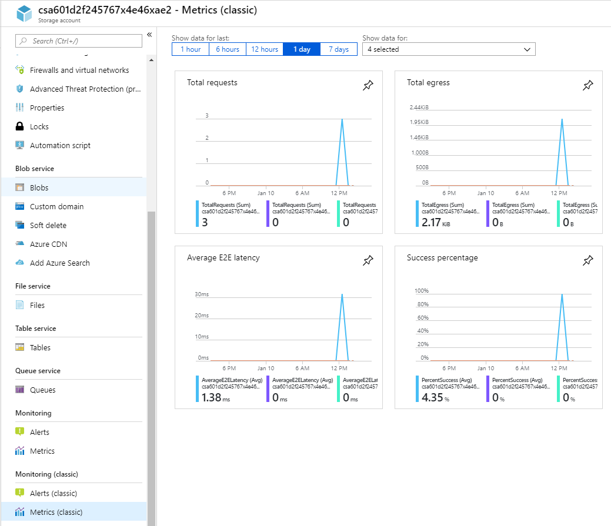

In preparation for moving your client proof files to Azure Blob storage, you want to identify what metrics are available for the platform. You also want to see how easy it is to display metric information on an ad-hoc basis. For example, you might want to know how much storage is being used in Azure, or how much latency is involved when clients retrieve files for review.

In this unit, you'll focus on using the Azure portal to view available metrics on-demand.

By the end of this unit, you'll be able to identify, select, and display Azure Blob Storage metrics and display those metrics in the Azure portal.

## Azure Storage and Blob Storage

Azure Storage provides cloud-based storage for range of data types with virtually unlimited capacity. The facilities that Azure storage provides include:

- A cloud-based data object store
- A file system service for objects stored in the cloud
- A reliable messaging service
- A NoSQL store for unstructured data

### Azure Blob Storage

This module concentrates on Azure Blob storage, which is Microsoft's object storage solution for the cloud. Blob storage provides the best solution for storing large quantities of unstructured data, making it ideal for:

- Serving images to a browser
- Distributing unstructured files
- Hosting audio and video streams
- Storing backup, archiving, and disaster recovery data
- Providing storage for data analysis, either on-premises or in Azure

Blob storage resources consist of the following:

| Resource Types | Description |
|-----|-----|
| **A storage account** | A unique namespace for your data in Azure |
| **A container** | Analogous to a folder in a file system |
| **One or more blobs in that container** | Analogous to files in a file system |

A storage account can have unlimited numbers of containers and a container can hold unlimited numbers of blobs.

You can access blob storage over http or https from any global Internet connection. Your options for accessing blob data include URLs, Azure Storage REST API, Azure PowerShell, Azure CLI, or one of the many Azure Storage client libraries. These client libraries can be in multiple languages, including .NET, Java, Node.js, Python, PHP, and Ruby.

> [!NOTE]
> Note: Blob storage supports Azure Data Lake Storage Gen2. Fore more information, see [Introduction to Azure Data Lake Storage Gen2](https://docs.microsoft.com/azure/storage/blobs/data-lake-storage-introduction).

### Blob Types

Azure Blob storage supports three different types of blobs:

| Blob Types | Description |
|-----|-----|
| **Block Blobs** | These are best for storing text and binary data with a maximum size of about 4.7 TB. Block blobs consist of blocks of data that are managed individually. |
| **Append Blobs** | These consist of blocks, just like block blobs, but are optimized for append operations. Append blobs are ideal for scenarios such as logging data from virtual machines. |
| **Page Blobs** | These can store random access files up to 8 TB in size, such as virtual hard drive (VHD) files in Azure virtual machines. |

### Importance of Metrics

Metrics are a vital component of your management approach to blob storage. Metrics enable you to identify usage trends, trace requests, and to diagnose issues with your storage account. Areas that you particularly want to track in Azure include:

- Overall blob storage usage
- Storage costs
- Allocation of costs to groups
- Availability
- Latency

Azure Blob Storage provides the following metrics, which can be categorized as capacity or transaction metrics.

**Capacity metrics include:**

- Blob capacity
- Blob container count
- Blob count
- Index capacity

**Transaction metrics include:**

- Availability
- Egress and Ingress
- Success end to end (E2E) Latency
- Success server latency
- Transactions

Capacity metrics are sent to Azure Monitor every hour and are refreshed daily. Transaction metrics are sent to Azure Monitor every minute, and are available both for the account and service. You should be aware that the refresh interval does affect the exercise in the next module, as metrics aren't displayed in real time. You can also specify custom metrics.

## Viewing Metrics

There are two main mechanisms for viewing Azure blob storage metrics:

- In the Azure portal
- In a custom Dashboard (covered later in this module)

### Portal

Viewing blob storage metrics in the Azure portal is the simplest way to view Azure blob storage metrics. The portal provides two implementations - classic metrics and the current implementation.

Clicking Metrics creates a New chart space, in which you can select the metrics that you want to display.

However, clicking Metrics (Classic) shows four charts for total requests, total egress, Average E2E Latency, and success percentage.

### Filtering

With some metrics, you can implement filtering, which enables you to focus on more specific values. For example, if you select the Blob Capacity Average metric, you can then filter by two properties, that are Blob tier and Blob Type. Clicking the Add Filter button and then selecting Blob Type as the filtered property brings up options for:

- Azure Data Lake Storage
- PageBlob
- BlockBlob

However, the Blob Tier option enables you to choose from the following types of tier:

- Archive
- Cool
- Hot
- Standard
- Untiered

### Splitting

For greater granularity with your metrics, you can also apply splitting, using the same properties that were available with filtering. For example, selecting to split by blob type will bring up separate lines, one for Azure Data Lake storage, one for PageBlob, and one for BlockBlob.

### Chart Types

Within Azure current metrics, you can then select one of four chart types:

- Line
- Area
- Bar
- Scatter

The option you select will depend on the metric type that you are displaying. The option will also depend on whether the values changes over time or are static. For example, scatter charts work best with data that varies rapidly over time.

### Chart customization

Within each of the four chart types, you can then customize the way in which those charts display information.

Here you have options to edit the chart title and change the Y-axis range between set minimum and maximum values.
