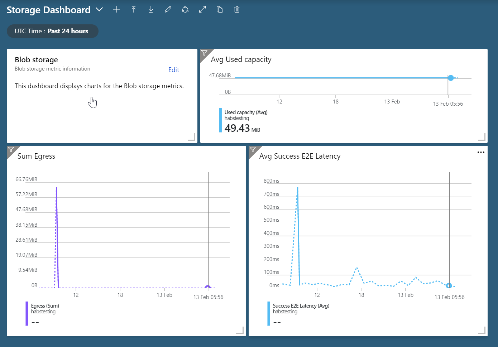
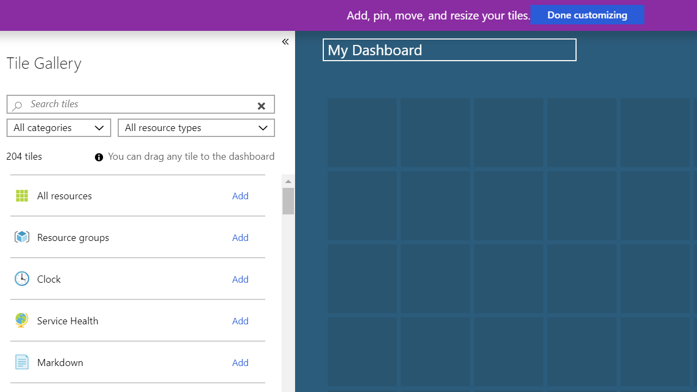
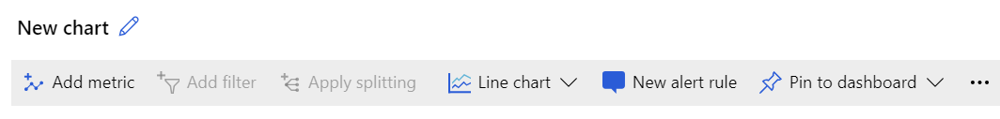
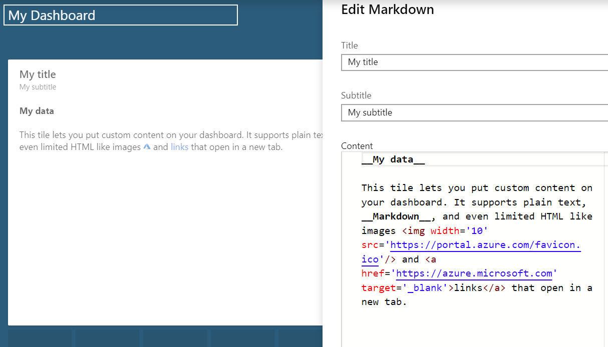

You've now identified certain metrics in Azure Blob Storage that you want to monitor on an ongoing basis when customer files are moved onto the platform. Rather than creating a chart every time you want to see the metric data, you want to see how to use dashboards to check on specific metrics regularly.

Management has also asked for regular reports about the use and performance of the platform to ensure that customers are satisfied as more files are moved to Azure. You want to see if management can use dashboards for this purpose.

## What's a dashboard?

Often, you want to create the same reports by using up-to-date information, such as platform usage or the resultant performance when working with files on a storage platform. However, it's inconvenient to create a fresh chart and configure the settings each time you want to see such a report. 

In the Azure portal, you can create a dashboard and add persistent charts to closely monitor key metrics, such as latency or the number of transactions being processed. You can also present other information from your Azure subscription, such as virtual machine information. And you can present other web-based content, such as notices or video content. You can even share these dashboards with other users in your Azure Active Directory organization.

## Create dashboards

Your Azure portal normally starts with a dashboard created automatically for you. This dashboard already has several *tiles* by default. Tiles contain information about your Azure tenant or links to help you get started with using Azure.

You can create more dashboards by using the toolbar on the left side of the dashboard page. The toolbar enables you to create, edit, clone, and delete dashboards. You can also download and upload dashboards, and share dashboards with other Azure user accounts.

When you create a new dashboard, you specify a name or title for it, and Azure creates an empty dashboard with no tiles. The dashboard is divided into a grid to help tile placement and sizing when you add content.

### Resource and data tiles

After the dashboard is initially created, it's put into edit mode so you can add, remove, and resize tiles. Tile content suggestions appear on the left side of the dashboard, in the *tile gallery*. This gallery helps you get started with adding tiles and content to the dashboard. 

Tiles can display several types of content. Some tiles display links to resources. Other tiles display data about the resources in your Azure subscription. Such as, virtual machine load, storage account usage, or subscription billing information.

Tiles stay up to date, so you can use dashboards to display monitoring information in near real time. There are predefined tiles for a wide variety of Azure resource types. Including, device management, databases, resource groups, storage accounts, security, and diagnostics.

In addition to the tile gallery, you can add Azure Monitor charts to a dashboard from the associated resources in the Azure portal. When you're viewing resource information and viewing metrics, you can use an option on the chart toolbar to add the chart to a dashboard directly.

After you add tiles to a dashboard, you can drag tiles to reorganize the dashboard layout, or resize the tiles within the dashboard grid structure.

### Markdown tiles

In addition to resource and data tiles, you can add *Markdown* tiles to your dashboards. Markdown tiles allow you to add certain web content to your dashboard. Web content can include titles or descriptions, links to FAQs or reference pages, and media content such as video embedded in the tile.

Markdown tiles support plain text, some HTML formatting, and Markdown (which is a form of markup language designed to use a basic formatting syntax).
