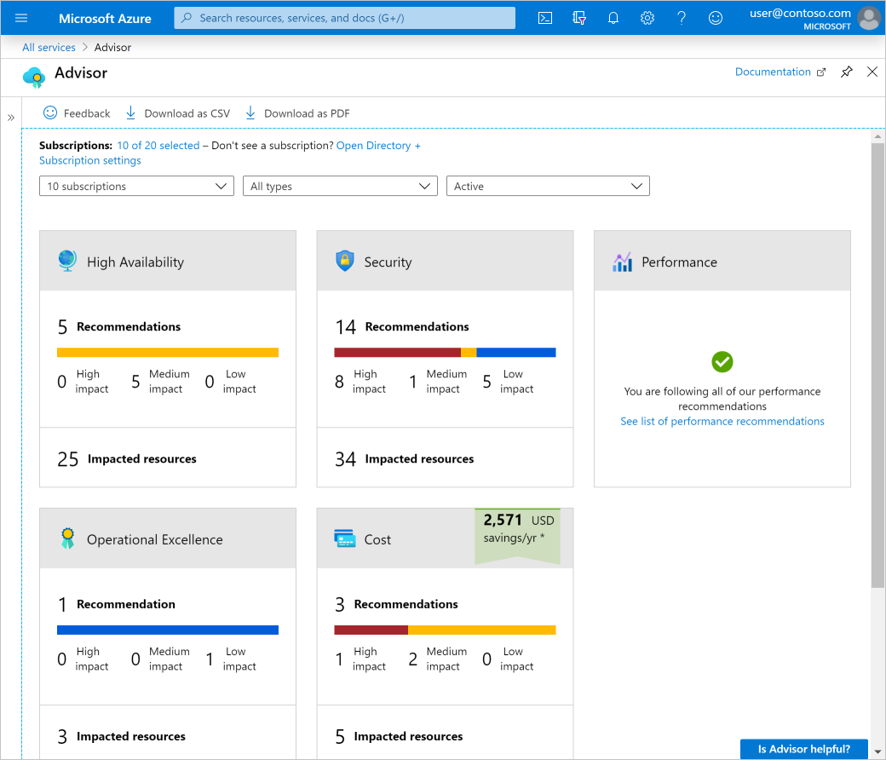

Don't use an H1 for the title - The title for each unit is defined in the yml file. Content can just start without a heading because that will be added by the system.

## Heading 2

**Bold**
_italics_

### Heading 3

[Link example](https://azure.microsoft.com/services/advisor/?azure-portal=true)

Bulleted list example:

- Reliability
- Security
- Performance

Image tag example:

