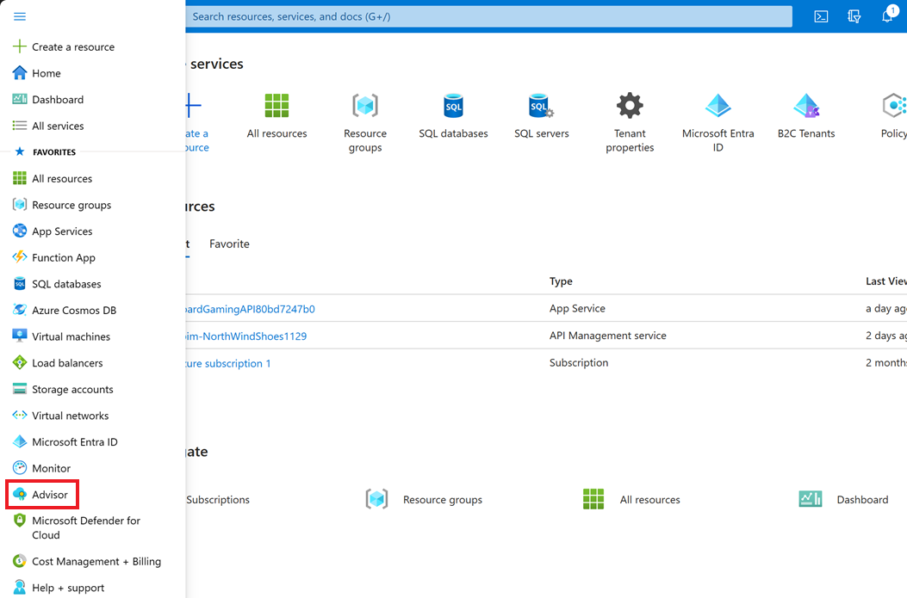
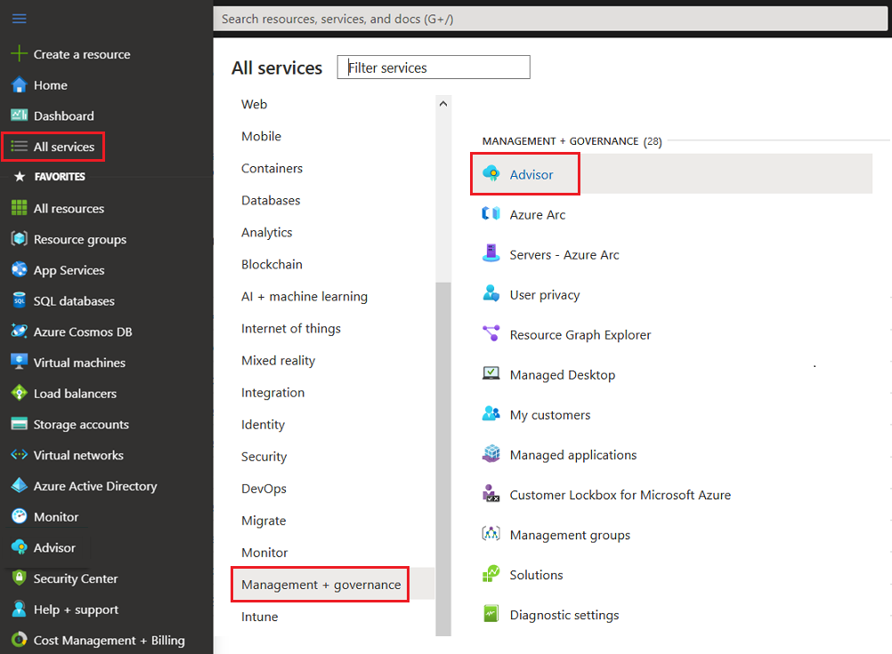
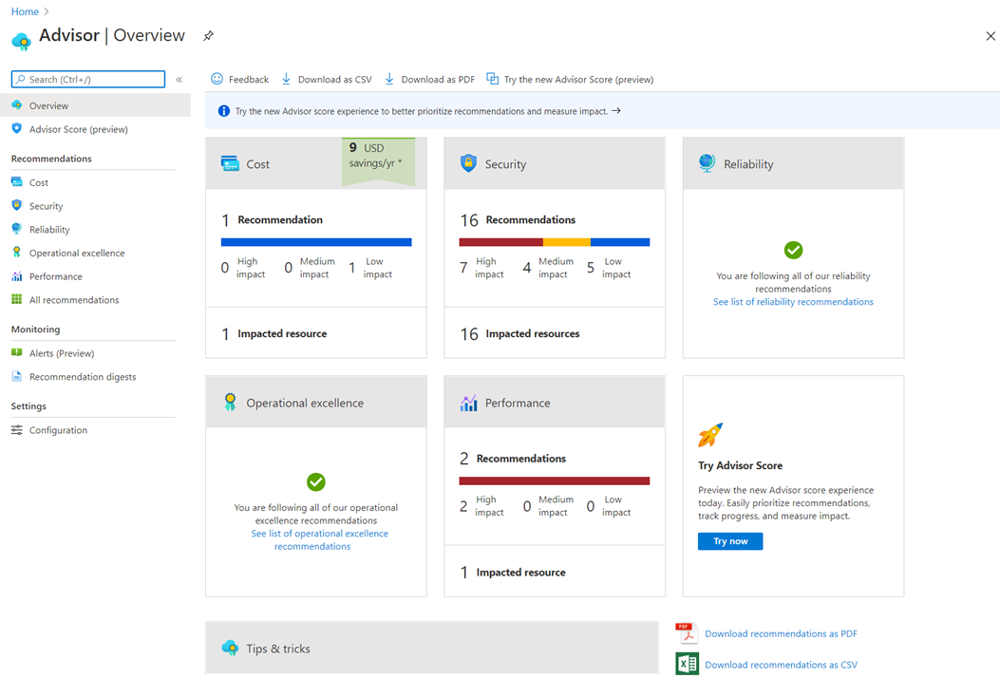
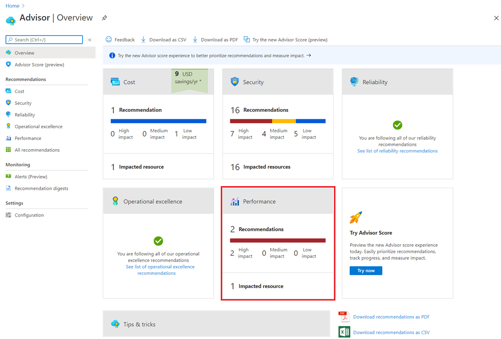
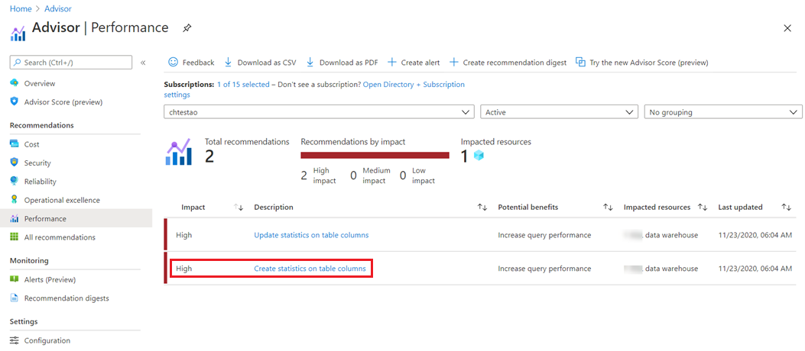
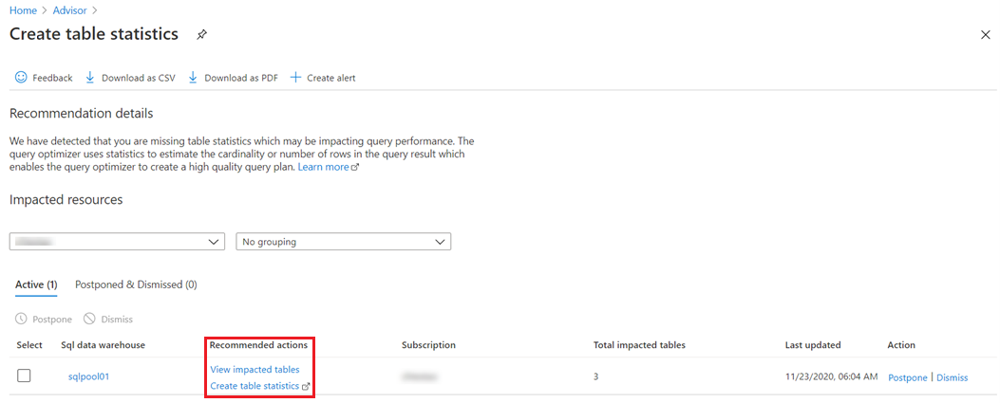

## Where can I find Advisor?

Advisor is available on the [Azure portal.](https://portal.azure.com/?azure-portal=true). Here are a few different ways you can get to it:

- Type "advisor" in the search bar at the top of the portal. Then select **Advisor** from the list of services.

   > [!div class="mx-imgBorder"]
   > 

- Select **Advisor** from the left pane of the portal.

   > [!div class="mx-imgBorder"]
   > 

- Select **All services** from the left pane of the portal. Then select **Advisor** under **Management + governance**

   > [!div class="mx-imgBorder"]
   > 

After you do any one of these three, the Advisor dashboard is displayed.

> [!div class="mx-imgBorder"]
> 

### Areas where Advisor can help

As you'll notice in the image above, Advisor gives you recommendations for these five categories:

| Category | Description |
|---------|---------|
| **Cost** | Helps optimize and reduce your overall Azure spend by identifying idle and underutilized resources. |
| **Security** | Integrates with [Azure Security Center](https://docs.microsoft.com/azure/security-center/security-center-recommendations?azure-portal=true) to identify potential vulnerabilities that can lead to security breaches. |
| **Reliability** | Helps to ensure and improve the continuity of your business-critical applications. |
| **Operational excellence** | Makes recommendations for process and workflow efficiency, resource manageability, and deployment best practices. |
| **Performance** | Helps improve the speed and responsiveness of your business-critical applications. |

### Examples of Advisor recommendations

Advisor gives you several recommendations for each of these categories. Here are several examples. Their titles are pretty self-explanatory, but if you want more information about any one of them, just select the link.

#### Cost

- [Resize or shut down underutilized instances](https://docs.microsoft.com/azure/advisor/advisor-cost-recommendations#optimize-virtual-machine-spend-by-resizing-or-shutting-down-underutilized-instances?azure-portal=true)
- [Eliminate unprovisioned ExpressRoute circuits](https://docs.microsoft.com/azure/advisor/advisor-cost-recommendations#reduce-costs-by-eliminating-unprovisioned-expressroute-circuits?azure-portal=true)
- [Delete or reconfigure idle virtual network gateways](https://docs.microsoft.com/azure/advisor/advisor-cost-recommendations?azure-portal=true&#reduce-costs-by-deleting-or-reconfiguring-idle-virtual-network-gateways)

#### Reliability

- [Ensure application gateway fault tolerance](https://docs.microsoft.com/azure/advisor/advisor-high-availability-recommendations?azure-portal=true&#ensure-application-gateway-fault-tolerance)
- [Protect your virtual machine data from accidental deletion](https://docs.microsoft.com/azure/advisor/advisor-high-availability-recommendations?azure-portal=true&#protect-your-virtual-machine-data-from-accidental-deletion)
- [Configure Traffic Manager endpoints for resiliency](https://docs.microsoft.com/azure/advisor/advisor-high-availability-recommendations?azure-portal=true&#configure-traffic-manager-endpoints-for-resiliency)

#### Operational excellence

- [Create Azure Service Health alerts to be notified when Azure problems affect you](https://docs.microsoft.com/azure/advisor/advisor-operational-excellence-recommendations?azure-portal=true&#create-azure-service-health-alerts-to-be-notified-when-azure-problems-affect-you)
- [Design your storage accounts to prevent reaching the maximum subscription limit](https://docs.microsoft.com/azure/advisor/advisor-operational-excellence-recommendations?azure-portal=true&#design-your-storage-accounts-to-prevent-reaching-the-maximum-subscription-limit)
- [No validation environment enabled](https://docs.microsoft.com/azure/advisor/advisor-operational-excellence-recommendations?azure-portal=true&#no-validation-environment-enabled)

#### Performance

- [Improve App Service performance and reliability](https://docs.microsoft.com/azure/advisor/advisor-performance-recommendations?azure-portal=true&#improve-app-service-performance-and-reliability)
- [Use managed disks to prevent disk I/O throttling](https://docs.microsoft.com/azure/advisor/advisor-performance-recommendations?azure-portal=true&#use-managed-disks-to-prevent-disk-io-throttling)
- [Improve MySQL connection management](https://docs.microsoft.com/azure/advisor/advisor-performance-recommendations?azure-portal=true&#improve-mysql-connection-management)

#### Security

Advisor integrates with [Azure Security Center](https://docs.microsoft.com/azure/security-center/security-center-recommendations?azure-portal=true) to provide security recommendations on the Advisor dashboard Security tab.

Security Center periodically analyzes the security state of your Azure resources to identify potential security vulnerabilities, such as overdue system updates. Security Center then creates recommendations, and Advisor guides you through the process of resolving them.

## How does Advisor work?

Think of Azure Advisor as your personalized cloud consultant. It gives you messages that provide information on best practices to optimize the setup of your Azure services. 

Advisor analyzes your *resource configuration* and *usage telemetry* and then recommends solutions that can help you improve the cost effectiveness, performance, reliability, and security of your Azure resources.

## Advisor recommendation remediation flow

Now that you've learned a little about your Advisor recommendations, we'll show you the typical process you follow to resolve them:

First, on your Advisor dashboard, select a category that shows that there are recommendations to resolve. In this example image, you can select the **Performance** tile since it shows that there are two recommendations. You'll also notice that there are no recommendations for either **Security** or **Operational excellence**. 

> [!div class="mx-imgBorder"]
> 

The next screen opens showing the details for the recommendations. You can select a link for a recommendation that you want to resolve. For this explanation, we'll select **Create statistics on table columns**, which you'll notice is showing as a high impact item.

> [!div class="mx-imgBorder"]
> 

After you select a recommendation, a window opens showing some suggestions for actions you can take.

> [!div class="mx-imgBorder"]
> 

At this point in the flow, you have several options for how you want to handle the recommendation.

- You can select the link for the recommended action and another window opens that lets you take the necessary steps to resolve the recommendation.
- If you choose to deal with the recommendation later on, you can select **Postpone**. Advisor removes it from the list, but will recommend it again if it sees that the issue hasn't been resolved.
- Or if you know this is an issue you don't want to resolve, you can just select **Dismiss** and Advisor will remove it from the list and will no longer show it as a recommendation for that resource.

   > [!div class="mx-imgBorder"]
   > 
