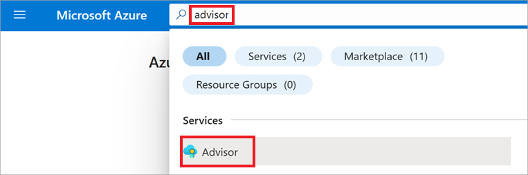
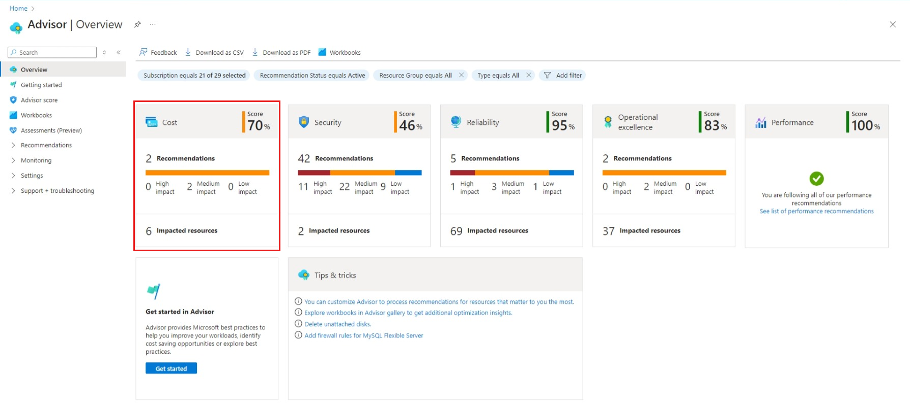
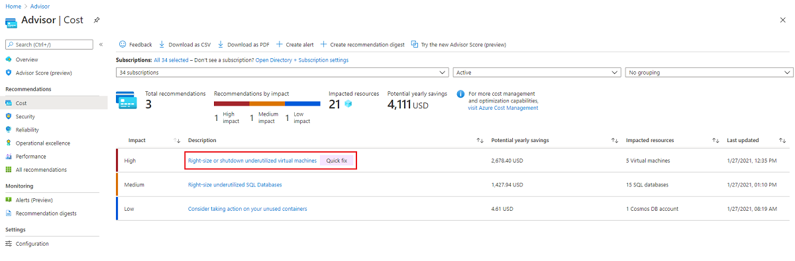
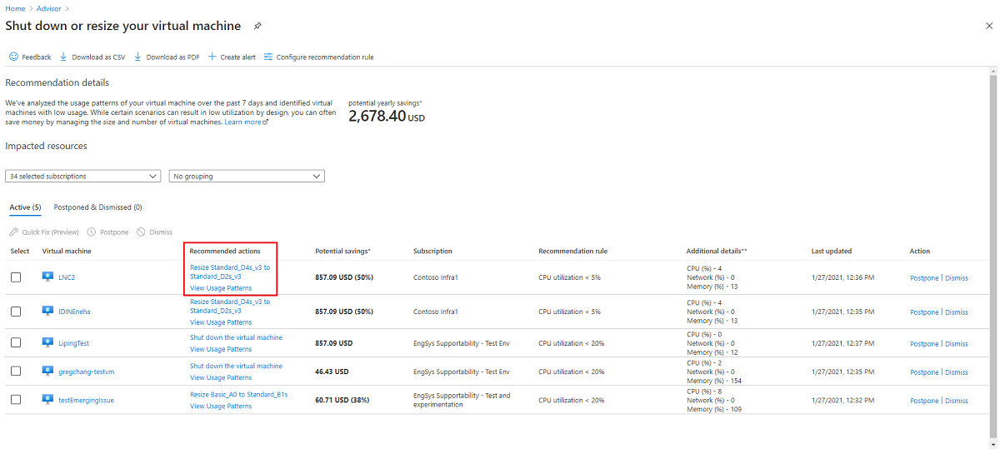
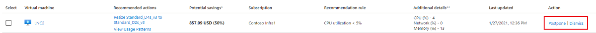

Now, let's walk through a real world example to see how Advisor can work in your environment. Below you'll find guided step-by-step instructions that take you to your Azure subscription where you can review and apply some Advisor recommendations to help optimize your Azure workloads.

1. First, log in to the [Azure portal](https://portal.azure.com/?azure-portal=true).
1. Go to your Advisor dashboard by typing "advisor" in the search bar and then selecting **Advisor** from the list of services.

   > [!div class="mx-imgBorder"]
   > 

    The Advisor dashboard opens showing personalized recommendations for all your subscriptions. The recommendations are divided into the five categories that you learned about in the previous unit.

1. You can select any one of the five categories that shows there are recommendations to address. For this unit, we'll be looking at optimization opportunities. So go ahead and select **Cost**.

    > [!div class="mx-imgBorder"]
    > 

   The **Advisor | Cost** page opens where you can view things like:

    - A description of the recommendations Advisor is making
    - How many resources are impacted and what the impact level is
    - The potential monthly cost savings if you resolve the issues

1. Select a recommendation from the **Description** list to review it in more detail and to see ways in which you can remediate the issue that was flagged. For this exercise, we are looking at the recommendation for **Right-size or shutdown underutilized virtual machines**.

   > [!div class="mx-imgBorder"]
   > 

    After selecting it, the **Shut down or resize your virtual machine** page opens showing the resources affected and recommended actions you can take to resolve the issues. It also breaks down the cost savings you can achieve per resource.

    For this exercise, there are a couple different recommended actions you can apply for each virtual machine.

   > [!div class="mx-imgBorder"]
   > 

1. Select one of the **Recommended actions** from the list. The next page that opens helps guide you through specific actions that you can take right now to apply the recommendation and resolve the issue.

    However, you'll notice that you also have the option to **Postpone** or **Dismiss** the recommended action if you so choose, as we discussed in a previous unit.

   > [!div class="mx-imgBorder"]
   > 
