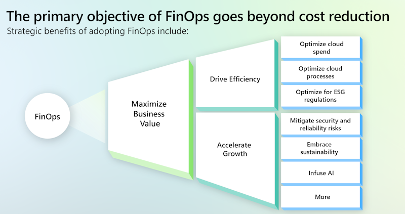

## Overview

The FinOps Foundation defines FinOps as "an operational framework and cultural practice that maximizes the business value of cloud, enables timely data-driven decision making, and creates financial accountability through collaboration between engineering, finance, and business teams."

FinOps supports a cultural shift within organizations, fostering best practices aimed at enhancing efficiency and effectively managing cloud investments. It promotes accountability and data-driven decision-making to support business growth.

But contrary to popular belief, the primary objective of FinOps extends beyond mere cost optimization. It encompasses a comprehensive approach to managing cloud finances, focusing on optimizing cloud spending while also enhancing operational efficiency, resource utilization, and overall business agility. By embracing FinOps principles, organizations aim not only to control expenses but also to align cloud investments with strategic goals, drive innovation, and foster continuous improvement in cloud management practices.

## FinOps Framework

The FinOps framework provides the operating model for establishing and excelling in the practice of FinOps. It helps organizations maximize the business value of cloud, enable timely data-driven decision making, and create financial accountability through collaboration between engineering, finance, and business teams. In fewer words, the framework is the operating model for FinOps.

The FinOps framework can be thought of as the building blocks of a FinOps practice. In this metaphor, practitioners can choose and arrange their blocks in different ways, resulting in unique implementations of FinOps that are all constructed from the same components.

Like FinOps, the framework is evolving and informed by community experiences, contributions, and conversations. It's expounded by a growing library of stories, papers, and playbooks illustrating successful practices.

The primary components of the framework are:

- Principles
- Personas
- Phases
- Maturity model
- Domains
- Capabilities

For more information, see the [FinOps Framework](https://www.finops.org/framework/) by the [FinOps Foundation](https://www.finops.org/).
