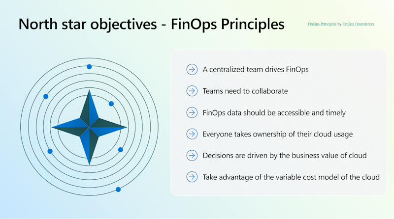

The FinOps framework includes six principles that act as north star objectives of the FinOps practice. These principles are:

## A centralized team drives FinOps

- The central team encourages, evangelizes, and enables best practices in a shared accountability model. In this regard, the FinOps central team is much like security, which has a central team yet everyone remains responsible for their portion.
- Executive buy-in for FinOps and its practices and processes is required.
- Rate, commitment, and discount optimization are centralized to take advantage of economies of scale.
- Remove the need for engineers and operations teams to think about rate negotiations, allowing them to stay focused on usage optimization of their own environments.

## Teams need to collaborate

- Finance, technology, product, and business teams work together in near real time as the cloud operates on a per-resource, per-second basis.
- Teams work together to continuously improve for efficiency and innovation.

## FinOps data should be accessible and timely

- Process and share cost data as soon as it becomes available.
- Real-time visibility autonomously drives better cloud utilization.
- Fast feedback loops result in more efficient behavior.
- Consistent visibility into cloud spend is provided to all levels of the organization.
- Create, monitor, and improve real-time financial forecasting and planning.
- Trending and variance analysis helps explain why costs increased.
- Internal team benchmarking drives best practices and celebrates wins.
- Industry peer-level benchmarking assesses your company's performance.

## Everyone takes ownership for their cloud usage

- Accountability of usage and cost is pushed to the edge, with engineers taking ownership of costs from architecture design to ongoing operations.
- Individual feature and product teams are empowered to manage their own usage of cloud against their budget.
- Decentralize the decision making around cost-effective architecture, resource usage, and optimization.
- Technical teams must begin to consider cost as a new efficiency metric from the beginning of the software development lifecycle.

## Decisions are driven by business value of cloud

- Unit economic and value-based metrics demonstrate business impact better than aggregate spend.
- Make conscious trade-off decisions among cost, quality, and speed.
- Think of cloud as a driver of innovation.

## Take advantage of the variable cost model of the cloud.

- The variable cost model of the cloud should be viewed as an opportunity to deliver more value, not as a risk.
- Embrace just-in-time prediction, planning, and purchasing of capacity.
- Agile iterative planning is preferred over static long-term plans.
- Embrace proactive system design with continuous adjustments in cloud optimization over infrequent reactive cleanups.

_For more information, see the [FinOps Principles](https://www.finops.org/framework/principles/) by the [FinOps Foundation](https://www.finops.org/)._
