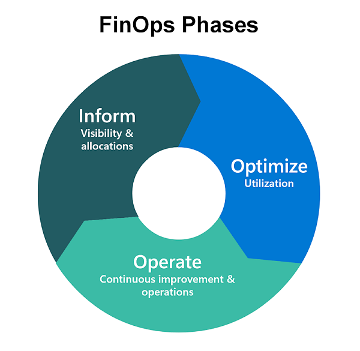

The FinOps phases are designed as an iterative loop to support the customer journey in adopting and improving practices continuously. It consists of three phases - Inform, Optimize, and Operate, which don't need to follow a strict sequence. This flexibility allows organizations to customize it for their specific needs. Additionally, it's important to note that different teams might be in different stages based on various factors and objectives.

## Inform

**Visibility & Allocation**

In the _Inform_ phase, FinOps activities involve identifying data sources for cloud cost, usage, and efficiency data. Using this data for allocation, analysis and reporting empowers teams to develop capabilities in budgeting, forecast trends, build KPIs for benchmarking, and develop metrics that reveal the business value of an organization's cloud spend.

## Optimize

**Rates & Usage**

In the _Optimize_ phase, FinOps activities involve identifying opportunities to improve cloud efficiency using the data and capabilities developed in the Inform Phase.

## Operate

**Continuous Improvement & Usage**

In the _Operate_ phase, FinOps activities involve implementing organizational changes to operationalize FinOps using the data and capabilities developed in the Inform and Optimize phase. This includes establishing cloud governance policies, compliance monitoring, and empowering individuals through the development of training programs, team guidelines, and automation policies that are aligned with organizational objectives.

For more information, see the [FinOps Phases](https://www.finops.org/framework/phases/) by the [FinOps Foundation](https://www.finops.org/).
