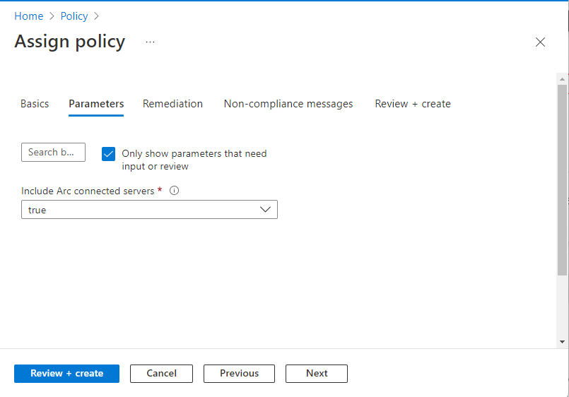
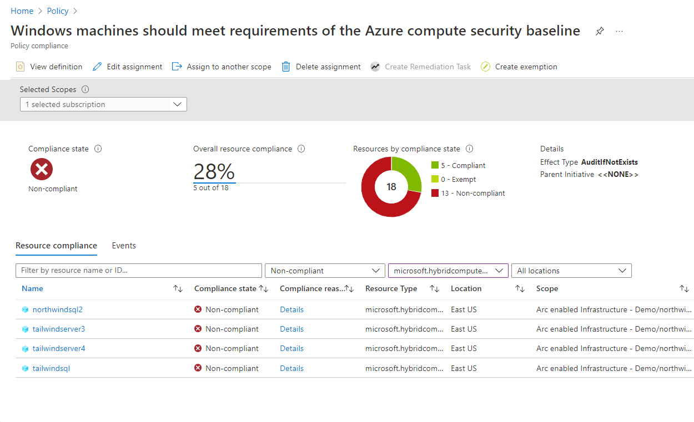

Fabrikam Residences onboarded its machines to Azure Arc-enabled servers and now wants to ensure that these machines meet Azure’s compute security baseline. In this Unit, you learn how to assign Azure Policies to your Azure Arc-enabled servers and view their compliance.

## Overview of Azure Policy

Azure Policy evaluates resources in Azure by comparing the properties of those resources to business rules. These business rules, described in JSON format, are known as policy definitions. To simplify management, several business rules can be grouped together to form a policy initiative (sometimes called a policySet). Once your business rules are formed, the policy definition or initiative is assigned to any scope of resources that Azure supports. For example, management groups, subscriptions, resource groups, or individual resources.

Azure Policy Guest Configuration is one type of Azure Policy available for Azure Arc-enabled servers. There are over 50 built-in Azure Policies that can be readily applied to Azure Arc-enabled servers for auditing settings, deployment of extensions, and remediation.

## Assign Azure Policy

Here we walk through assigning an Azure Policy to ensure that your Arc-enabled Windows servers meet Azure’s compute security baseline.

1. From your browser, go to the [Azure portal](https://portal.azure.com/).
1. In the portal, browse **Policy** and select **Assignments** from the left-pane.
1. Select **Assign policy** and then **Policy Definition**.
1. Search **security baseline** from Available Definitions and select the Policy Definition: **Windows machines should meet requirements of the Azure compute security baseline** before moving to the next step.

   

1. Set the parameter **Include Arc connected servers** to **true**.

   

1. Select **Review + create** and **Create.**

On the Azure Policy Assignments page, your new Azure Policy assignment appears in the list of Assignments. The assignment takes around 30 minutes to take effect and appear in this list.

## View compliance

After the Azure Policy Assignment is complete, you can review compliance with the policy and assign remediation tasks to ensure resource compliance.

1. In the same portal page for **Policy**, select **Compliance** from the left-pane.
1. Select on the policy **Windows machines should meet requirements of the Azure compute security baseline** to view its compliance status.
1. You can filter by different resource types, compliance, or locations. To view just the compliance of Azure Arc-enabled servers, select **All Resource Types** and change the selection to only **microsoft.hybridcompute/machines**. 

  

Based on the compliance state, you can choose to edit assignment, create exemptions, create a remediation task, or delete the assignment. 
