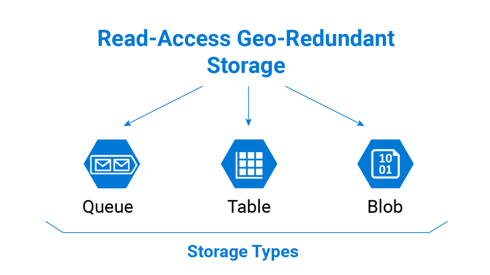
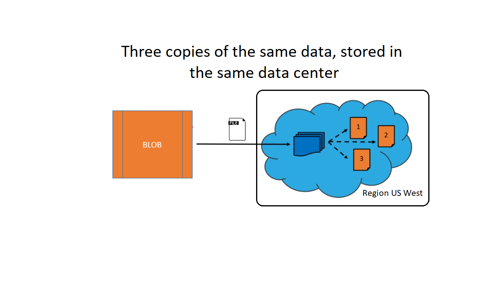
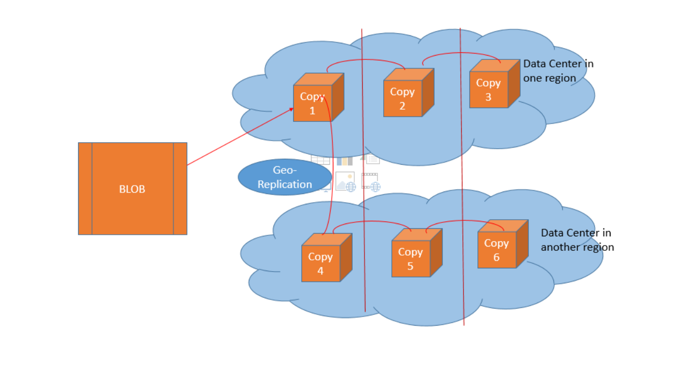
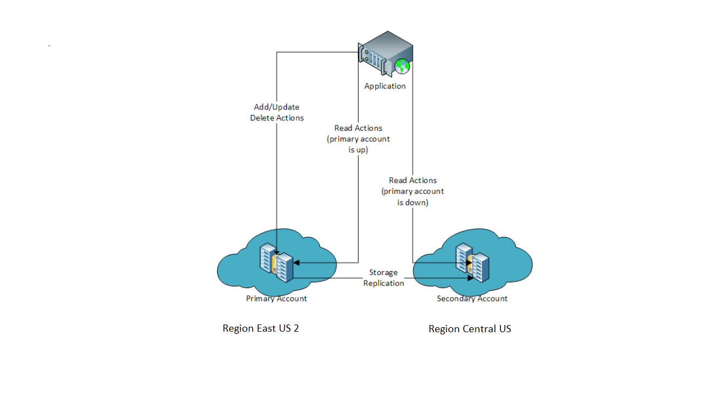

As part of the project to make your healthcare application highly available, you need to create and configure an Azure storage account. Recall that your application allows doctors and consultants in the field to upload images from visits with patients. These images contain essential clinical information, and they must be available even if an Azure region fails.

Let's see how an Azure storage account is configured to allow for replication and high availability of data.

## Azure storage accounts

Azure storage accounts are used to house data objects such as files, blobs, tables, and disks for virtual machines. The data that you store in a storage account can be accessed from any location globally via HTTP or HTTPS and is highly available and secure.

## Data redundancy

Data in Azure is replicated to ensure that it's always available, even if a datacenter or region becomes inaccessible or a specific piece of hardware fails. You have the following replication options:

- Locally redundant storage (LRS)
- Zone-redundant storage (ZRS)
- Geographically redundant storage (GRS)
- Read-access geo-redundant storage (RA-GRS)
- Geo-zone-redundant storage (GZRS)
- Read-access geo-zone-redundant storage (RA-GZRS)

Each replication option provides a different level of redundancy and durability. The following sections describe these options in more detail.

### What is locally redundant storage (LRS)?

Locally redundant storage replicates data and stores three copies across fault domains, or racks of hardware, within a single datacenter facility in one region. Data is replicated so that if there's a hardware fault or maintenance work, your data is still available and accessible.

LRS protects your data from hardware failures, but you aren't protected if there's a datacenter outage. For example, if Array 1 in UK South suffers a hardware failure, your data is still available on Array 2. If the entire datacenter suffers a failure, you'd most likely lose your data.

LRS is the least expensive replication option available. It also offers the least durability, because you can potentially lose all your data during a datacenter outage, depending on the severity of the outage.

### What is zone-redundant storage (ZRS)?

Zone-redundant storage replicates your data across three storage clusters in a region. Each cluster is physically separated from the other two, which means that each cluster is supplied by separate utilities, such as power or networking.

If there's an outage in a datacenter, you can still access your data from another availability zone in that region. Data is normally replicated to two or three availability zones, depending on the region.

An availability zone (AZ) is a physical location that's made up of one or more datacenters in a region. There are typically two or three AZs per region, where each AZ is independent of the other AZs in the region.

ZRS offers 99.999999999999 percent durability of data. However, ZRS might not protect you from a regional outage, because all AZs reside in the same region. To migrate data to ZRS from either LRS or GRS requires some planning and manual migration, and it requires a tool such as AZCopy.

### What is geographically redundant storage (GRS)?

Geographically redundant (or geo-redundant) storage provides multiple levels of replication. Your data is replicated three times within the primary region, then that set is replicated to a secondary region.

GRS provides the highest level of durability, because you finish with six copies of your data. Such durability means that even if there's a datacenter failure or regional issues in the primary region, your data is always available. If the primary region fails, Azure storage is still available in the secondary region. The secondary region is automatically paired to the primary region based on the primary region you selected. You can't change this pairing configuration.

Keep in mind that your data in the secondary region is inaccessible until the primary region has failed across to the secondary region. At this point, the secondary region becomes the active region (primary), and your data becomes accessible.

### What is read-access geo-redundant storage (RA-GRS)?

Geo-redundant storage provides 99.9999999999999999 percent durability, because it replicates data and objects to a secondary region. When failover starts, DNS entries that point to the primary region are updated to point to the secondary region. Microsoft currently controls the DNS failover process.

When you use RA-GRS, you need to ensure that your application knows with which endpoint it's interacting. The secondary region has "-secondary" appended to the name of the endpoint.

RA-GRS is ideal for applications that require high availability.

A new feature currently in preview allows you to start a failover between primary and secondary regions from the Azure portal, PowerShell, or the Azure CLI. When the primary endpoint becomes unavailable, you can fail over to the secondary endpoint.

After the failover and DNS endpoint updates are complete, the storage account is set back to LRS. You're responsible for reverting the replication settings from LRS to RA-GRS or GRS after the primary region becomes available again.

### What is geo-zone-redundant storage (GZRS)?

Geo-zone-redundant storage (GZRS) combines the high availability benefits of ZRS with GRS. With this replication type, your data is copied across three availability zones in one region. Data is also replicated three times to another secondary region that's paired with it. This way, your zone-redundant data is also secure from regional level outage.

### What is read-access geo-zone-redundant storage (RA-GZRS)?

Read-access geo-zone-redundant storage (RA-GZRS) uses the same replication method as GZRS, but lets you read from the secondary region. If you want to read the data that's replicated to the secondary region, even if your primary isn't experiencing downtime, use RA-GZRS for your replication type.

## When to use each type of redundant storage

We can summarize the most appropriate use of each type of redundant storage with the following table:

|Replication type  |Copies  | Use case  |
|---------|---------|---------|
|LRS|3|Data remains highly available, but for compliance reasons, isn't allowed to leave the local datacenter.|
|ZRS|3|Needs redundancy in multiple physical locations, but because of compliance, data isn't allowed to leave a region.|
|GRS|6|App has access to the data, even if an entire region has an outage.|
|RA-GRS|6|App reads from multiple geographical locations, so you can serve users from a location that's closer to them.|
|GZRS|6| App can access data, even if the primary region has failed, and your secondary region has a datacenter that's experiencing an outage, but you don't want to read from the secondary region unless the primary region is down.|
|RA-GZRS|6| Regularly read data from your secondary region, perhaps to serve users from a location closer to them, even if a datacenter is up in your primary region.|

## Change replication strategy

After you've created an Azure storage account, you can change the replication strategy. You can switch the replication status of a storage account from LRS to GRS, or LRS to RA-GRS, and back again. To change the replication strategy to GZRS, the process you use depends on the current replication strategy for your account.
