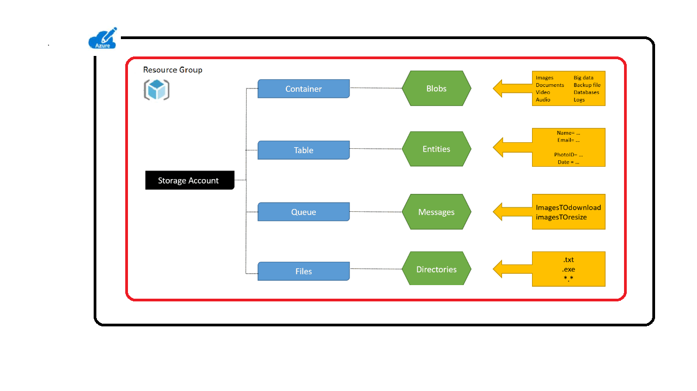

As the solution architect for your organization's healthcare system, you want to start preparing the foundations for your highly available healthcare application deployment.

In this exercise, you create an Azure storage account and configure the account for RA-GRS. By default, the storage account is set to LRS when you create it. Because you want the application to be highly available, you change the mode to RA-GRS. The storage account is used as a disaster-recovery feature to ensure that the application is always running.

First, create an Azure storage account to store the application data.



## Create an Azure storage account to host healthcare application

Create a storage account. The storage account hosts the healthcare application.

1. In Cloud Shell, run the following commands:

    ```bash
    STORAGEACCT=$(az storage account create \
            --resource-group <rgn>[Sandbox resource group]</rgn> \
            --name healthcareapp$RANDOM \
            --sku Standard_RAGRS \
            --output tsv \
            --query "name")
  
    echo $STORAGEACCT
    ```

    Make a note of the value of the **\$STORAGEACCT** variable if you need to re-create it in a later exercise.

    This step sets the replication policy of the storage account to RA-GRS, which enables the application to fail over to the secondary region if there's an outage.

1. Verify the replication status by running the following command:

    ```azurecli
        az storage account show \
            --name $STORAGEACCT \
            --query "[statusOfPrimary, statusOfSecondary]"
    ```

   The status of the primary and secondary sites should both be listed as *available*.

## Retrieve the connection string for the storage account

1. To obtain the connection string for the storage account that you created in the previous section, run the following command:

    ```azurecli
        az storage account show-connection-string \
            --name $STORAGEACCT \
            --resource-group <rgn>[Sandbox resource group]</rgn>
    ```

1. Copy the output connection string and save it for reference later in this module.

## Fail over Azure storage account

Use Cloud Shell to view the replication status of your storage account. To view the status of the primary and secondary locations, run the following command:

```azurecli
    az storage account show \
        --name $STORAGEACCT \
        --expand geoReplicationStats \
        --query "[primaryEndpoints, secondaryEndpoints, geoReplicationStats]"
```

The output shows useful information that's related to the primary endpoint, the secondary endpoint, and the last time data was synchronized across regions.

If the command returns the error *Last sync time is unavailable for account healthcareappnnnn*, wait a few minutes and repeat the command.
