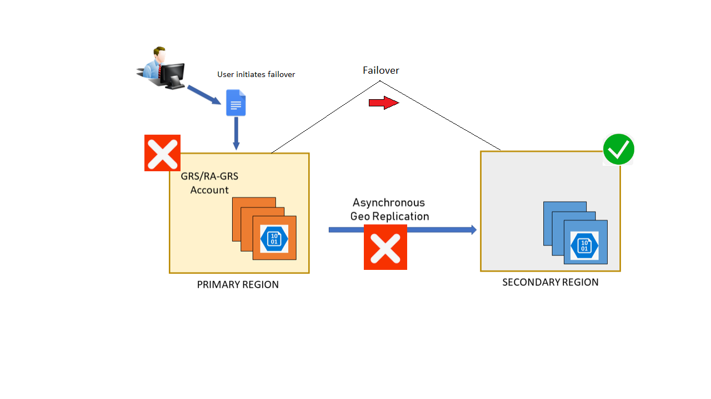

You've created your storage account in Azure and configured the replication settings to enable RA-GRS. You're now ready to start designing the healthcare application to make use of the RA-GRS storage account. This approach helps to ensure that the application is highly available for doctors and consultants in the field, even if there's an outage in their primary region.

In this unit, you look at how to design and configure an application that can handle disaster recovery and failover. You also explore the considerations that apply when you design applications for high availability.

## How an account failover works

When you configure a storage account for GRS or RA-GRS, the client writes data to the primary endpoint or region. The data is then automatically replicated across to the secondary region, as shown in the following image:


If the primary region that hosts your geo-redundant storage becomes unavailable, you can fail over to the secondary region.

When failover occurs, the secondary region becomes your new primary region, and all data is then accessible from this new primary region. All DNS records, which relate to your storage account, have their DNS endpoints updated to point to the new primary region. This redirection requires no changes to your application code.

A failure in the primary region is shown in the following image:



> [!IMPORTANT]
> Failover is automatic and controlled by Microsoft. A manual failover of an Azure storage account isn't possible in the majority of the Azure regions. However, Microsoft has made a new feature available in WestUS2 and CentralUS regions with which you can manually failover the storage account by using the following command:
>
> ```bash
> az storage account failover --name "storageaccountname"
> ```

## Implications of a storage account failover

When a storage account failover occurs, you could lose data. Data from the current primary region might not replicate across to the secondary region at the time of the failover. To determine whether there's likely to be data loss, you can check the **Last Sync Time** property. You used the command for finding this value in the previous exercise to review the storage account replication status.

## Design a resilient application

When you design your application, consider the following factors:

- **Resiliency**: The ability to recover from a failure and continue to function, to avoid downtime and data loss.

- **High availability**: The ability to continue to function in a healthy state if there's a hardware fault, a server fault, or network issues that affect one or more components of the application.

- **Disaster recovery**: The ability to recover if a major incident affects the services that host the application, such as a datacenter outage or complete regional outage. Disaster recovery includes manually failing over an application by using Azure Site Recovery. With Azure Site Recovery, you can fail over servers between Azure regions or Azure backups. You can then restore a database or application from a backup.

- **Eventual consistency**: RA-GRS works by replicating data from the primary endpoint to the secondary endpoint. The data, which is replicated between the regions, isn't immediately available at the secondary location. Eventual consistency means that all of the transactions on the primary region eventually appear in the secondary region. The data isn't lost, but there might be some lag.

    The following table shows the effects of eventual consistency on the healthcare system. When new or updated records are written to the primary region, the latest records are immediately available in the primary storage location. These updates are eventually propagated to the secondary regions, but there might be a delay before propagation occurs. An application that reads data from a secondary location might see out-of-date data for a short while.

    | Time | Transaction | Replication | Last sync time | Result |
    | ------| -------- | --------------- | --------------- | ------ |
    | T0 | Doctor adds patient record|  |  | Transaction is added but not replicated |
    | T1 |  | Record is replicated | T1 | Last Sync Time field is updated |
    | T2 | Consultant updates patient record | |T1 | Record is updated in primary region but not replicated |
    | T3 | Read record from secondary region | | | Data from the secondary region is stale, because updates haven't yet been replicated from the primary region |
    | T4 |  | Record replicated | T4 | Data at secondary region is now updated; Last Sync Time field is updated |

## Best practices for cloud-based applications with RA-GRS

When you develop applications for the cloud, consider the guidelines in the next sections.

### Retry transient failures

Many conditions can cause transient failures, from a disconnected database, temporary loss of network, or latency issues that cause slow response times from services. Applications must detect the faults and determine whether it's merely a blip in the service or a more severe outage. The application must have the capability to retry a service if it believes the fault is likely to be transient, before listing it as failed.

### Handle failed writes

RA-GRS replicates writes across locations. If the primary location fails, you can direct read operations toward the secondary location. However, this secondary location is read-only. If a long-lasting outage (more than a few seconds) occurs at the primary location, your application must run in read-only mode. You can achieve read-only mode in several ways:

- Temporarily return an error from all write operations until write capability is restored.
- Buffer write operations, perhaps by using a queue, and enact them later when the write location becomes available.
- Write updates to a different storage account in another location. Merge these changes into the storage account at the primary location when it becomes available.
- Trigger the application to disable all write operations and inform the user that the application is running in read-only mode. You can also use this mechanism if you need to upgrade the application and ensure that no one is using the primary location while the upgrade is taking place.

An application that uses the Azure Storage client library can set the *LocationMode* of a read request to one of the following values:

- **PrimaryOnly**: The read request fails if the primary location is unavailable. This failure is the default behavior.
- **PrimaryThenSecondary**: Try the primary location first, then try the secondary location if the primary location is unavailable. Fail if the secondary location is also unavailable.
- **SecondaryOnly**: Try only the secondary location, and fail if it's not available.
- **SecondaryThenPrimary**: Try the secondary location first, and then try the primary location.

### Handle eventual consistency

Be prepared to handle stale data if it's read from a secondary region. It takes time to replicate data between regions, and an outage can occur between the time when data is written to the primary location and it's replicated to each secondary location.

### Use the Circuit Breaker pattern

In distributed environments, communication between remote resources can fail because of slow network connections, resource timeouts, resources being offline, or a transmission problem corrupting data in transit. Most of the time, these issues are transient and resolve themselves. If the application retries the same operation, it often succeeds.

In some situations, when an outage is severe, it makes sense for the application to stop retrying the operation and instead start failover to a secondary site.

To prevent an application from retrying operations that have failed, you can implement the Circuit Breaker pattern.

The Circuit Breaker pattern forces the application to fail over to the secondary site, which allows the application to resume its normal service. At the same time, the circuit breaker continues to check whether the resources on the primary site are back online. When they do come online, it allows the application to reconnect to the primary site. The circuit breaker acts as a proxy. It monitors the service. If there's a failure in the service, the circuit breaker prevents the application from retrying that endpoint and forces it to go to an alternative endpoint.

The difference between the Circuit Breaker pattern and the Retry pattern is that the Retry pattern allows an application to keep retrying a connection to a resource that might be offline. The Circuit Breaker pattern prevents this behavior and fails over the application to the secondary connection.

The purpose of implementing a Circuit Breaker pattern is to provide stability to your application while the system recovers from a failure.

Use the Circuit Breaker pattern to prevent an application from trying connections to resources that have failed and, instead, to minimize disruption by redirecting the connection to working resources. Don't use the Circuit Breaker pattern for accessing local or in-memory data structures, because circuit breakers would add overhead to the system.

When you implement the Circuit Breaker pattern, set the *LocationMode* of read requests appropriately. Most of the time, you should set this mode to *PrimaryThenSecondary*. If the read from the primary location times out, the secondary location is used. However, this process can slow down an application if it's done repeatedly. After the circuit breaker has detected that the primary location is unavailable, it should switch the mode to *SecondaryOnly*. This action ensures that read operations don't wait for a timeout from the primary location before trying the secondary location. When the circuit breaker estimates that the primary location has been repaired, it can revert back to the *PrimaryThenSecondary* mode.

For more information, check out [Circuit Breaker pattern](/azure/architecture/patterns/circuit-breaker).