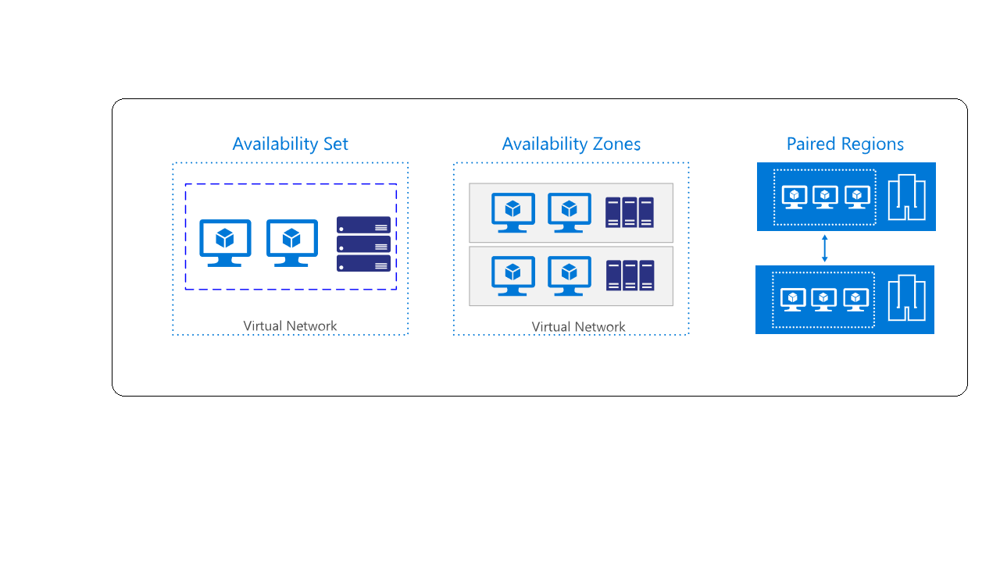

You've created your storage account in Azure and configured the replication settings to enable RA-GRS.  Now you're ready to start designing the EasyHealthCare application to make use of the RA-GRS storage account. This approach helps to ensure the application is highly available for doctors and consultants in the field.  Doctors and consultants can access data and upload records 24/7, even if there's an outage in their Primary region.

In this unit, you'll look at how to design and configure an application that can handle disaster recovery and fail over. You'll learn about considerations that must be taken when designing applications for high availability.

## How an account fail-over works

When you configure a storage account GRS or RA-GRS, the client writes data to the primary endpoint or region. The data is then automatically replicated across to the secondary region. The diagram below shows this process

.

If the primary region hosting your geo-redundant storage becomes unavailable, you can fail over to the secondary region.

When failover occurs, the secondary region becomes the new primary region, and all data is then accessible from your new primary. All DNS records, which relate to your storage account, have their DNS endpoints updated to point to the new primary region. This redirection doesn't require any changes to your application code.

The following diagram shows what happens when the primary region fails

.

## Implications of storage account failover

If you initiate a storage account failover, the DNS records are updated so that the secondary region becomes the new primary region. There's potential that you could lose data if you fail over the storage account. Data from the current primary region might not have replicated across to the secondary region at the time of invoking failover. To determine if there's likely to be data loss, you can check the **Last Sync Time** property.  The command to find this value was used in the previous exercise to review the storage account replication status.

## How to design a resilient application

There are a number of factors you need to consider when designing your application to be resilient and highly available.  Some of the areas you must consider include:

- **Resiliency** - This is the ability for the application to recover from a failure and continue to function, to avoid downtime and data loss

- **High availability** -  This is the capability of the application to continue to function in a healthy state in the event there is a hardware fault, server fault, or network issues impacting one or more components of the application.

- **Disaster recovery** - This is the ability to recover the application if there's a major incident impacting the services hosting the application such as a datacenter outage, or complete regional outage.  Disaster recovery includes manually failing over an application using ASR (Azure Site Recovery). ASR enables you to fail over servers between Azure regions or Azure backups. You can then restore a database or application from backup.

- **Eventual consistency** - Read Access-Geo Redundant Storage (RA-GRS) works by replicating data from the primary endpoint to the secondary endpoint.  The data, which is replicated between the regions is not available at the secondary location immediately.  Eventual consistency means that all the transactions on the primary region will eventually appear at the secondary region. The data isn't lost, but there may be some lag. The table below shows the effects of eventual consistency in the EasyHealthCare system. When a doctor uploads a new record to primary region, or when a consultant updates an existing record, the latest records are immediately available in the primary storage location. The updates are eventually propagated to the secondary regions, but there may be a delay before this occurs. An application reading data from a secondary location may see out-of-date data for a short while.

| Time  | Transaction | Replication     | Last Sync Time  | Result |
| ------| --------    | --------------- | --------------- | ------ |
| T0    | Doctor adds patient record| - | - | Transaction added but not replicated |
| T1    | -       | Record replicated | T1       | Last Sync Time field updated  |
| T2    | Consultant updates patient record | -|T1 | Record updated on primary but not replicated |
| T3    | Read records from secondary region | | | When you read data from the secondary, you get stale data as this hasn't yet been replicated from the primary |
| T4    |    -        | Records replicate |    -           | Data at secondary now updated. Last Sync Time updated |

## Azure Features that support high availability

There are several features available within Azure that you can use to make an application redundant at various levels, from a server failure, hardware fault, or an entire region outage.

.

- **Availability sets**. If your application is hosted on virtual machines, you should deploy two or more virtual machines in an Azure availability set. Using an availability set protects your application against hardware faults, servers issues, server maintenance, and network faults.  With availability sets, servers are split across different fault and update domains, to provide resiliency against all issues listed above

- **Availability Zones**. An availability zone (AZ) is a separate facility within an Azure region.  A facility is commonly known as a datacenter.  There are usually two or three AZs within one region. Each AZ has access to its own set of hardware, power, and networks. Deploying your application across AZs will protect your application from a datacenter failure by ensuring that servers are still accessible in the other AZs.

- **Azure Site Recovery**. Using Azure Site Recovery (ASR) you can replicate virtual machines to another Azure region for disaster recovery and business continuity.  Virtual machines replicate across from primary to secondary regions based on a replication policy you set. In the event of an Azure region failure, you can invoke disaster recovery by bringing the virtual machines online in the secondary region.  Once the primary region is back online, you can easily fail back the virtual machines.

- **Azure Health Dashboard**. The health dashboard tracks the health of your applications and Azure Services.  An application must be designed to cope with network blips, so set up alerting for monitoring possible outages.

- **Azure Backup**. USe this service to ensure that you have a backup of your data and virtual machines to recover from a complete service failure.

## Best practices for cloud-based applications

This section summarizes some general guidelines you should follow when developing an application for the cloud.

### Retry transient failures

Transient failures can be caused by a number of conditions from a disconnected database, temporary loss of network, latency issues causing slow response from service. Applications must detect the faults and determine whether it's simply a blip in the service, or a more severe outage.  The application must have the capability to retry a service if it believes the fault is likely to be transient, before listing it as failed.

### Load balance across virtual machines

When you deploy an application in the cloud, you can load balance the traffic to the application by placing the virtual machines behind a load balancer and distributing the traffic to the virtual machines. If there's a fault with one of the servers, the load balancer will detect this and take the server out of service.

You can also scale out the application across more than one virtual machine. If demand increases to your application, the application can spread the load across virtual machines to help improve performance.

Use Azure Traffic Manager to distribute traffic across endpoints. You can distribute traffic to your application running in the primary region. If there's a failure with the servers in the primary region, Azure Traffic Manager will detect this failure and redirect the traffic to the secondary region.

### Replicate data

Replicate data across to secondary regions, so that the data can still be accessed if there's an outage in the primary region.  Use geo-redundant storage accounts across regions. If you're deploying applications that use databases like SQL or Cosmos DB, use the replication features of these services to copy the data across to a secondary region.

You can also make use of ASR to replicate virtual machines between regions. ASR replicates the data to a target region and when an outage occurs you can fail over to the secondary location.

### Use the Circuit Breaker pattern

In distributed environments, communication between remote resources can fail because of slow network connections, resources timeouts, resources being offline, or a transmission problem corrupting data in transit. A majority of the time these issues are transient and will resolve themselves. If the application retries the same operation, it often succeeds.

In some situations when the outage is severe, it makes sense for the application to stop retrying the operation and instead initiate fail over to a secondary site.
To prevent an application to keep retrying operations that have failed, you can implement the Circuit Breaker pattern.  

The circuit breaker pattern forces the application to fail over to the secondary site allowing the application to resume its normal service.  At the same time, the circuit breaker will continue to check if the resources on the primary site are back online, and when they do come online, it will allow the application to reconnect to the primary site. The circuit breaker acts like a proxy; it monitors a service and if there's a failure in the service, it prevents the application from retrying that endpoint and forces it to go to an alternative endpoint.

The difference between the Circuit Breaker pattern and the Retry pattern, is that the  Retry pattern will allow an application to keep retrying a connection to a resource, which may be offline. The circuit breaker pattern will prevent this behavior and fail over the application to the secondary connection.

The purpose of implementing a Circuit Breaker pattern is to provide stability to your application while the system recovers from a failure.

Use the Circuit Breaker pattern to prevent an application from trying connections to resources, which have failed, and instead redirecting the connection to working resources to minimize disruption. Don't't use the Circuit Breaker pattern for accessing local or in-memory data structures, as circuit breakers would add overhead to the system.

For more information, see [Circuit Breaker pattern](https://docs.microsoft.com/azure/architecture/patterns/circuit-breaker)