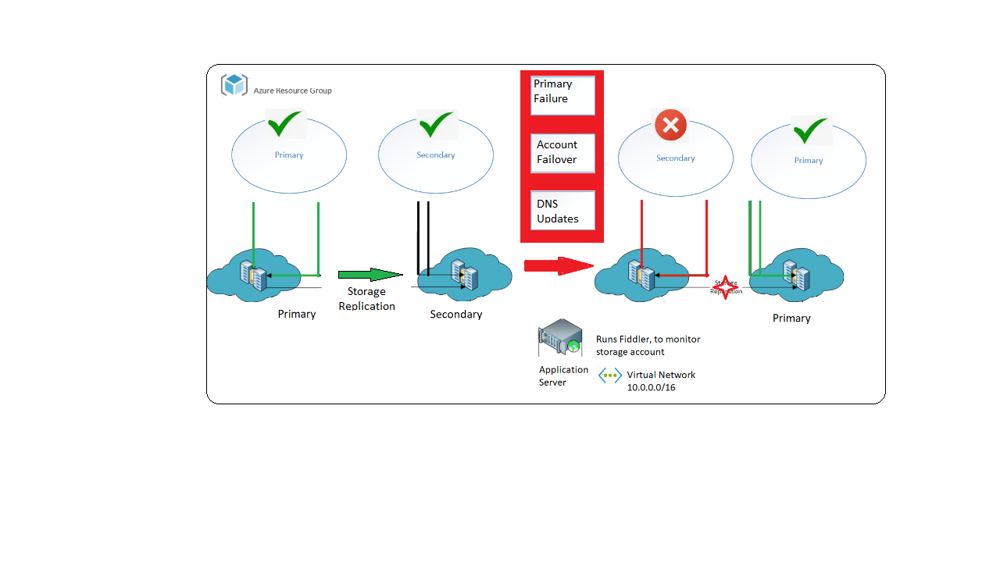

You're now ready to start implementing the design to deploy a highly available application. To test the application, download and install Fiddler.

Recall that your application needs to automatically fail over and use the storage accounts at the secondary location if there's a failure connecting to the primary region that holds your data in Azure storage. The circuit breaker forces the application to behave in this manner. When the primary location is back online, the circuit breaker reroutes the application back to the primary region.

Before you commit to full-blown development of the healthcare application, you want to test this approach by using a sample application with dummy data.

In this exercise, you run an application that shows how you can use the Circuit Breaker pattern with an RA-GRS storage account. When a problem is detected, the application switches to the secondary storage account, and it fails back to the primary location when it's available again. The application uploads a file to Blob storage and then loops, repeatedly downloading the same file. If there's an error reading the storage account from the primary location, the application retries the operation. If the retry fails after repeated attempts, the application switches to the storage account at the secondary location. The application reads the data from the secondary location until the number of reads has exceeded a specified threshold. The application then attempts to switch back to the primary location, but it returns to the secondary location if the primary location is still unavailable.



## What is Fiddler?

Fiddler is a third-party tool that's used to help debug applications, particularly web applications. It captures network traffic between computers and, based on the result, uses its event-based scripting subsystem to halt connections.

In this unit, you use Fiddler Classic to monitor the connection to the storage account for the healthcare application. When the application detects that consultants are no longer able to download blobs from storage, it starts a failover to the secondary storage account. When it detects that the primary connection is available again, it redirects the connections to the primary location. In Fiddler, you can see the traffic being directed to the various storage account endpoints.

If you don't have Fiddler Classic installed already, download and install it from the [Telerik Fiddler home page](https://www.telerik.com/download/fiddler?azure-portal=true).

> [!NOTE]
> Fiddler has released a new version of their application. This exercise uses Fiddler Classic, which is currently only available for Windows.

## Install Visual Studio and download the sample code

The application code runs locally on your desktop. You need Visual Studio to build the application.

1. If you don't already have Visual Studio 2019 installed, you can download a free version from the [Visual Studio 2019 home page](https://visualstudio.microsoft.com/vs/?azure-portal=true).

1. Use Git to download the sample code. Open a Git command prompt window, and run the following command to download the circuit breaker sample application to your computer. Replace *\<folder>* with a convenient location on your hard drive:

    ```bash
    git clone https://github.com/MicrosoftDocs/mslearn-ha-application-storage-with-grs <folder>
    ```

    > [!NOTE]
    > This sample repository uses .NET 3.1. If you need to use a more recent framework version, such as .NET 6.0, open the **circuitbreaker.csproj** file. Change the target framework line under `<PropertyGroup>` to `<TargetFramework>netcoreapp6.0</TargetFramework>`.

## Configure Fiddler

1. Start Fiddler.

1. On the **Tools** menu, select **Options**.

1. In the **Options** pane, select the **HTTPS** tab.

1. On the **HTTPS** tab, select **Decrypt HTTPS traffic**. If you're prompted to install more certificates from Fiddler, accept them, and then close and restart Fiddler.

    :::image type="content" source="../media/5-fiddler-options.png" alt-text="Screenshot of the Fiddler HTTPS configuration tab in the Options dialog box." loc-scope="third-party"::: <!--Fiddler, no-loc -->

## Examine the sample application

1. Switch to the Cloud Shell window in the browser.
1. To obtain the connection string for the storage account you created in the previous exercise, run the following command:

    ```azurecli
        az storage account show-connection-string \
            --name $STORAGEACCT \
            --resource-group <rgn>[Sandbox resource group]</rgn>
    ```

1. Copy the output connection string to the clipboard.

1. Start Visual Studio, and open the *CircuitBreaker.sln* solution that you downloaded from GitHub. This application implements the Circuit Breaker pattern to manage connections to a replicated Azure storage account. The circuit breaker detects whether the connection to the primary location is available. If it isn't available, the circuit breaker switches to the secondary account for a short while before it retries the primary location.

1. In the **Solution Explorer** window, double-click the *Program.cs* file. This file contains the C# source code for the application.

1. In the `Program` class, locate the following statement:

    ```csharp
        static string storageConnectionString = "<Add your storage connection string here>";
    ```

    Replace *\<Add your storage connection string here>* with the connection string from the clipboard.

1. Scroll down to the start of the `RunCircuitBreakerAsync` method:

    ```csharp
        /// <summary>
        /// Main method. Sets up the objects needed, then performs a loop
        ///   to perform a blob operation repeatedly, responding to the Retry and Response Received events.
        /// </summary>
        private static async Task RunCircuitBreakerAsync()
    ```

1. In this method, locate the following block of code:

    ```csharp
        // Define a reference to the actual blob.
        CloudBlockBlob blockBlob = null;
    
        // Upload a BlockBlob to the newly created container.
        blockBlob = container.GetBlockBlobReference(ImageToUpload);
        await blockBlob.UploadFromFileAsync(ImageToUpload);
    ```

    This code uploads the sample data (an image file) to a blob in your storage account.

1. Examine the block of code that follows these statements:

    ```csharp
        // Set the location mode to secondary so you can check just the secondary data center.
        BlobRequestOptions options = new BlobRequestOptions();
        options.LocationMode = LocationMode.SecondaryOnly;
    
        // Before proceeding, wait until the blob has been replicated to the secondary data center.
        // Loop and check for the presence of the blob once per second
        //   until it hits 60 seconds or it finds it.
        int counter = 0;
        while (counter < 60)
        {
            counter++;
    
            Console.WriteLine("Attempt {0} to see if the blob has replicated to secondary yet.", counter);
    
            if (await blockBlob.ExistsAsync(options, null))
            {
                    break;
            }
    
            // Wait a second, then loop around and try again.
            // When it's finished replicating to the secondary, continue on.
            await Task.Delay(1000);
        }
        if (counter >= 60)
        {
            throw new Exception("Unable to find the image on the secondary endpoint.");
        }
    ```

    This code attempts to verify that the data has been replicated to the secondary location. If the blob doesn't appear in this location after 60 seconds, the code times out with an exception.

1. Examine the following statement:

    ```csharp
        // Set the starting LocationMode to PrimaryThenSecondary. 
        // Note that the default is PrimaryOnly. 
        // You must have RA-GRS enabled to use this.
        blobClient.DefaultRequestOptions.LocationMode = LocationMode.PrimaryThenSecondary;
    ```

    This statement specifies that the application should attempt to read from the primary storage location first, and then from the secondary location if the primary location is unavailable.

1. Scroll down to the following block of code:

    ```csharp
    for (int i = 0; i < 1000; i++)
    {
            if (blobClient.DefaultRequestOptions.LocationMode == LocationMode.SecondaryOnly)
            {
                    Console.Write("S{0} ", i.ToString());
            } else
            {
                    Console.Write("P{0} ", i.ToString());
            }
            ...
    }
    ```

    This code iterates for 1000 times, downloading the data from Blob storage. The first *if...else* statement displays the iteration number of the download attempt (starting at 0), together with a prefix (either "P" or "S"), indicating whether the blob was downloaded by using the primary or secondary storage location.

1. Examine the following block. Some statements have been omitted to focus on the logic of this code:

    ```csharp
        // Set up an operation context for the downloading the blob.
        OperationContext operationContext = new OperationContext();

        try
        {
            // Hook up the event handlers for the Retry event and the Request Completed event.
            // These events are used to trigger the change from primary to secondary and back.
            operationContext.Retrying += OperationContextRetrying;
            operationContext.RequestCompleted += OperationContextRequestCompleted;

            // Download the file.
            Task task = blockBlob.DownloadToFileAsync(string.Format("./CopyOf{0}", ImageToUpload), FileMode.Create, null, null, operationContext);
            ...
            await task;
            ...
        }
        catch (Exception ex)
        {
            // If you get a gateway error here, check to ensure that your storage account redundancy is set to RA-GRS.
            Console.WriteLine(ex.ToString());
        }
        finally
        {
            // Unhook the event handlers so everything can be garbage collected properly.
            operationContext.Retrying -= OperationContextRetrying;
            operationContext.RequestCompleted -= OperationContextRequestCompleted;
        }
    }
    ```

    This block implements part of the Circuit Breaker pattern. The `OperationContext` object provides events that you can use to retry a failed request. A *Retrying* event occurs when a request fails and is being retried. A *RequestCompleted* event is raised when the request has finished, either successfully or with a failure. The `DownloadToFileAsync` method downloads the blob data from storage, and it also takes the `OperationContext` object as a parameter. If the download fails, the operation runs the `OperationContextRetrying` method. When the download is completed, it runs the `OperationContextRequestCompleted` method.

1. Scroll down to the **OperationContextRetrying** method:

    ```csharp
    /// Retry Event handler 
    /// If it has retried more times than allowed, and it's not already pointed to the secondary location,
    ///   flip it to the secondary location and reset the retry count.
    /// If it has retried more times than allowed, and it's already pointed to the secondary location, throw an exception. 
    private static void OperationContextRetrying(object sender, RequestEventArgs e)
    {
        retryCount++;
        Console.WriteLine("Retrying event because of failure reading the primary. RetryCount = " + retryCount);

        // Check to see whether we've had more than n retries. In which case, switch to the secondary location.
        if (retryCount >= retryThreshold)
        {

            // Check to see whether we can fail over to the secondary location.
            if (blobClient.DefaultRequestOptions.LocationMode != LocationMode.SecondaryOnly)
            {
                blobClient.DefaultRequestOptions.LocationMode = LocationMode.SecondaryOnly;
                retryCount = 0;
            }
            else
            {
                throw new ApplicationException("Both primary and secondary are unreachable. Check your application's network connection. ");
            }
        }
    }
    ```

    This method tracks how many times in succession the request has failed. If this number exceeds a specified threshold, the method changes the `LocationMode` property of the blob client to force it to download data from the secondary location.

1. Find the `OperationContextRequestCompleted` method:

    ```csharp
    /// RequestCompleted Event handler 
    /// If it's not pointing at the secondary location, let it go through. It either was successful 
    ///   or it failed with a nonretryable event (which we hope is temporary).
    /// If it's pointing at the secondary location, increment the read count. 
    /// If the number of reads has hit the threshold of the number of reads you want to do against the secondary location
    ///   before you switch back to primary location, switch back and reset the secondaryReadCount. 
    private static void OperationContextRequestCompleted(object sender, RequestEventArgs e)
    {
        if (blobClient.DefaultRequestOptions.LocationMode == LocationMode.SecondaryOnly)
        {
            // You're reading the secondary location. Let it read the secondary location [secondaryThreshold] times, 
            //    then switch back to the primary and see whether it's available now.
            secondaryReadCount++;
            if (secondaryReadCount >= secondaryThreshold)
            {
                blobClient.DefaultRequestOptions.LocationMode = LocationMode.PrimaryThenSecondary;
                secondaryReadCount = 0;
            }
        }
    }
    ```

    If the download has been successful, this method checks to see which location was used (primary or secondary). The method tracks the number of successive downloads that are performed by using the secondary location. When this number exceeds a threshold value, the code forces a switch back to the primary location. If the primary location is now available, it's used for the remaining downloads. If the primary location is still unavailable, the download operation fires the `Retrying` event of the `OperationContext` object, which switches back to the secondary location again.

## Test the application and trigger a failover

1. On the **Debug** menu, select **Start Debugging** to run the application.

    The application starts by uploading a file to your Azure storage account. The application waits until the file has been replicated to the secondary storage account location, and then it loops, downloading the file repeatedly. The application displays a message containing an iteration number and a prefix that indicates that a file was downloaded from the primary location. For example, it displays *P0* for the first iteration, *P1* for the second iteration, and so on.

    :::image type="content" source="../media/5-app-download.png" alt-text="Screenshot of the output from the sample application, showing the messages displayed as the data is repeatedly downloaded." loc-scope="other"::: <!-- no-loc -->

1. While the app is running, switch to Fiddler. Fiddler shows the HTTP traffic uploading the file to your storage account and then downloading the data again. The left pane displays a list of requests that are sent to your storage account, similar to the list shown in the following image:

    :::image type="content" source="../media/5-fiddler-status.png" alt-text="Screenshot of the Fiddler application, showing the traffic sent to your Azure storage account by the sample application." loc-scope="other"::: <!-- Fiddler, no-loc -->

1. Return to the application window, and press any key to pause it.

1. In Fiddler, on the **Rules** menu, select **Customize Rules**.

1. Search for the **OnBeforeResponse** function. Add the following code to this function, after the existing statements in this function. Replace *\<storage account name\>* with the name of the storage account that you created in the previous exercise:

    ```javascript
    if (oSession.hostname == "<storage account name>.blob.core.windows.net") {
        oSession.responseCode = 503;
    }
    ```

    The JavaScript code you added to the Fiddler **OnBeforeResponse** function returns an HTTP 503 (Service Unavailable) error for requests to the primary storage account location. This error simulates the inaccessibility of the storage endpoint. The Circuit Breaker code in the sample application should detect this failure and fail over to the secondary storage location. The data was previously replicated from the primary to the secondary storage location by Azure, so the data should be accessible.

1. On the **File** menu, select **Save**.

1. Return to your application, and press any key to continue running it.

   Fiddler displays the HTTP 503 errors that are being generated against the primary location. The application window displays the message *Retrying event because of error reading the primary*. After five retries, the circuit breaker in the application switches to the secondary location and starts reading from it instead. You see messages with the *S* prefix for secondary rather than *P* for primary. After the circuit breaker reads from the secondary account for a short period, it attempts to switch back to the primary location. This attempt fails, so the circuit breaker reverts to the secondary location for another period. This process continues until the primary location becomes available again, as shown in the following image:

   :::image type="content" source="../media/5-app-switch.png" alt-text="Screenshot of the output from the sample application, showing the switch from the primary account to the secondary account." loc-scope="other"::: <!-- no-loc -->

1. Press any key to pause the application once again.

1. In Fiddler, remove the code that you added earlier to the **OnBeforeResponse** function, and save the script.

1. Return to your application and press any key to continue running it. The application now successfully reverts to the primary storage account location.

1. Close the application, and then close Visual Studio.

1. In Fiddler, on the **Tools** menu, select **Options**.

1. In the **Options** pane, select the **HTTPS** tab.

1. On the **HTTPS** tab, select **Actions**, then select **Reset All Certificates**. Allow Fiddler to remove its certificates from the Trusted Root List and the Root Store. This action removes the HTTPS inspection certificate that Fiddler installed earlier.

1. Select **OK**, then close Fiddler.

You've verified that the data uploaded to an Azure storage account is replicated across different regions. You've seen how an application can use the Circuit Breaker pattern to handle connection failures, and how it switches from the primary to the secondary storage account location. The application can revert back to the primary location when the connection becomes available again.
