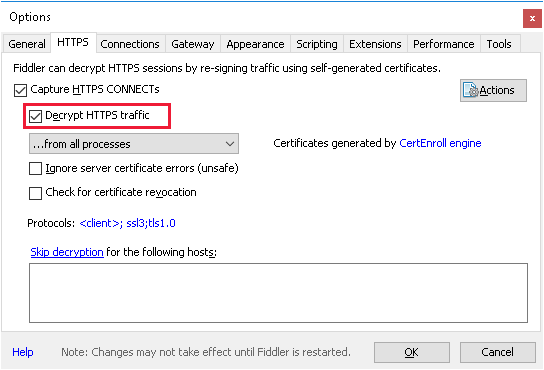
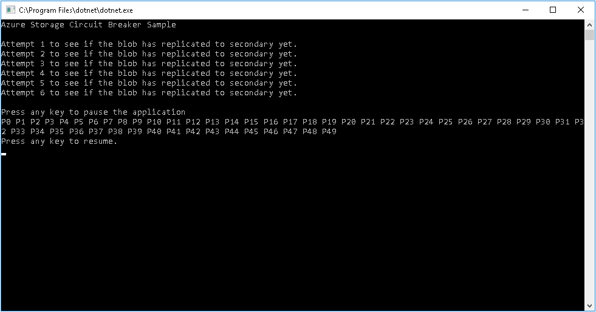
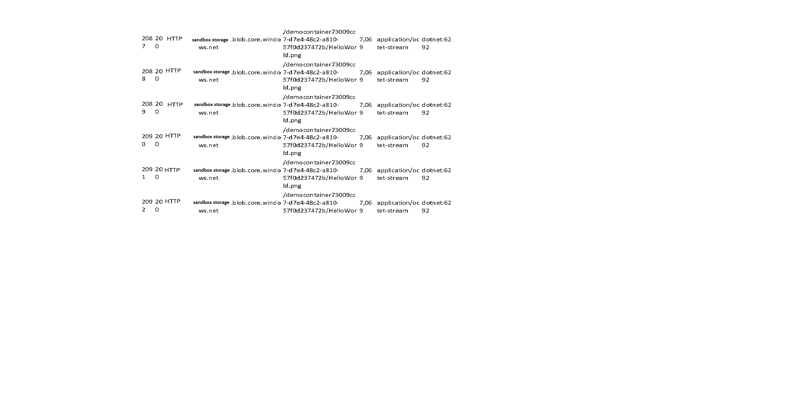
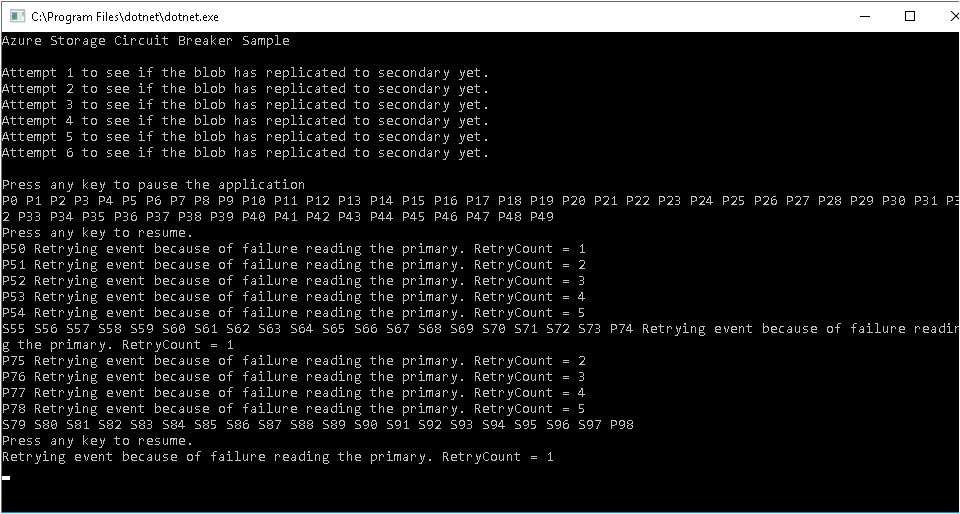

As the Solution Architect for the health care system, you're now ready to start implementing the design to deploy a highly available application. You're also going to download and install Fiddler that you'll use to test the application.

In the health care system, your application should automatically failover and use the storage accounts at the secondary location if there's a failure connecting to the primary region holding your data in Azure storage. The circuit breaker should force the application to behave in this manner. When the primary location is back online, the circuit breaker should reroute the application back to the primary region. Before committing to full-blown development of the health care application, you want to test this approach using a sample application with dummy data.

In this exercise, you’ll run an application that shows how you can use the Circuit Breaker pattern with an RA-GRS storage account. The application switches to the secondary storage account when a problem is detected, and fails back to the primary location when it's available again. The application uploads a file to blob storage, it then loops, repeatedly downloading the same file. If there's an error reading the storage account from the primary location, the application retries the operation. If the retry fails after a number of repeated attempts, the application switches to the storage account at the secondary location. The application reads the data from the secondary location until the number of reads has exceeded a specified threshold. The application then attempts to switch back to the primary location, but returns to the secondary location if the primary location is still unavailable.


## What is Fiddler?

The Fiddler tool is a third-party tool that is used to help you debug applications, in particular web applications. It captures network traffic between computers, and based on the result, uses its event-based scripting subsystem to halt connections. In this exercise, you'll use Fiddler to monitor the connection to the storage account for the health care application. When the application detects that consultants are no longer able to download blobs from storage, it will initiate failover to the secondary storage account. When it detects that the primary connection is available again, it will redirect the connections to the primary location. You'll see the traffic being directed to the different storage account endpoints in Fiddler.

If you don't have Fiddler installed already, download it and install from the [Telerik Fiddler home page](https://www.telerik.com/fiddler).

> [!NOTE]
> Fiddler is available for Windows, Linux, and OS X. This exercise works best if you use the Windows version.

## Install Visual Studio and download the sample code

The application code runs locally on your desktop. You require Visual Studio to build the application.

1. If you don't already have Visual Studio 2019 installed, you can download a free version from the [Visual Studio 2019 home page](https://visualstudio.microsoft.com/vs/).

2. Use Git to download the sample code. Open a Git command prompt window, and run the following command to download the CircuitBreaker sample application to your computer. Replace *\<folder>* with a convenient location on your hard drive:

    ```Command Prompt
    git clone https://github.com/MicrosoftDocs/mslearn-ha-application-storage-with-grs <folder>
    ```

## Configure Fiddler

1. Start Fiddler.

2. On the **Tools** menu, click **Options**.

3. In the **Options** dialog box, click the **HTTPS** tab.

4. On the **HTTPS** tab, select **Decrypt HTTPS traffic**. If you're prompted to install additional certificates from Fiddler, accept them, then close Fiddler and restart it.

    

## Examine the sample application

1. Switch to the Cloud Shell window in the browser, and run the following command to obtain the connection string for the storage account you created in the previous exercise:

    ```azurecli
    az storage account show-connection-string \
        --name $STORAGEACCT \
        --resource-group <rgn>[Sandbox resource group]</rgn>
    ```

2. Copy the output connection string to the clipboard.

3. Start Visual Studio, and open the *CircuitBreaker.sln* solution that you downloaded from GitHub. This application implements the Circuit Breaker pattern to manage connections to a replicated Azure storage account. The circuit breaker detects whether the connection to the primary location is available, and if not, switches to the secondary account for a short while before retrying the primary location again.

4. In the **Solution Explorer** window, double-click the **Program.cs** file. This file contains the C# source code for the application.

5. In the **Program** class, locate the following statement:

    ```C#
    static string storageConnectionString = "<Add your storage connection string here>";
    ```

    Replace the text `<Add you storage connection string here>` with the connection string from the clipboard.

6. Scroll down to the start of the **RunCircuitBreakerAsync** method:

    ```C#
    /// <summary>
    /// Main method. Sets up the objects needed, then performs a loop
    ///   to perform a blob operation repeatedly, responding to the Retry and Response Received events.
    /// </summary>
    private static async Task RunCircuitBreakerAsync()
    ```

7. In this method, locate the following block of code:

    ```C#
    // Define a reference to the actual blob.
    CloudBlockBlob blockBlob = null;

    // Upload a BlockBlob to the newly created container.
    blockBlob = container.GetBlockBlobReference(ImageToUpload);
    await blockBlob.UploadFromFileAsync(ImageToUpload);
    ```

    This code uploads the sample data (an image file) to a blob in your storage account.

8. Examine the block of code that follows these statements:

    ```C#
    // Set the location mode to secondary so you can check just the secondary data center.
    BlobRequestOptions options = new BlobRequestOptions();
    options.LocationMode = LocationMode.SecondaryOnly;

    // Before proceeding, wait until the blob has been replicated to the secondary data center.
    // Loop and check for the presence of the blob once a second
    //   until it hits 60 seconds or it finds it.
    int counter = 0;
    while (counter < 60)
    {
        counter++;

        Console.WriteLine("Attempt {0} to see if the blob has replicated to secondary yet.", counter);

        if (await blockBlob.ExistsAsync(options, null))
        {
            break;
        }

        // Wait a second, then loop around and try again.
        // When it's finished replicating to the secondary, continue on.
            await Task.Delay(1000);
    }
    if (counter >= 60)
    {
        throw new Exception("Unable to find the image on the secondary endpoint.");
    }
    ```

    This code attempts to verify that the data has been replicated to the secondary location. If the blob does not appear in this location after 60 seconds, the code times out with an exception.

9. Examine the following statement:

    ```C#
    // Set the starting LocationMode to PrimaryThenSecondary. 
    // Note that the default is PrimaryOnly. 
    // You must have RA-GRS enabled to use this.
    blobClient.DefaultRequestOptions.LocationMode = LocationMode.PrimaryThenSecondary;
    ```

    This statement specifies that the application should attempt to read from the primary storage location first, and then the secondary if the primary location is unavailable.

10. Scroll down to the following block of code:

    ```C#
    for (int i = 0; i < 1000; i++)
    {
        if (blobClient.DefaultRequestOptions.LocationMode == LocationMode.SecondaryOnly)
        {
            Console.Write("S{0} ", i.ToString());
        }
        else
        {
            Console.Write("P{0} ", i.ToString());
        }
        ...
    ```

    This code iterates for 1000 times, downloading the data from blob storage. The first `if..else` block displays the iteration number of the download attempt (starting at 0), together with a prefix (either "P" or "S"), indicating whether the blob was downloaded using the primary or secondary storage location.

11. Examine the following block. Some statements have been omitted, to focus on the logic of this code:

    ```C#
        // Set up an operation context for the downloading the blob.
        OperationContext operationContext = new OperationContext();

        try
        {
            // Hook up the event handlers for the Retry event and the Request Completed event
            // These events are used to trigger the change from primary to secondary and back.
            operationContext.Retrying += OperationContextRetrying;
            operationContext.RequestCompleted += OperationContextRequestCompleted;

            // Download the file.
            Task task = blockBlob.DownloadToFileAsync(string.Format("./CopyOf{0}", ImageToUpload), FileMode.Create, null, null, operationContext);
            ...
            await task;
            ...
        }
        catch (Exception ex)
        {
            // If you get a Gateway error here, check and make sure your storage account redundancy is set to RA-GRS.
            Console.WriteLine(ex.ToString());
        }
        finally
        {
            // Unhook the event handlers so everything can be garbage collected properly.
            operationContext.Retrying -= OperationContextRetrying;
            operationContext.RequestCompleted -= OperationContextRequestCompleted;
        }
    }
    ```

    This block implements part of the Circuit Breaker pattern. The `OperationContext` object provides events that you can use for retrying a failed request. The `Retrying` event occurs when a request fails and is being retried, and the `RequestCompleted` event is raised when the request has finished (either successfully, or with a failure). The `DownloadToFileAsync` method downloads the blob data from storage, but also takes the `OperationContext` object as a parameter. If the download fails, the operation will run the `OperationContextRetrying` method. When the download completes, it will run the `OperationContextRequestCompleted` method.

12. Scroll down to the **OperationContextRetrying** method:

    ```C#
    /// Retry Event handler 
    /// If it has retried more times than allowed, and it's not already pointed to the secondary,
    ///   flip it to the secondary and reset the retry count.
    /// If it has retried more times than allowed, and it's already pointed to secondary, throw an exception. 
    private static void OperationContextRetrying(object sender, RequestEventArgs e)
    {
        retryCount++;
        Console.WriteLine("Retrying event because of failure reading the primary. RetryCount = " + retryCount);

        // Check if we have had more than n retries in which case switch to secondary.
        if (retryCount >= retryThreshold)
        {

            // Check to see if we can failover to secondary.
            if (blobClient.DefaultRequestOptions.LocationMode != LocationMode.SecondaryOnly)
            {
                blobClient.DefaultRequestOptions.LocationMode = LocationMode.SecondaryOnly;
                retryCount = 0;
            }
            else
            {
                throw new ApplicationException("Both primary and secondary are unreachable. Check your application's network connection. ");
            }
        }
    }
    ```

    This method tracks how many times in succession the request has failed. If this number exceeds a specified threshold, the method changes the `LocationMode` property of the blob client to force it to download data from the secondary location.

13. Find the **OperationContextRequestCompleted** method

    ```C#
    /// RequestCompleted Event handler 
    /// If it's not pointing at the secondary, let it go through. It was either successful, 
    ///   or it failed with a nonretryable event (which we hope is temporary).
    /// If it's pointing at the secondary, increment the read count. 
    /// If the number of reads has hit the threshold of how many reads you want to do against the secondary
    ///   before you switch back to primary, switch back and reset the secondaryReadCount. 
    private static void OperationContextRequestCompleted(object sender, RequestEventArgs e)
    {
        if (blobClient.DefaultRequestOptions.LocationMode == LocationMode.SecondaryOnly)
        {
            // You're reading the secondary. Let it read the secondary [secondaryThreshold] times, 
            //    then switch back to the primary and see if it's available now.
            secondaryReadCount++;
            if (secondaryReadCount >= secondaryThreshold)
            {
                blobClient.DefaultRequestOptions.LocationMode = LocationMode.PrimaryThenSecondary;
                secondaryReadCount = 0;
            }
        }
    }
    ```

    If the download has been successful, this method checks to see which location was used (primary or secondary). The method tracks the number of successive downloads performed using the secondary location. When this number exceeds a threshold value, the code forces a switch back to the primary location. If the primary location is now available, it will be used for the remaining downloads. If the primary location is still unavailable, the download operation will fire the `Retrying` event of the `OperationContext` object, which will switch back to the secondary location again.

## Test the application and trigger a failover

1. On the **Debug** menu, click **Start Debugging** to run the application.

    The application starts by uploading a file to your Azure storage account. The application waits until the file has been replicated to the secondary storage account location, and then loops, downloading the file repeatedly. The application displays a message with an iteration number, and a prefix indicating that file was downloaded from the primary location. For example, *P0* for the first iteration, *P1* for the second iteration, and so on.

    

2. While the app is running, switch to Fiddler. Fiddler shows the HTTP traffic uploading the file to your storage account and then downloading the data again. The left-hand pane should display a list of requests sent to your storage account, similar to the following image:

    

3. Return to the application window and press any key to pause it.

4. In Fiddler, on the **Rules** menu, click **Customize Rules**.

5. Search for the **OnBeforeResponse** function. Add the following code to this function, after the existing statements in this function. Replace *\<storage account name\>* with the name of the storage account you created in the previous exercise:

    ```JavaScript
    if (oSession.hostname == "<storage account name>.blob.core.windows.net") {
        oSession.responseCode = 503;
    }
    ```

    The JavaScript code you added to the Fiddler **OnBeforeResponse** function returns an HTTP 503 (Service Unavailable) error for requests to the primary storage account location, to simulate the storage endpoint being unaccessible. The circuit breaker code in the sample application should detect this failure and failover to using the secondary storage location. The data was previously replicated from the primary to the secondary storage location by Azure, so the data should be accessible.

6. On the **File** menu, click **Save**.

7. Return to your application and press any key to continue running it.

8. In Fiddler, you'll see HTTP 503 errors being generated against the primary location. The application window will display the message *Retrying event because of error reading the primary*. After five retries, the circuit breaker in the application switches to the secondary location and starts reading from there instead. You'll see messages with the "S" prefix (for secondary) rather than "P". After reading from the secondary account for a short period, the circuit breaker will attempt to switch back to the primary location. This will fail, so the circuit breaker will revert to the secondary location for another period. This process will continue until the primary location becomes available again:

    

9. Press a key to pause the application once again.

10. In Fiddler, remove the code that you added earlier to the **OnBeforeResponse** function, and save the script.

11. Return to your application and press any key to continue running it. You'll see that the application now successfully reverts to the primary storage account location.

12. Close the application, and then close Visual Studio.

13. In Fiddler, on the **Tools** menu, click **Options**.

14. In the **Options** dialog box, click the **HTTPS** tab.

15. On the **HTTPS** tab, click **Actions**, and then click **Reset All Certificates**. Allow Fiddler to remove its certificates from the Trusted Root List and the Root Store. This action removes HTTPS inspection certificate installed by Fiddler earlier.

16. Click **OK**, and then close Fiddler.

You've verified that data uploaded to Azure storage is replicated across a storage account in different regions. You've seen how an application can use the Circuit Breaker pattern to handle connection failures, and switch from the primary to secondary storage account locations. The application can revert back to the primary location when the connection becomes available again.
