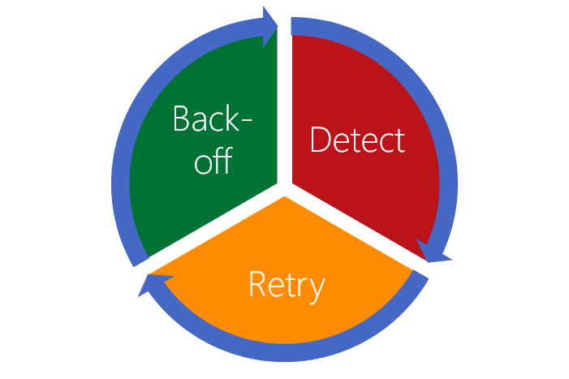

Transient errors (or transient faults) are an error or loss of service that quickly resolves itself.

The following list is some of the reasons an app can experience transient errors, or temporary interruptions, from a cloud-based service:

- The service is accessed over a network, so network issues could interrupt it.
- An app has no control over the stability of the service it's using, the service is a black box.
- An app doesn't have exclusive access to the service, and competes with possibly millions of other apps to use the service.
- How a service is scaled and the infrastructure on which it runs impacts the performance of a service.

In this unit, we examine the categories of transient errors your app can face and the common strategies used to recover from such errors. Then, we discuss an approach you can take in your app to handle all transient error types.

## Transient errors

### Connectivity

The loss of network connectivity is the most obvious error an app connecting to a cloud-based service can face. The connection can be broken locally when, for example, the device the app is running loses Wi-Fi connectivity. The connection can be lost because of DNS or routing errors. Perhaps the data center in which the service is running has gone offline. While a database server is being upgraded, or is under heavy load, the app's connection to it can be lost. In many instances, these problems are self-healing, and the connection goes back online without any external intervention. Build your app to check a connection is available before you start to use it. If the connection becomes unavailable, the app should try to connect again after an amount of time.

### Timeouts

A web-based service can have an active connection, but be unable to respond to calls quickly. How long should your app wait? If you aren't getting a response from a service, should you make the request again? If everyone who is using the service repeatedly makes requests again and again, can the service ever respond? If you retry the operation, is your data going to be duplicated if both the requests are eventually processed?

All apps need to decide when to give up on a request. An app should only retry a request if the operation is known to be idempotent. For example, you may have an operation that increments a value instead of setting it to a desired value. If a caller invokes it multiple times due to automated retries, it may create an undesirable result. Documentation for web service operations, library functions and other kinds of procedure calls should always be clear about whether or not a given procedure is idempotent.

### Throughput

Successful cloud-based services need to have a policy of throttling requests when the service is struggling under load to respond in an appropriate time. By reducing the throughput the service gives to clients, it's able to remain online and useful, rather than crashing and becoming permanently unavailable. Additionally, services should clearly communicate to clients when requests are rejected due to throttling. Clients should be able to respond to those communications by adjusting the rate at which they make requests. This ability to create *backpressure* helps to ensure that all the components in a processing pipeline remain healthy.

### Service unavailability

Perhaps the service you use is currently unavailable. Some APIs may return a time when the app should retry the request. How should your app handle the missing functionality? Apps should *gracefully degrade* and strive to be of use to an end user even if microservices, online storage, or hosted databases the app uses become unreachable. If the service is provided by a third party, you may not have visibility as to when it becomes available again. One approach to handling a service outage is to store a cache of the data returned by services. Your app can then fall back to using the data stored in the cache, and refresh it when the service comes back online.

## An approach to transient errors

Now that we've defined the different transient faults, let's look at an approach that can be used to handle all of them. Then, in the following units, you can implement this approach in your team's chat app.

The first step is for the code to **detect** that an error has occurred. Error detection shouldn't be limited to transient faults. You should implement normal best practice to handle application errors of all kinds. Whatever has caused the fault, detection also has a need to classify the errors being raised. The following list defines three error types:

- **Transient**: It will be self-correcting and that's why retrying the operation could be successful after a short-period of time.
- **Permanent**: The app can't expect a response from the service, and it should try to get the data from another service or a local cache.
- **Terminal**: There's nothing useful the app can do without access to the service, and the app should quit.

Having detected and classified a transient error, the code can use a **retry strategy** using any information the service has given as to when the operation should be retried. If there's no information, the app can still use a retry mechanism. A good retry strategy has the following characteristics:

- A defined maximum number of retries
- Specifies an interval between retries - a random or exponentially growing interval is best
- Uses a configuration file to store these parameters so that they can be adjusted easily without any code changes

Make sure that your retry strategy doesn't make things worse. One of the problems with transient errors is that it's normally external to your app, so you may not get any information as to why it's happening. Your app should avoid doing things that can make the situation worse:

- Don't keep retrying forever
- Immediate retires should only happen once -  after instantly retrying, use a delay between the next retry
- Add randomness to the delays, to avoid colliding with other clients that might be retrying at the same time
- Be aware of the possibility of cascading retries - don't have different layers of an app all retrying an operation as it can lead to exponential growth in the volume of retires

At some point, the app needs to make a decision to stop trying to get a response from a service if it's continually failing. The app should **back-off** from further attempts, and may even have to notify the user that it needs to quit. Apps that implement a good back-off mechanism, allow services like databases, a chance to recover if they are under heavy load.

All the errors have data that can be used to help diagnose them. An approach to logging these errors should be taken in each of the stages. Logging on the detection of an error, logging on the number of retries, and logging when quitting the app. 