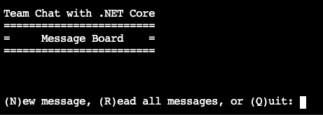
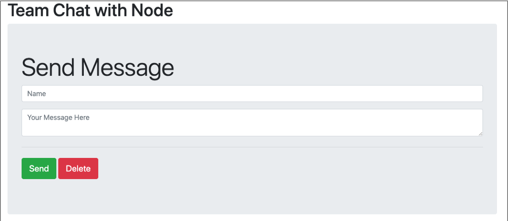

Now, let's add code to detect transient errors in your team's chat app. You can choose to change the C#, Java, or Node.js app. To get started, let's set up the chat app.

## Set up the database

The first thing to do is configure the app's back end. It uses an Azure Cosmos DB with a Mongo API. Use the following set of instructions to set up the database through the Azure CLI.

1. Run the following command in the Cloud Shell to set a variable called COSMOS_DB_NAME with a random name for our database.

    ```bash
    COSMOS_DB_NAME=learn-cosmos-db-$RANDOM
    ```

    [!include[](../../../includes/azure-cloudshell-copy-paste-tip.md)]

1. Run the following `az cosmosdb create` command to create a new Azure Cosmos DB database account.

    ```azurecli
    COSMOS_DB_ENDPOINT=$(az cosmosdb create \
      --resource-group <rgn>[sandbox resource group name]</rgn> \
      --name $COSMOS_DB_NAME \
      --kind MongoDB \
      --query documentEndpoint \
      --output tsv)
     ```

    The option `--kind MongoDB` sets up a Cosmos DB with a MongoAPI.

    > [!NOTE]
    > Setting up the database account can take a while, so please wait for it to complete.

1. Once the creation of our database account has finished, we can create a database in that account.

    ```azurecli
    az cosmosdb database create --name $COSMOS_DB_NAME \
      --resource-group-name <rgn>[sandbox resource group name]</rgn> \
      --db-name chat-app
    ```

    The option `--db-name chat-app` creates a database named chat-app to store your chat documents in.

1. Finally, run the following command in the Azure Cloud Shell to retrieve the connection strings for our new database.

    ```azurecli
    az cosmosdb keys list --type connection-strings \
      --resource-group <rgn>[sandbox resource group name]</rgn> \
      --name $COSMOS_DB_NAME  | sed -n -e '4 p' | sed -E -e 's/.*mongo(.*)true.*/mongo\1true/'
    ```

    This command `az cosmosdb list-connection-strings` returns a json object with connection information, piping `|` the JSON into two `sed` commands to strip out just the MongoDB connection string.
1. Save the connection string as it's needed for the rest of the module.

::: zone pivot="csharp"

## Clone the Chat App repository

Use the following steps to clone the Chat App GitHub repository with `git`. You can execute this right in the Cloud Shell.

1. The source files for the applications that you build in this unit are located in a GitHub repository. Use the following commands to make sure that you are in your home directory in Cloud Shell, and then to clone this repository:

    ```bash
    cd ~
    git clone https://github.com/MicrosoftDocs/mslearn-handle-transient-errors-in-your-app.git
    ```

    The repository is cloned to your home folder.

1. Move into the C# app folder.

    ```bash
    cd ~/mslearn-handle-transient-errors-in-your-app/csharp/chatapp/
    ```

1. Use the code editor to edit **Program.cs**.

    ```bash
    code Program.cs
    ```

1. Update the `connectionString` variable with the connection string value you saved earlier.

    [!code-csharp[](../src/csharp-chatapp/Program.cs?range=16-23&highlight=21)]

1. Select the three ellipses (**...**) to the top right of the editor and then select **Close** in the window click **Save**.

1. Compile and run the .NET Core app.

    ```bash
    dotnet build
    dotnet run
    ```

    The app displays the following interface in the Cloud Shell.

    

1. To test the app, type **N** and enter a name and message for a new message. Type **R** to read all messages posted to date. Type **Q** to quit the app. If you quit the app and then restart, notice that the messages you typed in the last session are available. This happens because the app is connecting to our Mongo DB in Azure Cosmos DB to retrieve all this data.

Let's see what happens when we break the connection to the backend database.

## Add code to detect errors

1. Use the code editor.

    ```bash
    code Program.cs
    ```

1. Scroll down to the getAllChats method. It should look the same as the following method.

    [!code-csharp[](../src/csharp-chatapp/Program.cs?range=69-78&highlight=72)]

    The Find method queries all the documents in the Azure Cosmos DB. But, what if a transient error occurs while we try that operation? Let's start by catching that error.

1. Replace the `getAllChats()` implementation with the code in the following block. Notice that we include a small helper method called `diagnose()` to print the exception message.

    ```csharp
    private static void getAllChats()
    {
        messages = database.GetCollection<ChatMessage>(collectionName);
        try
        {
            allMessages = messages.Find(new BsonDocument()).ToList();
            foreach (ChatMessage chat in allMessages)
            {
                Console.WriteLine(String.Format("{0}: {1}", chat.Name, chat.Message));
            }
            Console.WriteLine("\n");
        }
        catch (MongoDB.Driver.MongoConnectionException e)
        {
            diagnose(e);
        }
        catch (System.TimeoutException e)
        {
            diagnose(e);
        }
        catch (Exception e)
        {
            diagnose(e);
        }
    }

    private static void diagnose(Exception e)
    {
        Console.WriteLine($"Exception raised: {e.GetType()}\n");
    }
    ```

1. Let's save our changes and try them out. Select the three ellipses (**...**) to the top right of the editor and then select **Close Editor** followed by **Save**.

1. Build and run the app.

1. Compile and run the .NET Core app.

    ```bash
    dotnet build
    dotnet run
    ```

1. The example messages you created previously are listed.
1. Leave the app running, so we can demonstrate a transient error in the following section.

::: zone-end
::: zone pivot="java"

## Clone the Chat App repository

Use the following steps to clone the Chat App GitHub repository with `git`. You can execute this right in the Cloud Shell.

1. The source files for the applications that you build in this unit are located in a GitHub repository. Use the following commands to make sure that you are in your home directory in Cloud Shell, and then to clone this repository:

    ```bash
    cd ~
    git clone https://github.com/MicrosoftDocs/mslearn-handle-transient-errors-in-your-app.git
    ```

    The repository is cloned to your home folder.

1. Move into the Java app folder.

    ```bash
    cd ~/mslearn-handle-transient-errors-in-your-app/java/chatapp/
    ```

1. Use the code editor to edit **javaChat.java**.

    ```bash
    code javaChat.java
    ```

1. Change line 26 to contain the connection string shown previously.

    [!code-java[](../src/java-chatapp/javaChat.java?range=23-29&highlight=26)]

1. Select the three ellipses (**...**) to the top right of the editor and then select **Close** in the window click **Save**.

1. Compile and run the Java app.

    ```bash
    javac -cp .:lib/* javaChat.java
    java -cp .:lib/* javaChat
    ```

1. Test the app, create a new message, or read all the messages. When finished, type Q to quit.

## Add code to detect errors

1. Use the code editor.

    ```bash
    code javaChat.java
    ```

1. Replace the method `printAllMessages` with the following update. This snippet adds a try-catch block to detect transient errors from our database.

    ```java
    private static void printAllMessages (MongoDatabase db)
    {
        MongoCollection<Document> messages = db.getCollection(colName);

        Block<Document> printBlock = new Block<Document>() {
            @Override
            public void apply(final Document document) {
                System.out.printf("%s: %s\n", document.get("name"), document.get("message"));
            }
        };

        try {
            // Return all messages
            messages.find().forEach(printBlock);
        }
        catch (com.mongodb.MongoCommandException e) {
            diagnose(e);
        }
        catch (com.mongodb.MongoSecurityException e) {
            diagnose(e);
        }
        catch (Exception e) {
            diagnose(e);
        }
    }

    private static void diagnose(Exception e)
    {
        System.out.printf("Exception raised: %s\n\n", e.toString());
        e.printStackTrace();
    }
    ```

1. Select the three ellipses (**...**) to the top right of the editor and then select **Close Editor** in the window click **Save**.

1. Build and run the app.

1. Compile and run the Java app.

    ```bash
    javac -cp .:lib/* javaChat.java
    java -cp .:lib/* javaChat
    ```

1. The example messages you created previously are listed. Quit the app.

::: zone-end
::: zone pivot="node"

## Clone the Chat App repository

Use the following steps to clone the Chat App GitHub repository with `git`. You can execute this right in the Cloud Shell.

1. The source files for the applications that you build in this unit are located in a GitHub repository. Use the following commands to make sure that you are in your home directory in Cloud Shell, and then to clone this repository:

    ```bash
    cd ~
    git clone https://github.com/MicrosoftDocs/mslearn-handle-transient-errors-in-your-app.git
    ```

    The repository is cloned to your home folder.

1. Run the following command in the Cloud Shell to move into the node `chatapp` folder.

    ```bash
    cd ~/mslearn-handle-transient-errors-in-your-app/node/chatapp/
    ```

1. Use the code editor to edit **server.js**.

    ```bash
    code server.js
    ```

1. Change line 25 to contain the Mongo DB connection string returned after creating the database.

    [!code-javascript[](../src/node-chatapp/server.js?range=23-29&highlight=25)]

1. Select the three ellipses (**...**) to the top right of the editor and then select **Close** in the window click **Save**.

1. To navigate to our Node.js app in the browser, we have to open port 8000 in the sandbox. To open port 8000, run the following `curl` command in the Cloud Shell.

    ```bash
    curl -X POST http://localhost:8888/openPort/8000;
    ```

    When the port is opened successfully, you see a message similar to the following message.

    ```json
    {"message":"Port 8000 is open","url":"https://gateway03.westus.console.azure.com/n/cc-604c-74cb7fc3/cc-604c-74cb7fc3/proxy/8000/"}
    ```

1. Make a note of the url value in the message that was returned from the curl command. This is the url of our app.
1. Compile and run the Node.js app.

    ```bash
    npm install
    npm start
    ```

1. Open the url you saved previously in your favorite browser. You should see a user interface similar to the following screenshot.

    


1. Test the app by adding messages to the chat board through the interface.

1. Stop the server by pressing Ctrl+S in the Cloud Shell window.

## Add code to detect errors

1. Run the following command to edit **server.js** in the code editor of the Cloud Shell.

    ```bash
    code server.js
    ```

1. Scroll down to the code that connects to the database, starting at line 41.

    [!code-javascript[](../src/node-chatapp/server.js?range=30-44&highlight=41)]

1. When connecting to the database, you can handle any exceptions by adding a catch promise.

    ```javascript
    // Connect to MongoDB
    mongoose.connect( dbUrl, options )
        .then(() => console.log('Connection to MongoDB successful'))
        .catch(function(e) {
          console.log(e); // "error connecting to the database"
        });
    ```

1. Add a catch to the save call to the database.

    ```javascript
    // Save a message
    app.post('/messages', (req, res) => {
      let message = new Message(req.body);
      message.save()
        .then( () => {
          res.sendStatus(200);
          console.log('Message Posted');
        })
        .catch(function(e) {
          console.log(e); // "error connecting to the database"
        });
    });
    ```

    And the delete call.

    ```javascript
    // Delete all messages from the database
    app.post('/deleteall', (req, res) => {
      Message.deleteMany({})
        .then( () => {
          res.sendStatus(200);
          console.log('Messages Deleted');
        })
        .catch(function(e) {
          console.log(e); // "error connecting to the database"
        });
    });
    ```

1. Select the three ellipses (**...**) to the top right of the editor and then select **Close** in the window click **Save**.

1. Run the app.

    ```bash
    npm start
    ```

1. You may need to refresh the browser. The example messages you created previously are still listed.

::: zone-end

::: zone pivot="csharp"

## Create an error

1. Sign into the [Azure portal](https://portal.azure.com/learn.docs.microsoft.com?azure-portal=true) using the same account you activated the sandbox with.

1. On the Azure portal menu or from the **Home** page, select **Azure Cosmos DB**.

1. You should see a database account with a name beginning with **learn-cosmos-db-**. Select that database account.

1. In the Azure Cosmos DB panel, select **Firewall and virtual networks**.

1. Select **Selected networks**.

1. Uncheck **Allow access from Azure portal**.

1. Select **I understand that the current settings will block all VNets and IPs including Azure portal**.

1. Select **Save** to save the firewall configuration updates. These changes have enabled a firewall for the Azure Cosmos DB account, which blocks access from the Cloud Shell, simulating a connection outage.

    > [!NOTE]
    > It can take a while for these firewall updates to complete, so wait for them to finish before proceeding to the next step.

1. When the firewall configuration update has finished successfully, return to the chat app and select **R** to refresh all the messages. The refresh calls our `getAllChats()` method. After a few seconds, the call to find all messages times out and you should see that the code handled a System.TimeoutException and printed that to the console. The app is still running. If you now try to add a new message, you get another System.TimeoutException. However, this time the app crashes. Why? If you look closely at the code in Program.cs,** you can see that we only handle the exception gracefully in the `getAllChats()` method. `Main()` doesn't handle the exception so the app crashes instead.

To disable the firewall and let the app read and write to the Azure Cosmos DB database again, perform the following steps.

1. Visit the [Azure portal for sandbox](https://portal.azure.com/learn.docs.microsoft.com?azure-portal=true) using the same account you activated the sandbox with.

1. On the Azure portal menu or from the **Home** page, select **Azure Cosmos DB**.

1. You should see a database account with a name beginning with **learn-cosmos-db-**. Select that database account.

1. In the Azure Cosmos DB panel, select **Firewall and virtual networks**.

1. Select **All networks** and then select **Save** at the bottom of the screen.
1. Wait for the firewall configuration updates to finish, which can take a few minutes

This exercise shows how to detect an error in your app. So far, we just notify that an error has occurred. In the following units, we see how to retry our calls so that our app can recover from these kinds of errors.

::: zone-end

::: zone pivot="java"

## Create an error

1. Sign into the [Azure portal](https://portal.azure.com/learn.docs.microsoft.com?azure-portal=true) using the same account you activated the sandbox with.

1. On the Azure portal menu or from the **Home** page, select **Azure Cosmos DB**.

1. You should see a database account with a name beginning with **learn-cosmos-db-**. Select that database account.

1. In the Azure Cosmos DB panel, select **Firewall and virtual networks**.

1. Select **Selected networks**.

1. Uncheck **Allow access from Azure portal**.

1. Select **I understand that the current settings will block all VNets and IPs including Azure portal**.

1. Select **Save** to save the firewall configuration updates. These changes have enabled a firewall for the Azure Cosmos DB account, which blocks access from the Cloud Shell, simulating a connection outage.

    > [!NOTE]
    > It can take a while for these firewall updates to complete, so wait for them to finish before proceeding to the next step.

1. When the firewall configuration update has finished successfully, return to the browser and try sending more messages. Observe the messages displayed in the Cloud Shell. The app is still running, but we're catching transient errors caused by the lost connection to the database.

To disable the firewall and let the app read and write to the Azure Cosmos DB database again, perform the following steps.

1. Visit the [Azure portal for sandbox](https://portal.azure.com/learn.docs.microsoft.com?azure-portal=true) using the same account you activated the sandbox with.

1. On the Azure portal menu or from the **Home** page, select **Azure Cosmos DB**.

1. You should see a database account with a name beginning with **learn-cosmos-db-**. Select that database account.

1. In the Azure Cosmos DB panel, select **Firewall and virtual networks**.

1. Select **All networks** and then select **Save** at the bottom of the screen.
1. Wait for the firewall configuration updates to finish, which can take a few minutes

This exercise shows how to detect an error in your app. So far, we just notify that an error has occurred. In the following units, we see how to retry our calls so that our app can recover from these kinds of errors.

::: zone-end

::: zone pivot="node"

## Create an error

1. Sign into the [Azure portal](https://portal.azure.com/learn.docs.microsoft.com?azure-portal=true) using the same account you activated the sandbox with.

1. On the Azure portal menu or from the **Home** page, select **Azure Cosmos DB**.

1. You should see a database account with a name beginning with **learn-cosmos-db-**. Select that database account.

1. In the Azure Cosmos DB panel, select **Firewall and virtual networks**.

1. Select **Selected networks**.

1. Uncheck **Allow access from Azure portal**.

1. Select **I understand that the current settings will block all VNets and IPs including Azure portal**.

1. Select **Save** to save the firewall configuration updates. These changes have enabled a firewall for the Azure Cosmos DB account, which blocks access from the Cloud Shell, simulating a connection outage.

    > [!NOTE]
    > It can take a while for these firewall updates to complete, so wait for them to finish before proceeding to the next step.

1. When the firewall configuration update has finished successfully, return to the browser and try sending more messages. Observe the messages displayed in the Cloud Shell. The app is still running, but we're catching transient errors caused by the lost connection to the database.

To disable the firewall and let the app read and write to the Azure Cosmos DB database again, perform the following steps.

1. Visit the [Azure portal for sandbox](https://portal.azure.com/learn.docs.microsoft.com?azure-portal=true) using the same account you activated the sandbox with.

1. On the Azure portal menu or from the **Home** page, select **Azure Cosmos DB**.

1. You should see a database account with a name beginning with **learn-cosmos-db-**. Select that database account.

1. In the Azure Cosmos DB panel, select **Firewall and virtual networks**.

1. Select **All networks** and then select **Save** at the bottom of the screen.
1. Wait for the firewall configuration updates to finish, which can take a few minutes

This exercise shows how to detect an error in your app. So far, we just notify that an error has occurred. In the following units, we see how to retry our calls so that our app can recover from these kinds of errors.

::: zone-end
