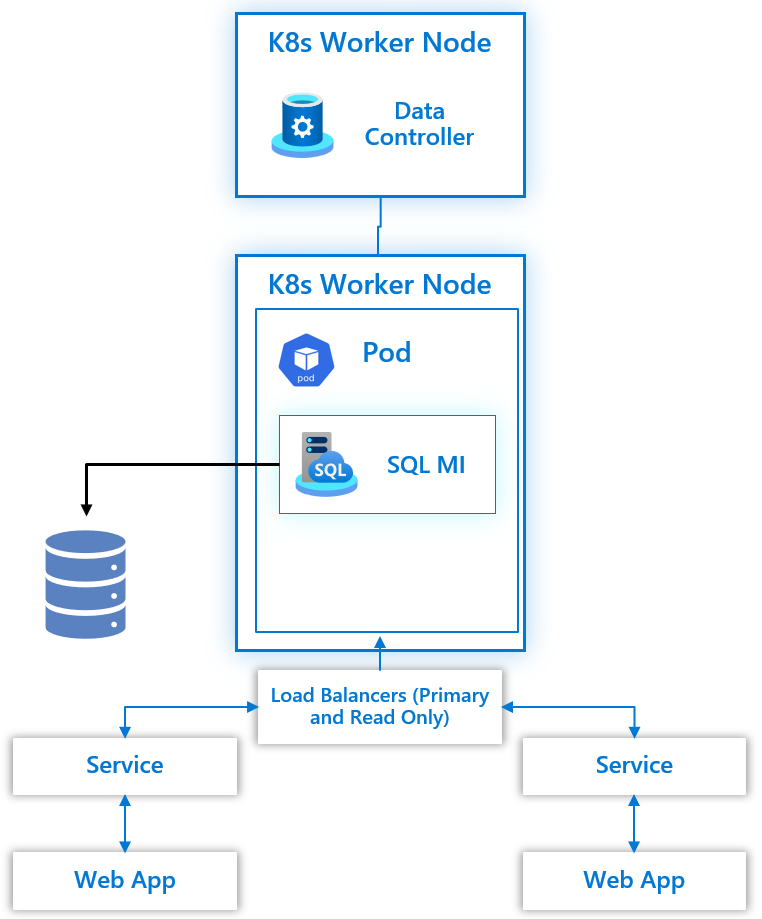

Azure Arc-enabled SQL Managed Instance (MI) provides High Availability capabilities out of the box. Deployed on Kubernetes as a containerized application, it uses Kubernetes constructs, such as stateful sets and persistent storage, to provide built-in health monitoring, failure detection, and failover mechanisms.

In this module, we will look at the capabilities of each deployment tier:

- General Purpose tier
- Business Critical tier

## General Purpose tier deployment

In this tier, only one replica is available, and we achieve high availability via Kubernetes orchestration. For instance, if a pod or node containing the managed instance container image crashes, Kubernetes will attempt to stand up another pod or node and attach to the same (shared) persistent storage. During this time, the Arc-enabled SQL MI is unavailable to applications. 

In cases where `load balancer` is the service type used in the Arc-enabled SQL MI deployment, applications can reconnect to the same primary endpoint, and Kubernetes will redirect the connection to the new primary. If `nodeport` is the service type used, the applications must reconnect to the new IP Address.

## Business Critical Tier deployment

In addition to what is natively provided by Kubernetes orchestration, Arc-enabled SQL MI utilizes [Contained Availability Groups](https://docs.microsoft.com/sql/database-engine/availability-groups/windows/contained-availability-groups-overview?view=sql-server-ver16) to provide higher levels of availability. In this deployment tier, you can deploy your Arc-enabled SQL MI with 2 or 3 replicas.

With two or more replicas deployed, one replica is automatically configured as a `readablesecondary` by default. A readable secondary allows for splitting workloads and using the provisioned resources appropriately. You can direct your read-only workloads to the readable secondary, thus allowing for your critical read/write workloads not to be impacted by reduced resources on the primary replica.

Each replica in the deployed environment is configured with its own persistent storage. All data is maintained and kept in sync with each replica using Availability Groups' synchronous data transfer technology. 

Using Contained Availability Groups, if any pod or node containing the managed instance container image crashes, the failure is transparent to the application as there is at least one other pod that contains all of the data from the primary and is ready to take on connections. The application will need to issue a reconnect, providing a much smaller interruption and greater uptime than the General Purpose tier deployment. Application connectivity to the Arc-enabled SQL MI has the same caveats as the General Purpose tier deployment with the configuration of the service tier being either `load balancer` (connecting to the primary endpoint) or `nodeport` (connecting to the new IP Address after a failover).

When deploying this tier, the Contained Availability Group is created automatically when multiple replicas are chosen. All databases are automatically added to the Contained Availability Group, including users and system databases. The deployment automatically provisions an external endpoint for connecting to the databases within the Contained Availability Group that plays the role of the Availability Group Listener.

## Azure Failover Groups

Azure Failover Groups provide the ability to architect and configure duplicate custom resources in multiple data center locations. Utilizing Azure Failover Groups delivers the ability to mitigate against site-level issues and failures to allow for business continuity in the secondary site.
Arc-enabled SQL MI utilizes [Distributed Availability Groups](https://docs.microsoft.com/sql/database-engine/availability-groups/windows/distributed-availability-groups?view=sql-server-ver16) to provide disaster recovery from one site to another regardless of the tier implemented.

Azure Failover Groups Asynchronously transfers data from the primary site Arc-enabled SQL MI primary replica to the secondary site Arc-enabled SQL MI primary replica. The same as the primary site Arc-enabled SQL MI, the secondary site Arc-enabled SQL MI synchronously transfers data from the primary replica to the configured secondary replicas.

To deploy an Azure Failover Group, the Arc-enabled SQL MI has the following configuration requirements:

- Duplicate compute and capacity deployed Arc-enabled SQL MI in both primary and secondary sites
- Duplicate tier level deployed Arc-enabled SQL MI in both primary and secondary sites
- Supports both General Purpose and Business Critical Tiers
- Manual failover between sites

