## Exercise 1 - Configuring readable secondaries

In this exercise, you will configure and use readable secondaries to take advantage of the secondary replica for read-only workloads.

1. Open Azure Data Studio.
2. Expand the Connections Tab.
3. Expand Azure Arc Controllers.
4. Expand the data controller.
5. Setup the following details for the Business Critical Tier Arc-enabled SQL Managed Instance:

    ```powershell
    $Env:SQLMIName = 'enter Business Critical Tier SQL Managed Instance Name here'
    $Env:MyNamespace = 'enter data controller namespace here'
    $Env:MyReadableSecondaries = 2
    ```

6. Execute the following command to review the current Arc-enabled SQL Managed Instance configuration. Search for replicas to review the current configuration:

    ```powershell
    az sql mi-arc show -n $Env:SQLMIName `
        --k8s-namespace $Env:MyNamespace `
        --use-k8s

     "replicas": [
        {
          "availabilityMode": "SYNCHRONOUS_COMMIT",
          "connectedState": "CONNECTED",
          "replicaName": "ae-msl-sqlmi2-0",
          "role": "PRIMARY",
          "secondaryRoleAllowConnections": "ALL",
          "synchronizationState": "HEALTHY"
        },
        {
          "availabilityMode": "SYNCHRONOUS_COMMIT",
          "connectedState": "CONNECTED",
          "replicaName": "ae-msl-sqlmi2-1",
          "role": "SECONDARY",
          "secondaryRoleAllowConnections": "ALL",
          "synchronizationState": "HEALTHY"
        },
        {
          "availabilityMode": "SYNCHRONOUS_COMMIT",
          "connectedState": "CONNECTED",
          "replicaName": "ae-msl-sqlmi2-2",
          "role": "SECONDARY",
          "secondaryRoleAllowConnections": "NO",
          "synchronizationState": "HEALTHY"
        }
      ]
    ```

7. Execute the following command to configure 2 readable secondaries:

    ```powershell
    az sql mi-arc update --name $Env:SQLMIName `
        --readable-secondaries $Env:MyReadableSecondaries `
        --k8s-namespace $Env:MyNamespace `
        --use-k8s
    ```

   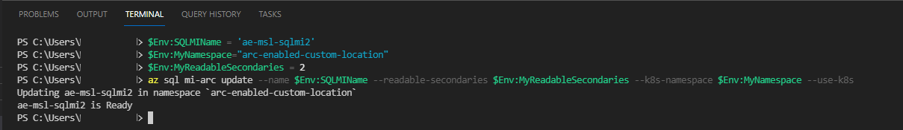

8. Re-execute step 6 to view the new configuration. You can see that both `ae-msl-sqlmi2-1` and `ae-msl-sqlmi2-2` are now configured as readable secondaries.

    ```
    "replicas": [
        {
          "availabilityMode": "SYNCHRONOUS_COMMIT",
          "connectedState": "CONNECTED",
          "replicaName": "ae-msl-sqlmi2-0",
          "role": "PRIMARY",
          "secondaryRoleAllowConnections": "ALL",
          "synchronizationState": "HEALTHY"
        },
        {
          "availabilityMode": "SYNCHRONOUS_COMMIT",
          "connectedState": "CONNECTED",
          "replicaName": "ae-msl-sqlmi2-1",
          "role": "SECONDARY",
          "secondaryRoleAllowConnections": "ALL",
          "synchronizationState": "HEALTHY"
        },
        {
          "availabilityMode": "SYNCHRONOUS_COMMIT",
          "connectedState": "CONNECTED",
          "replicaName": "ae-msl-sqlmi2-2",
          "role": "SECONDARY",
          "secondaryRoleAllowConnections": "ALL",
          "synchronizationState": "HEALTHY"
        }
      ]
    ```

1. Search the results from the CLI command executed in step 8. Search for endpoints. Retrieve the secondary endpoint value.
1. In the **Connections** tab, select **New Connection**. Enter the connection details for your secondary endpoint. 
1. Select **Connect**.

    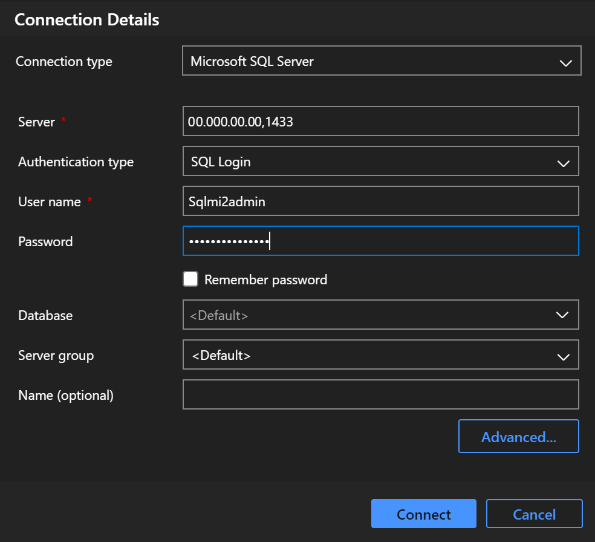

11. Open a new query window for the new secondary endpoint connection and execute the following commands. Your servername should not be the current primary replica:

    ```sql
    Select @@ServerName;

    Use AdventureWorks2019
    GO

    Select *
    From HumanResources.Employee;
    ```

    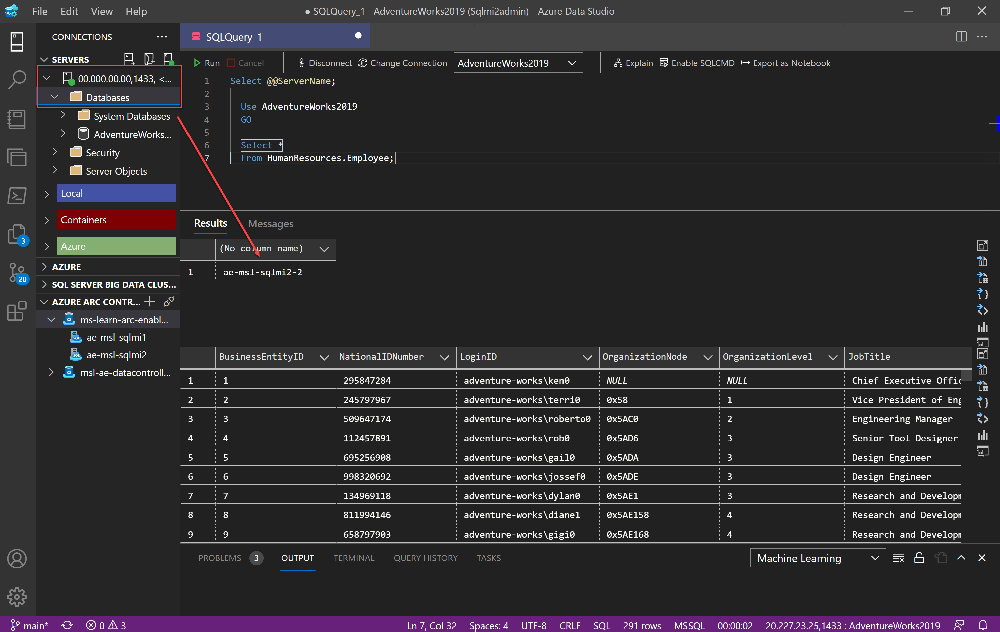


## Exercise 2 - Discovere Azure Arc-enabled SQL Managed Instance General Purpose tier

For this exercise, you will simulate the failure or loss of the Kubernetes pod hosting and running the General Purpose tier Arc-enabled SQL Managed Instance container. 

1. Open Azure Data Studio.
2. Expand the Connections Tab.
3. Right-click on your General Purpose tier SQL Managed Instance and select New Query.
4. Execute the following query to show access to the instance of SQL Server and the AdventureWorks2019 database:

   ```sql
   Select @@ServerName;

   Use AdventureWorks2019
   GO

   Select *
   From HumanResources.Employee;
   ```

   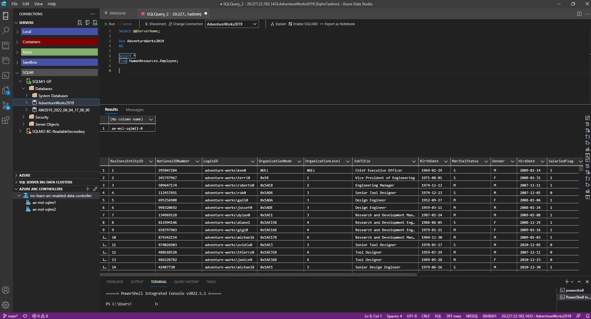

5. Open the Terminal window.
6. Execute the following commands to view the Kubernetes pods:

   ```powershell
   $Env:MyNamespace = 'enter your data controller namespace here'
   kubectl get pods -n $Env:MyNamespace
   ```

   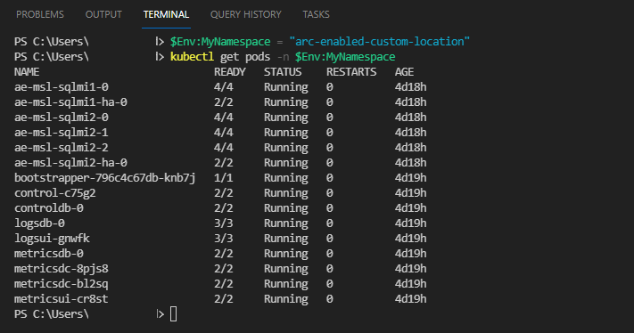

7. Simulate a pod failure by executing the following command:

   ```powershell
   $Env:MyGPPod = 'enter SQL Managed Instance Name here-0'
   kubectl delete pod $Env:MyGPPod -n $Env:MyNamespace 
   ```

   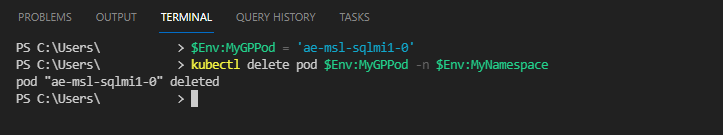

8. Execute the following command to view the status of the pods:

   ```powershell
   kubectl get pods -n $Env:MyNamespace
   ```

   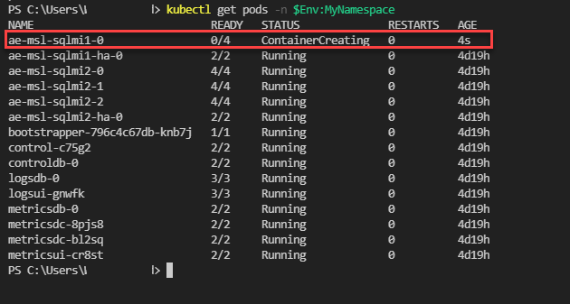

9. Re-execute step 8 to monitor the redeployment of the pod. Once the pod is back in a running state, you can perform standard checks to ensure the Instance of SQL Server is available and functioning as required.

    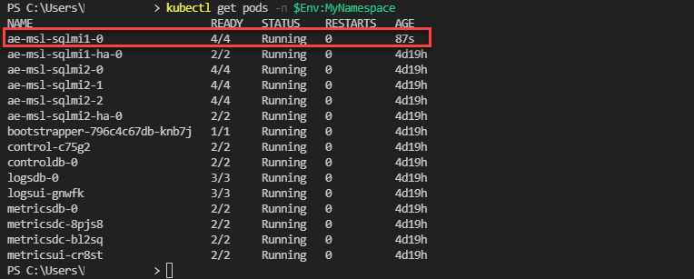

10. Re-execute step 4 to see if the instance is available again. This proves your instance is back available and accessible.

    

## Exercise 3 - Discovering Arc-enabled SQL Managed Instance Business Critical Tier High Availability

For this exercise, you will simulate the failure or loss of the Kubernetes pod hosting and running the Business Critical Tier Arc-enabled SQL Managed Instance container.

1. Open Azure Data Studio.
2. Expand the Connections Tab.
3. Right-click on your Business Critical tier SQL Managed Instance and select New Query.
4. Execute the following query to show access to the Instance of SQL Server and the AdventureWorks2019 database:

   ```sql
   Select @@ServerName;
 
   Use AdventureWorks2019
   GO

   Select *
   From HumanResources.Employee;
   ```

   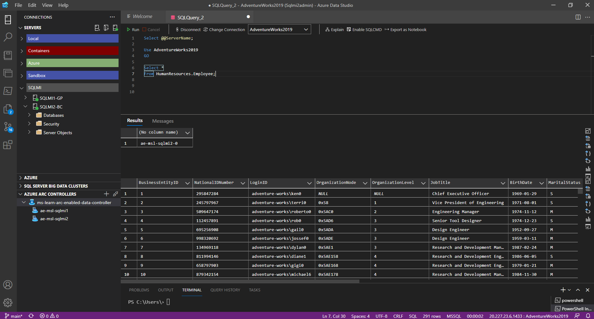

5. Open the Terminal window.
6. Execute the following commands to view the Kubernetes pods:

   ```powershell
   $Env:MyNamespace = 'enter your data controller namespace here'
   kubectl get pods -n $Env:MyNamespace
   ```

   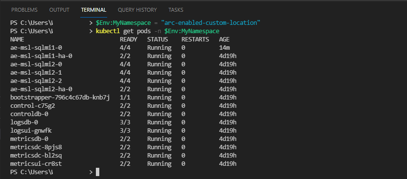

7. Simulate a pod failure by executing the following command:

   ```powershell
   $Env:MyBCPod = 'enter SQL Managed Instance Name here-0'
   kubectl delete pod $Env:MyBCPod -n $Env:MyNamespace 
   ```

   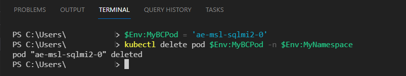

8. Execute the following command to view the status of the pods:

   ```powershell
   kubectl get pods -n $Env:MyNamespace
   ```

   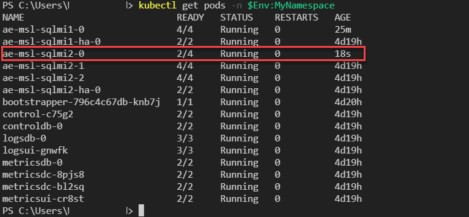

9. Re-execute step 4 to see if the instance is available, running on 'SQLMI-1'. Service disruption should be minimal, and your applications need re-connect functionality.

   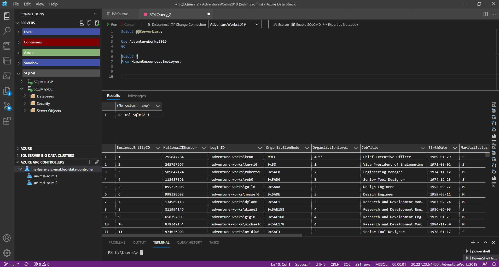

10. Execute the following command to view the status of the contained availability group:

    ```powershell
    $Env:MyResource-group = 'enter your resource group name here'
    az sql mi-arc list --k8s-namespace $Env:MyNamespace --use-k8s
    ```

    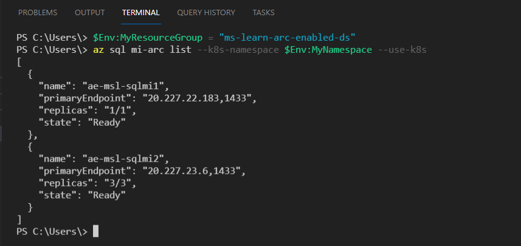

11. Check the status of all replicas in the contained availability group with the following command. Search for `highAvailability` in the output:

    ```powershell
    $Env:SQLMIName = 'enter your SQLMI name here'
    az sql mi-arc show --name $Env:SQLMIName --resource-group $Env:MyresourceGroup

    "highAvailability": {
            "healthState": "Healthy",
            "lastUpdateTime": "2022-06-07T00:39:38.927189Z",
            "mirroringCertificate": "-----BEGIN CERTIFICATE-----\n \n-----END CERTIFICATE-----\n",
            "replicas": [
              {
                "availabilityMode": "SYNCHRONOUS_COMMIT",
                "connectedState": "CONNECTED",
                "replicaName": "ae-msl-sqlmi2-0",
                "role": "SECONDARY",
                "secondaryRoleAllowConnections": "ALL",
                "synchronizationState": "HEALTHY"
              },
              {
                "availabilityMode": "SYNCHRONOUS_COMMIT",
                "connectedState": "CONNECTED",
                "replicaName": "ae-msl-sqlmi2-1",
                "role": "PRIMARY",
                 "secondaryRoleAllowConnections": "ALL",
                "synchronizationState": "HEALTHY"
              },
              {
                "availabilityMode": "SYNCHRONOUS_COMMIT",
                 "connectedState": "CONNECTED",
                "replicaName": "ae-msl-sqlmi2-2",
                "role": "SECONDARY",
                "secondaryRoleAllowConnections": "ALL",
                "synchronizationState": "HEALTHY"
              }
            ]
          }
    ```

12. Prepare for a manual failover from the existing primary replica - `'your sqlmi name-1'` back to the original primary replica - `'your sqlmi name-0'.` In the terminal window, execute the following commands to set the preferred primary replica:

   ```PowerShell
   $Env:MyPreferredPrimaryReplica = 'your sqlmi name-1'
   az sql mi-arc update --name $Env:SQLMIName `
     --k8s-namespace $Env:MyNamespace `
     --use-k8s `
     --preferred-primary-replica $Env:MyPreferredPrimaryReplica
   ```

   

13. Run the `az sql mi-arc update` CLI command from step 12 again to perform the actual failover.

14. Run step 11 again to confirm the changed primary replica roles.

   ```
   "highAvailability": {
           "healthState": "Healthy",
           "lastUpdateTime": "2022-06-07T00:39:38.927189Z",
           "mirroringCertificate": "-----BEGIN CERTIFICATE-----\n \n-----END CERTIFICATE-----\n",
           "replicas": [
             {
               "availabilityMode": "SYNCHRONOUS_COMMIT",
               "connectedState": "CONNECTED",
               "replicaName": "ae-msl-sqlmi2-0",
               "role": "PRIMARY",
               "secondaryRoleAllowConnections": "ALL",
               "synchronizationState": "HEALTHY"
             },
             {
               "availabilityMode": "SYNCHRONOUS_COMMIT",
               "connectedState": "CONNECTED",
               "replicaName": "ae-msl-sqlmi2-1",
               "role": "SECONDARY",
               "secondaryRoleAllowConnections": "ALL",
               "synchronizationState": "HEALTHY"
             },
             {
               "availabilityMode": "SYNCHRONOUS_COMMIT",
               "connectedState": "CONNECTED",
               "replicaName": "ae-msl-sqlmi2-2",
               "role": "SECONDARY",
               "secondaryRoleAllowConnections": "ALL",
               "synchronizationState": "HEALTHY"
             }
           ]
         }
   ```

## Exercise 4 - Point-in-time restores

For this exercise, you will use the automated backups already created for the AdventureWorks2019 database restored to the Arc-enabled SQL Managed Instance environment previously.

1. Open Azure Data Studio.
2. Expand the Connections Tab.
3. Expand Azure Arc Controllers.
4. Expand the Arc data controller.
5. Right Click on your Arc-enabled SQL Managed Instance and select Manage.

   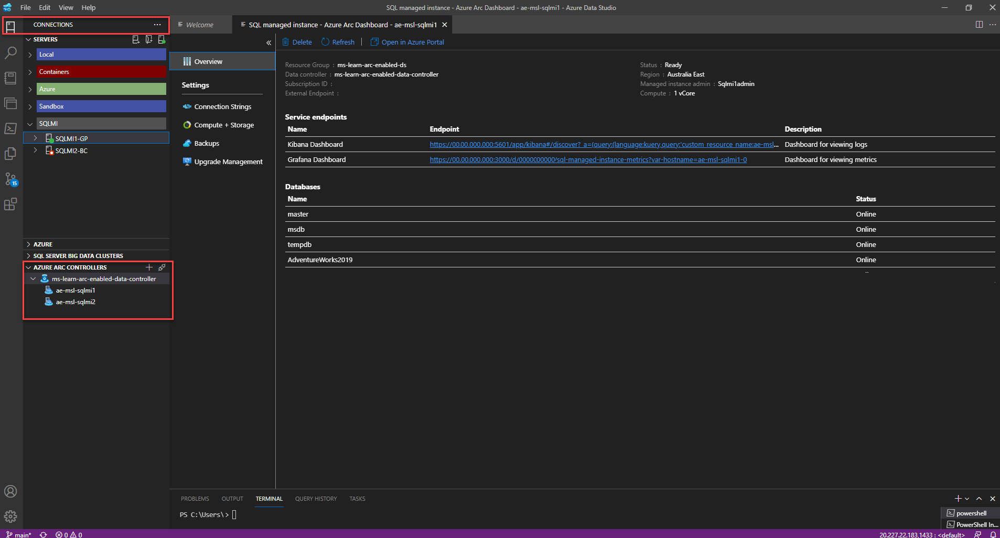

6. Select Backups.
7. Review the earliest point in time & latest point in time for the AdventureWorks2019 sample database.
8. Click the restore icon to initiate the point in time restore process

   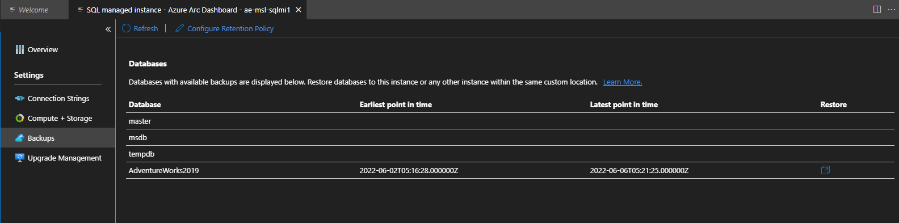

9. Enter a name for the newly restored database.
10. Enter a point in time between the earliest point in time & the latest point in time to which you want to restore.
11. Select restore.

    

12. To monitor the progress of the point in time restore execute the following command in the Azure Data Studio Terminal Window:

    ```powershell
    kubectl get sqlmirestoretask -n 'enter your data controller namespace here'
    ```

13. This may take a while, depending on the time chosen for the point in time restore.
14. Refresh the database list on the Backups tab.

    

15. Connect to your Instance of SQL Server and confirm the database exists, and you can query the data.

## Exercise 5 - Deploying Arc-enabled SQL Managed Instance Azure failover groups

We will use an Arc-enabled SQL Managed Instance Business Critical environment for this exercise. The environment consists of an Arc-enabled SQL Managed Instance located at our primary site and a duplicate Arc-enabled SQL Managed Instance located at our secondary site.

### Pre-requisites

Make sure to complete the following before proceeding:

1. Have access to a supported Kubernetes cluster in your primary site.
2. Completed Module 1, Exercise - Deploy an Azure Arc Data Controller (For your primary site).
3. Completed Module 2, Exercise - Deploy an Azure Arc-enabled SQL Managed Instance (For your primary site).
4. Completed Module 2, Exercise – Restore AdventureWorks2019 to your primary site Arc-enabled SQL Managed Instance.
5. Have access to a supported Kubernetes cluster in your secondary site.
6. Completed Module 1, Exercise - Deploy an Azure Arc Data Controller (For your secondary site).
7. Completed Module 2, Exercise - Deploy an Azure Arc-enabled SQL Managed Instance (For your secondary site).
8. Ensure to set your license type: Disaster Recovery.
9. Have access to a shared local storage location to which both Azure Arc-enabled SQL Managed Instances have access.

### Deploy Arc-enabled SQL Managed Instance failover groups

1. In Azure Data Studio, open the Terminal Window.
2. Ensure you are connected to your Azure Subscription.
3. Prepare your Arc-enabled SQL Managed Instance primary site parameter values:

   ```Powershell
   ## Primary Site Arc-enabled SQL Managed Instance parameter details
   $Env:MySubscription = 'enter your subscription id here'
   $Env:MyPrimaryResourceGroup = 'enter your primary site resource group name'
   $Env:MyPrimaryNamespace = 'enter your primary site data controller namespace'
   $Env:MyPrimaryInstance = 'enter your primary site SQL Managed Instance name'
   $Env:MyCertFullPath = 'enter you local path/sqlcerts'
   $Env:MyPrimaryCertFile = 'sqlprimary.pem'  ## Use anyname you wish
   $Env:MyAFG = 'aemsldag' ## Use any name you wish
   $Env:MyPrimaryDAG = 'sqlprimary-dag'  ## Use anyname you wish
   $Env:MyPrimaryCluster = 'enter your primary site kubernetes cluster name here'
   ```

   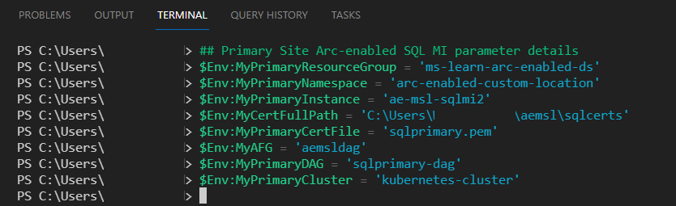

4. Ensure you are connected to your primary site Kubernetes Cluster.

   ```PowerShell
   Kubectl config use-context $Env:MyPrimaryCluster
   ```

   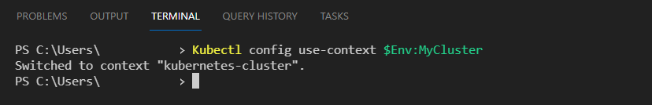

5. Retrieve the mirroring certificate for the primary site. This is required to be accessible to both sites. In this example, use the local user account home location. Ensure you set this appropriately for your environment. You can confirm the creation of the `sqlprimary.pem` certificate file in your configured local location.

   ```PowerShell
   az sql mi-arc get-mirroring-cert --subscription $Env:MySubcriptionID `
     --name $Env:MyPrimaryInstance  `
     --cert-file "$Env:MyCertFullPath\$Env:MyPrimaryCertFile" `
     --k8s-namespace $Env:MyPrimaryNamespace `
     --use-k8s
   ```

6. Retrieve the SQL Managed Instance Mirroring Endpoint IP address for the primary site:

   ```PowerShell
   $PrimaryMirroringEndpoint = $(
     az sql mi-arc show -n $Env:MyPrimaryInstance `
         --resource-group $Env:MyPrimaryResourceGroup `
         -o tsv `
         --query 'properties.k8SRaw.status.endpoints.mirroring'
   )

   $Env:MyPrimaryMirroringIP = "tcp://$PrimaryMirroringEndpoint"
   ```

7. Prepare your Arc-enabled SQL Managed Instance secondary site parameter values:

   ```Powershell
   $Env:MySecondaryResourceGroup = 'enter your secondary site resource group name'
   $Env:MySecondaryNamespace = 'enter your secondary site data controller namespace'
   $Env:MySecondaryInstance = 'enter your secondary site SQL Managed Instance name'
   $Env:MySecondaryCertFile = 'sqlsecondary.pem'  ## Use anyname you wish
   $Env:MySecondaryDAG = 'sqlsecondary-dag'  ## Use anyname you wish
   $Env:MySecondaryCluster = 'enter your secondary site kubernetes cluster name here'
   ```

   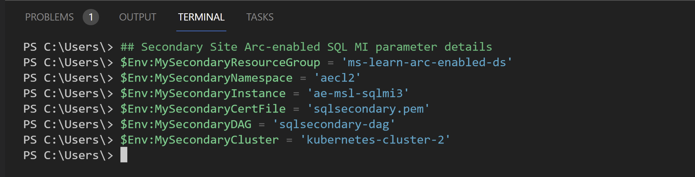

8. Ensure you are connected to your secondary site Kubernetes Cluster.

   ```PowerShell
   Kubectl config use-context $Env:MySecondaryCluster
   ```

   

9. Retrieve the mirroring certificate for the secondary site. This is required to be accessible to both sites. In this example, we are using the local user account home location. Ensure you set this appropriately for your environment. You can confirm the creation of the `sqlsecondary.pem` certificate file in your configured local location.

   ```PowerShell
   az sql mi-arc get-mirroring-cert --subscription $Env:MySubcriptionID `
     --name $Env:MySecondaryInstance `
     --cert-file "$Env:MyCertFullPath\$Env:MySecondaryCertFile" `
     --k8s-namespace $Env:MySecondaryNamespace `
     --use-k8s
   ```

10. Retrieve the SQL Managed Instance Mirroring Endpoint IP address for the secondary site:

   ```PowerShell
   $SecondaryMirroringEndpoint = $(
     az sql mi-arc show -n $Env:MySecondaryInstance  `
         --resource-group $Env:MySecondaryResourceGroup `
         -o tsv `
         --query 'properties.k8SRaw.status.endpoints.mirroring'
   )

   $Env:MySecondaryMirroringIP = "tcp://$SecondaryMirroringEndpoint" 
   ```

11. Ensure you are connected to your primary site Kubernetes Cluster.

   ```PowerShell
   Kubectl config use-context $Env:MyPrimaryCluster
   ```

12. Create the Azure failover group Primary resource on the primary site.

   ```PowerShell
   az sql instance-failover-group-arc create --shared-name $Env:MyAFG `
     --name $Env:MyPrimaryDAG  `
     --mi $Env:MyPrimaryInstance `
     --role primary `
     --partner-mi $Env:MySecondaryInstance  `
     --partner-mirroring-url $Env:MySecondaryMirroringIP `
     --partner-mirroring-cert-file "$Env:MyCertFullPath\$Env:MySecondaryCertFile" `
     --k8s-namespace $Env:MyPrimaryNamespace `
     --use-k8s

     ## The output should display: Deploying $Env:MyPrimaryDAG in namespace $Env:MyPrimaryNamespace
     ## $Env:MyPrimaryDAG is Ready

   ## Confirm primary resource has been created
   az sql instance-failover-group-arc show --subscription $Env:MySubcriptionID `
     --name $Env:MyPrimaryDAG `
     --k8s-namespace $Env:MyPrimaryNamespace `
     --use-k8s

   ## The output should have similar to this:
     "sharedName": "aemsldag",
     "sourceMI": "ae-msl-sqlmi2",
     "partnerMI": "ae-msl-sqlmi3",
     "partnerMirroringURL": "tcp://20.70.91.199:5022"
   ```

13. Ensure you are connected to your secondary site Kubernetes Cluster.

   ```PowerShell
   Kubectl config use-context $Env:MySecondaryCluster
   ```

14. Create the Azure failover group Secondary resource on the secondary site.

   ```PowerShell
   az sql instance-failover-group-arc create --shared-name $Env:MyAFG `
     --name $Env:MySecondaryDAG `
     --mi $Env:MySecondaryInstance `
     --role secondary `
     --partner-mi $Env:MyPrimaryInstance `
     --partner-mirroring-url $Env:MyPrimaryMirroringIP `
     --partner-mirroring-cert-file "$Env:MyCertFullPath\$Env:MyPrimaryCertFile" `
     --k8s-namespace $Env:MySecondaryNamespace `
     --use-k8s

     ## The output should display: Deploying $Env:MySecondaryDAG in namespace $Env:MySecondaryNamespace
     ## $Env:MySecondaryDAG is Ready

   ## Confirm secondary resource has been created
   az sql instance-failover-group-arc show --subscription $Env:MySubcriptionID `
     --name $Env:MySecondaryDAG `
     --k8s-namespace $Env:MySecondaryNamespace `
     --use-k8s 

   ## The output should have similar to this:
     "sharedName": "aemsldag",
     "sourceMI": "ae-msl-sqlmi3",
     "partnerMI": "ae-msl-sqlmi2",
     "partnerMirroringURL": "tcp://20.92.195.233:5022"
   ```

15. Open SQL Server Management Studio and connect to the primary external endpoint for the primary site instance. Expand **Always On High Availability**. You should now see the newly created Azure failover group.

   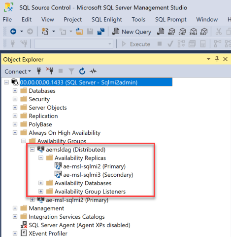

16. In SQL Server Management Studio, connect to the primary external endpoint for the secondary site instance. Expand **Always On High Availability**. You should now see the newly created Azure failover group.

   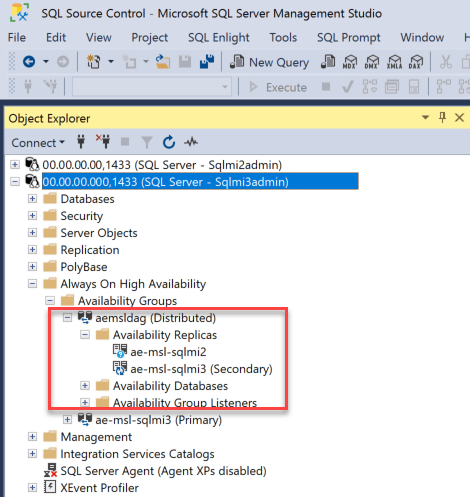

17. Expand the database tree on the secondary site instance. You should see the AdventureWorks2019 database that was restored to your primary site instance previously. Notice you did not have to perform any tasks to get your primary site database onto your secondary site instance. With the creation of the Azure failover group (Distributed availability group), all databases on the primary instance will automatically be seeded to the secondary site. Depending on the size of the database, the network bandwidth between the primary and secondary sites will dictate the time for the databases to be synchronized. 
