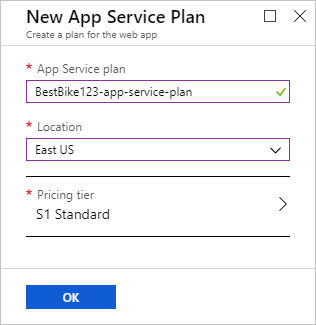
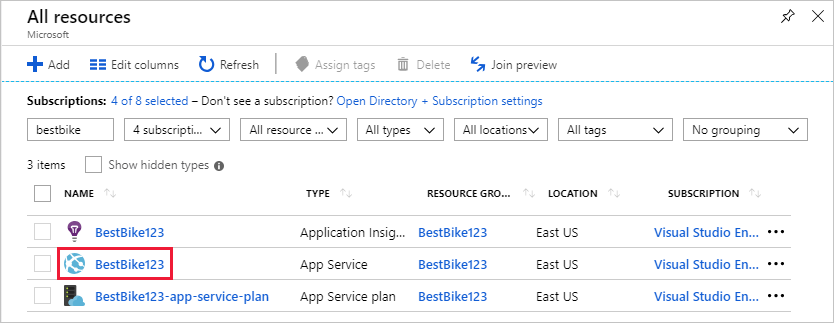
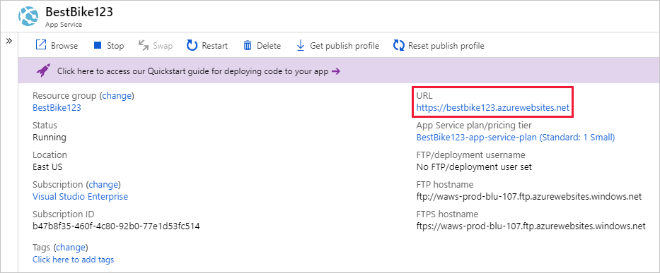

In this unit, you will use the Azure portal to create a web app.

[!include]

## Create a web app

Sign into the [Azure portal](https://portal.azure.com/learn.docs.microsoft.com?azure-portal=true) using the same account you activated the sandbox with.

::: zone pivot="csharp"

1. Click the **Create a resource** link at the top of the left-hand navigation. Everything you create on Azure is a resource.

1. The portal navigates you to the **Marketplace** page. From here, you can search for the resource you want to create or select one of the popular resources that people create in the Azure portal.

1. Click **Web** > **Web App**. The portal redirects you to the **Create New Web App** page.

1. When you create a new web app, the Azure portal requests some information to create the app for you. In this section, provide the following basic information:

    1. **App name**: Your client wants to name the application `BestBike`. Type the name in this field. This value must be globally unique among all other web apps hosted on Azure, and the portal will make sure no one else has used the app name. To ensure your name is unique, add some numbers to your app's name until you find a unique variant.

    2. **Subscription**: In this field, you need to select an active Azure subscription from the drop-down list. Select the Concierge subscription.

    3. **OS**: In this field, you need to decide whether to use **Windows** or **Linux** to host your new web app. This setting directly affects the App Service plan that you are going to select or create below. If you remember, an App Service plan resembles a virtual machine that is an operating system with all the resource (CPU, RAM, etc.) needed on that machine to run your application. In this case, your client prefers to host the web app over a Windows machine. Therefore, make the selection **Windows**.

    4. **Publish**: You can choose to either publish code, or a Docker container image. We will be writing code to run in App Service, so make sure the **Code** option is selected.

    5. **Application Insights**: Azure Application Insights helps you detect and diagnose quality issues in your web apps and web services, and helps you understand what your users actually do with it. One of the requirements of your client is the ability to view some insight reports about the traffic coming over their website and to study some trends of when the traffic goes high and when it goes low. In this case, select the **On** option to turn on Application Insights for this web app. Once you select the **On** option, you are also required to select the location or region that will store the Application Insights data. Note that Application Insights are available in only a limited number of regions. For this demo, select any of the available regions.

::: zone-end

::: zone pivot="node"

1. Click the **Create a resource** link at the top of the left-hand navigation. Everything you create on Azure is a resource.

1. The portal navigates you to the **Marketplace** page. From here, you can search for the resource you want to create or select one of the popular resources that people create in the Azure portal.

1. Click **Web** > **Web App**. The portal redirects you to the **Create New Web App** page.

1. When you create a new web app, the Azure portal requests some information to create the app for you. In this section, provide the following basic information:

    1. **App name**: Your client wants to name the application `BestBike`. Type the name in this field. This value must be globally unique among all other web apps hosted on Azure, and the portal will make sure no one else has used the app name. To ensure your name is unique, add some numbers to your app's name until you find a unique variant.

    2. **Subscription**: In this field, you need to select an active Azure subscription from the drop-down list. Select the Concierge subscription.

    3. **OS**: In this field, you need to decide whether to use **Windows** or **Linux** to host your new web app. This setting directly affects the App Service plan that you are going to select or create below. If you remember, an App Service plan resembles a virtual machine that is an operating system with all the resource (CPU, RAM, etc.) needed on that machine to run your application. In this case, your client prefers to host the web app over a Linux machine. Therefore, make the selection **Linux**.

    4. **Publish**: You can choose to either publish code, or a Docker container image. We will be writing code to run in App Service, so make sure the **Code** option is selected.

    5. **Runtime Stack**: When hosting a web app on a Linux app service plan, you need to inform App Service what web server technology the application runs on. We will be using **Node.js** as our runtime, select the latest version of Node.js from the list.

::: zone-end

::: zone pivot="java"

1. Click the **Create a resource** link at the top of the left-hand navigation. Everything you create on Azure is a resource.

1. The portal navigates you to the **Marketplace** page. From here, you can search for the resource you want to create or select one of the popular resources that people create in the Azure portal.

1. Click **Web** > **Web App**. The portal redirects you to the **Create New Web App** page.

1. When you create a new web app, the Azure portal requests some information to create the app for you. In this section, provide the following basic information:

    1. **App name**: Your client wants to name the application `BestBike`. Type the name in this field. This value must be globally unique among all other web apps hosted on Azure, and the portal will make sure no one else has used the app name. To ensure your name is unique, add some numbers to your app's name until you find a unique variant.

    2. **Subscription**: In this field, you need to select an active Azure subscription from the drop-down list. Select the Concierge subscription.

    3. **OS**: In this field, you need to decide whether to use **Windows** or **Linux** to host your new web app. This setting directly affects the App Service plan that you are going to select or create below. If you remember, an App Service plan resembles a virtual machine that is an operating system with all the resource (CPU, RAM, etc.) needed on that machine to run your application. In this case, your client prefers to host the web app over a Linux machine. Therefore, make the selection **Linux**.

    4. **Publish**: You can choose to either publish code, or a Docker container image. We will be writing code to run in App Service, so make sure the **Code** option is selected.

    5. **Runtime Stack**: When hosting a web app on a Linux app service plan, you need to inform App Service what web server technology the application runs on. Our Java app will run on the Tomcat web server, so select **Tomcat 9.0 (JRE 8)** from the list.

::: zone-end

## Use the sandbox resource group

An Azure web app must be part of a resource group. Select **Use existing** and choose <rgn>[sandbox resource group name]</rgn>.

## Create an App Service plan

In this field, you need to select an App Service plan to run your application. By default, the portal selects the most recent App Service plan that you created. Click on the **App Service plan/Location** field to navigate to the **App Service plan** page.

Click on the **Create new** link to navigate to the **New App Service Plan** page. The portal requests some information from you in order to create the new App Service plan.

1. **App Service plan**: In this field, you provide a name for the new App Service plan. For this app, type the same web app name you chose above and append a suffix of `-app-service-plan` to easily distinguish this resource from others.

2. **Location**: In this field, you need to select the region where this App Service plan resides. In other words, select the geographical location where the App Service plan will set up the virtual machine(s) that are required to run your application. In this case, you can select any of the options in the list below.

[!include]

::: zone pivot="csharp"

3. **Pricing tier**: In this field, you need to select the size of the virtual machine that is going to host your application. Click on the **>** sign to navigate to the **Pricing tier** page.

    Here you have many options to choose from. The portal groups those options by the level of workload needed. The three workload categories available are Dev/Test, Production, and Isolated. Depending on the requirements of the application you want to host on Azure, you will select the relevant workload category. For now, select the **S1** pricing tier under the **Production Workload** category. Then, click on **Apply** to confirm the pricing tier you have selected above.

::: zone-end

::: zone pivot="java"

3. **Pricing tier**: In this field, you need to select the size of the virtual machine that is going to host your application. Click on the **>** sign to navigate to the **Pricing tier** page.

    Here you have many options to choose from. The portal groups those options by the level of workload needed. The three workload categories available are Dev/Test, Production, and Isolated. Depending on the requirements of the application you want to host on Azure, you will select the relevant workload category. For now, select the **P1V2** pricing tier under the **Production Workload** category. Then, click on **Apply** to confirm the pricing tier you have selected above.

::: zone-end

Now, you are back to the **New App Service plan** page.

4. Click the **OK** button to use your new App Service Plan.

    
   
5. Click the **Create** button to start the process of creating the web app.

    > [!NOTE]
    > It can take a few seconds to get your web app created and ready for your use.

The portal redirects you to the dashboard page and notifies you once it creates the web app.

Once the app is ready, navigate to the new app in the Azure portal.

1. Click the **All resources** menu on the left side navigation. The **All resources** page lists all the resources that you have created in the Azure portal.

2. Click through the BestBike App Service just created for you.

    > [!NOTE]
    > If you search for your app by the name "BestBike", you may also find the Application Insights and App Service Plan resources created for your new web app. Make sure you are clicking through the resource with the type of **App Service**.

    

The portal opens the web app service home page with the **Overview** section selected.

To preview your new web app's default content, click on the **URL** in the top right of the Azure portal. If you see a placeholder web page, it means you have successfully created the web app.
