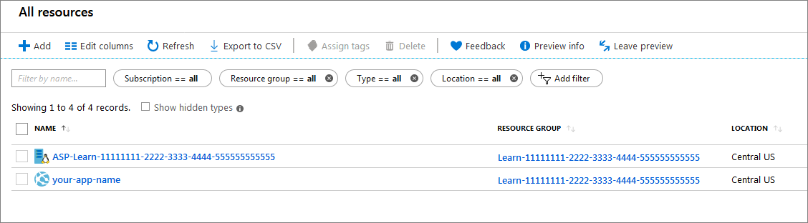
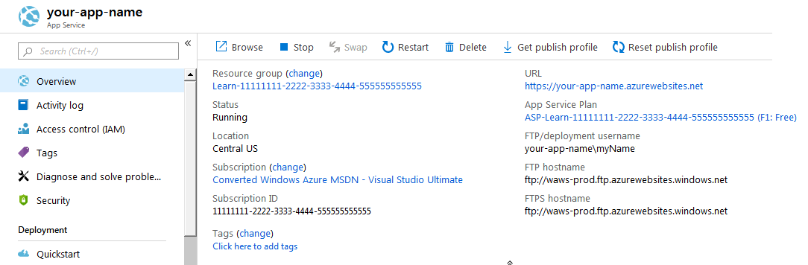

In this unit, you will use the Azure portal to create a web app.

[!include]

## Create a web app

Sign into the [Azure portal](https://portal.azure.com/learn.docs.microsoft.com?azure-portal=true) using the same account you activated the sandbox with.

[!include]

::: zone pivot="csharp"

1. Select the **Create a resource** link at the top of the left-hand navigation. Everything you create on Azure is a resource.

1. The portal navigates you to the **Marketplace** page. From here, you can search for the resource you want to create or select one of the popular resources that people create in the Azure portal.

1. Select **Web** > **Web App** to display the web app creation wizard.

1. Fill out the wizard with the following values:

    | Field | Value | Details |
    |---|---|---|
    | **Subscription** | Concierge Subscription | The web app you are creating must belong to a resource group. Here, you select the Azure subscription to which the resource group belongs (or will belong, if you are creating it within the wizard). |
    | **Resource Group** | Select <rgn>[Sandbox resource group]</rgn> from the menu | The resource group to which the web app will belong. All Azure resources must belong to a resource group. |
    | **Name** | *Enter a unique name* | The name of your web app. This name will be part of the app's URL: *appname*.azurewebsites.net.  The name you choose must be unique among all Azure web apps. |
    | **Publish** | Code | The method you will use to publish your application. When publishing your application as code, you also must configure Runtime Stack to prepare your App Service resources to run your app. |
    | **Runtime stack** | .NET Core 2.2 | The platform on which your application runs. Note that your choice here may affect whether you have a choice of operating system - for some runtime stacks, App Service supports only one operating system. |
    | **Operating System** | Windows | The operating system used on the virtual servers that run your app. |
    | **Region** | *Select a region from the note above* | The geographical region from which your app will be hosted. |
    | **Windows Service Plan** | *Leave default* | The name of the App Service plan that will power your app. By default, the wizard will create a new plan in the same region as the web app. |
    | **Sku and size** | F1 | The pricing tier of the plan being created. This determines the performance characteristics of the virtual servers that power your app, and the features it has access to. To select the F1 tier, select **Change size** to open the Spec Picker wizard. On the **Dev / Test** tab, select **F1** from the list, then select Apply. |

1. Navigate to the **Monitoring** tab at the top of the page and toggle **Enable Application Insights** to **No**.

::: zone-end

::: zone pivot="java"

1. Select the **Create a resource** link at the top of the left-hand navigation. Everything you create on Azure is a resource.

1. The portal navigates you to the **Marketplace** page. From here, you can search for the resource you want to create or select one of the popular resources that people create in the Azure portal.

1. Select **Web** > **Web App** to display the web app creation wizard.

1. Fill out the wizard with the following values:

    | Field | Value | Details |
    |---|---|---|
    | **Subscription** | Concierge Subscription | The web app you are creating must belong to a resource group. Here, you select the Azure subscription to which the resource group belongs (or will belong, if you are creating it within the wizard). |
    | **Resource Group** | Select <rgn>[Sandbox resource group]</rgn> from the menu | The resource group to which the web app will belong. All Azure resources must belong to a resource group. |
    | **Name** | *Enter a unique name* | The name of your web app. This name will be part of the app's URL: *appname*.azurewebsites.net.  The name you choose must be unique among all Azure web apps. |
    | **Publish** | Code | The method you will use to publish your application. When publishing your application as code, you also must configure Runtime Stack to prepare your App Service resources to run your app. |
    | **Runtime stack** | Tomcat 9.0 | The platform on which your application runs. Note that your choice here may affect whether you have a choice of operating system - for some runtime stacks, App Service supports only one operating system. |
    | **Operating System** | Linux | The operating system used on the virtual servers that run your app. |
    | **Region** | *Select a region from the note above* | The geographical region from which your app will be hosted. |
    | **Linux Plan** | *Leave default* | The name of the App Service plan that will power your app. By default, the wizard will create a new plan in the same region as the web app. |
    | **Sku and size** | F1 | The pricing tier of the plan being created. This determines the performance characteristics of the virtual servers that power your app, and the features it has access to. To select the F1 tier, select **Change size** to open the Spec Picker wizard. On the **Dev / Test** tab, select **F1** from the list, then select Apply. |

::: zone-end

::: zone pivot="node"

1. Select the **Create a resource** link at the top of the left-hand navigation. Everything you create on Azure is a resource.

1. The portal navigates you to the **Marketplace** page. From here, you can search for the resource you want to create or select one of the popular resources that people create in the Azure portal.

1. Select **Web** > **Web App** to display the web app creation wizard.

1. Fill out the wizard with the following values:

    | Field | Value | Details |
    |---|---|---|
    | **Subscription** | Concierge Subscription | The web app you are creating must belong to a resource group. Here, you select the Azure subscription to which the resource group belongs (or will belong, if you are creating it within the wizard). |
    | **Resource Group** | Select <rgn>[Sandbox resource group]</rgn> from the menu | The resource group to which the web app will belong. All Azure resources must belong to a resource group. |
    | **Name** | *Enter a unique name* | The name of your web app. This name will be part of the app's URL: *appname*.azurewebsites.net.  The name you choose must be unique among all Azure web apps. |
    | **Publish** | Code | The method you will use to publish your application. When publishing your application as code, you also must configure Runtime Stack to prepare your App Service resources to run your app. |
    | **Runtime stack** | Node LTS | The platform on which your application runs. Note that your choice here may affect whether you have a choice of operating system - for some runtime stacks, App Service supports only one operating system. |
    | **Operating System** | Linux | The operating system used on the virtual servers that run your app. |
    | **Region** | *Select a region from the note above* | The geographical region from which your app will be hosted. |
    | **Linux Plan** | *Leave default* | The name of the App Service plan that will power your app. By default, the wizard will create a new plan in the same region as the web app. |
    | **Sku and size** | F1 | The pricing tier of the plan being created. This determines the performance characteristics of the virtual servers that power your app, and the features it has access to. To select the F1 tier, select **Change size** to open the Spec Picker wizard. On the **Dev / Test** tab, select **F1** from the list, then select Apply. |

::: zone-end

Select **Review and Create** to navigate to the review page, then select **Create** to create the app.

> [!NOTE]
> It can take a few seconds to get your web app created and ready for your use.

The portal will display the deployment page, where you can view the status of your deployment. Once the app is ready, navigate to the new app in the Azure portal:

1. Select the **All resources** menu on the left side navigation.

1. Select your Web App resource from the list. Make sure to select the web app, and not the App Service plan.

    

    The portal displays the web app overview page.

    

1. To preview your new web app's default content, select its **URL** at the top right. The placeholder page that loads indicates that your web app is up and running and ready to receive deployment of your app's code.
