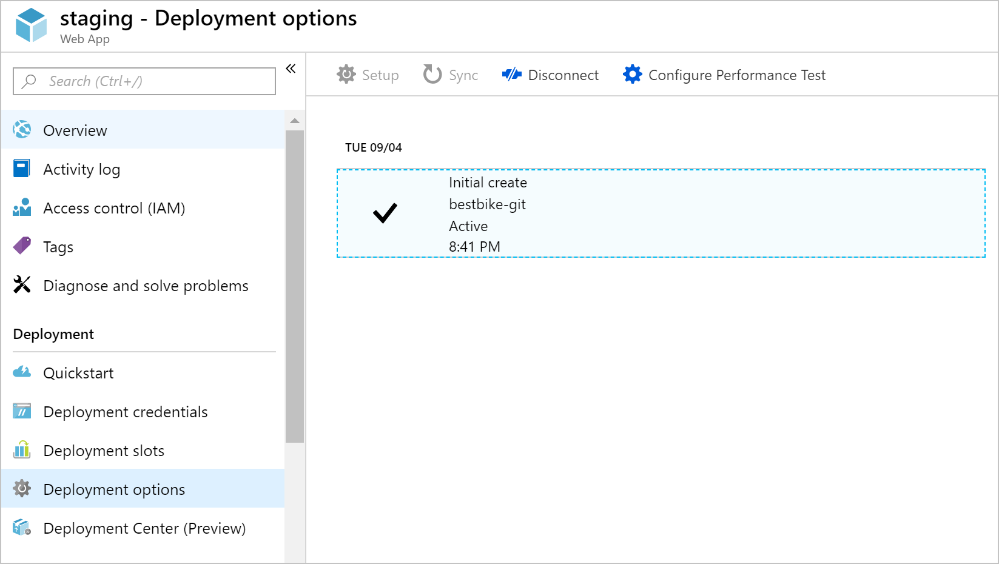
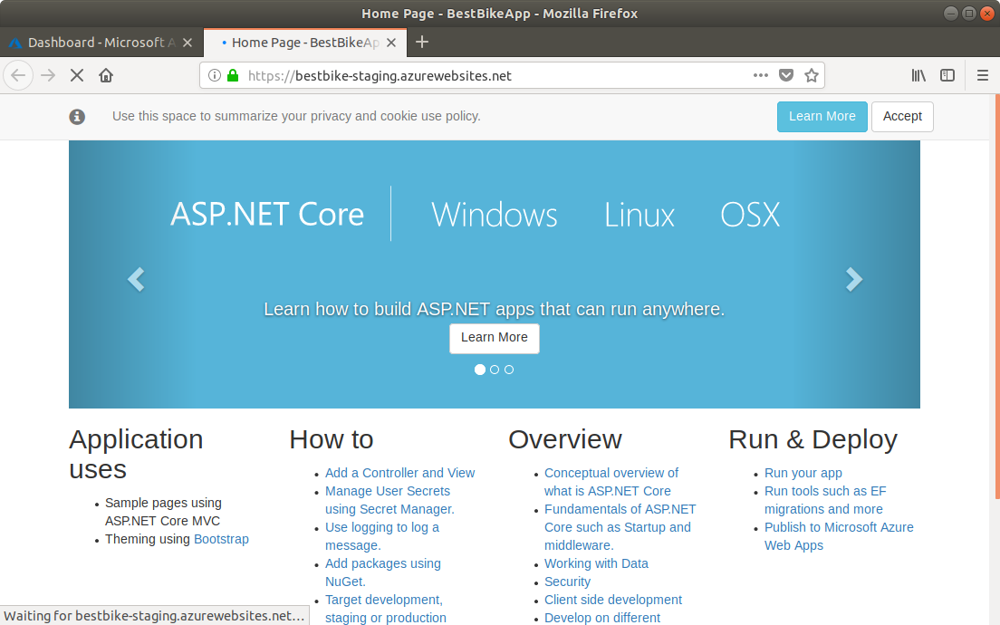

In this unit, you'll deploy your web application to App Service.

::: zone pivot="csharp"

## Use a local Git repository as your deployment option

Next, we'll configure App Service for Git deployment. This will enable us to deploy new versions of our application by pushing our code to a Git endpoint in Azure.

1. In the overview page for your App Service web app, click the **Deployment Center** menu item on the left-hand navigation.

1. Click on **Local Git**.

1. Click **Continue**.

1. Click on **App Service Kudu build server**.

1. Click **Finish**.

## Create deployment credentials

Before you can deploy with Git, App Service requires you to set up a username/password that can be used to authenticate from the Git client.

1. Click the **Deployment Credentials** button.

1. Click on **User Credentials**.

1. If not already populated, set the **Username** field. This does not have to be the same as your Azure account username.

1. Enter a **Password** of your choice, and then confirm your password.

    > [!NOTE]
    > Make sure you don't forget your username and password! You will need them later when we start uploading and deploying our code to Azure.

1. Click on **Save Credentials**.

1. Take note of the **Git Clone Uri**, which is the Azure Git repository URL that you will use as a **remote** for your local application code repository.

## Set up Git on Cloud Shell

Git is already installed Azure Cloud Shell but you'll want to set your username and email for your cloud shell account.

1. In the Cloud Shell on the right, type the following commands, replacing the `[your name]` and `[your email]` placeholders with your own name and email (without the braces):

    ```bash
    git config --global user.name "[your name]"
    git config --global user.email "[your email]"
    ```

1. To verify that your information has been recorded by Git, type the following command:

    ```bash
    cat ~/.gitconfig
    ```

   You should be seeing the following, with your name and email shown:

    ```output
    [user]
        name = {your name}
        email = {your email}
    ```

## Initialize a local Git repository for your code

To start using Git, you need to initialize a local Git repository for your .NET Core application code.

1. Make sure you are in the project folder you created earlier.

    ```bash
    cd ~/BestBikeApp/
    ```

1. Initialize a new Git repository by issuing the following command:

    ```bash
    git init
    ```

    If the command is successful, you receive a message like the following:

    ```output
    Initialized empty Git repository in /home/{your-user}/BestBikeApp/.git/
    ```

1. Stage all the application files to Git.

   The next step is to let Git know about your application files. Do that by adding all the files of the working directory so that they get **staged** by Git. Type the following command:

    ```bash
    git add .
    ```

    The command above adds all files, represented by the ".", to the staging state of Git.

1. Now, you need to commit your changes to Git.

   Once you stage the files with Git, you need to commit your files to the **Git commit history** on your local machine. You do that by typing the following command:

    ```bash
   git commit -m "Initial commit"
    ```

   The `commit` command accepts the `-m` argument to include a message with the commit you are creating. Later on, when you push your code to Azure, you will be able to see the same message stored with this particular commit.

## Add a remote for the local Git repository

At this point, you have successfully initialized a new local Git repository. In addition, you've committed all of your application files to Git. What remains is to add a **remote** to connect your local Git repository to that hosted on Azure.

To do so, you need to:

1. Copy the **Git clone url** that you saw above.

1. Once copied, you go back to the **Terminal** window and issue the following Git command with your url:

    ```bash
    git remote add origin https://BESTBIKE-git@BESTBIKE.scm.azurewebsites.net:443/BESTBIKE.git
    ```

    The above Git command connects your local Git repository to the one hosted on Azure. Now you can deploy your code by pushing to it.

1. To verify the above command, type the following Git command:

    ```bash
    git remote -v
    ```

    The command above generates the following output:

    ```output
    origin	https://BESTBIKE-git@BESTBIKE.scm.azurewebsites.net:443/BESTBIKE.git (fetch)
    origin	https://BESTBIKE-git@BESTBIKE.scm.azurewebsites.net:443/BESTBIKE.git (push)
    ```

## Push your code to Azure

Now that you have your local Git repository hooked to the remote Git repository on Azure, you will develop and build the app, and then push your application code to Azure.

1. Type the following Git command to push your **master** branch to the remote Git repository on Azure:

    ```bash
    git push origin master
    ```

1. You will be prompted to enter the password that you noted from the **Deployment Credentials** section above. Enter your password and hit Enter. Git starts uploading your committed files to the Azure remote Git repository.

## Verify the code is uploaded to Azure

1. Switch back to the Azure portal.

1. Click on the **All Resources** menu item on the left-side navigation.

1. The Azure portal navigates you to the list of all resources created on Azure so far.

1. Click on your web app.

1. Once you arrive to the overview page, go to **Deployment Center**.

    You will see that your first commit that you have locally on your machine is now uploaded to the Azure portal.

    When you push your code to the remote Git repository in App Service, Azure records this operation.

    Every time you push your code to Azure, you will see a new record, together with the commit message (the string that you supply with the `-m` argument) that you type when committing your changes.

    ****

1. Let's visit the application URL. The URL was mentioned above, however, if you forget that URL, you can always go to the **Overview** page of the staging deployment slot and pick up the URL.

1. Type the URL in your browser address bar.

    

Congratulations! You have successfully hosted your application on App Service!

::: zone-end

::: zone pivot="node"

There are two primary ways to upload a **.zip** file to an App Service web app.

First, you can deploy a zipped website up to App Service using a dedicated built-in web page. If you navigate to `https://<app_name>.scm.azurewebsites.net/ZipDeployUI` you are shown a site you can drag/drop the local **.zip** file and upload it to your server. You need to sign in with the same Azure credentials used to create the site in this case. This approach is similar to using FTP to upload to the storage folder mapped to the website host.

The second approach which we'll use here is the command line. The Azure CLI includes the `webapp deployment` command to upload a ZIP file that contains all the files for the website. Use the following command to upload your zip file to your created website. Make sure to replace the `<app_name>` and .zip filename:

```azurecli
az webapp deployment source config-zip --resource-group <rgn>[sandbox resource group name]</rgn> --src helloworld.zip --name <app_name> 
```

This will respond with a JSON block with the details about the transfer.

```json
{
  "active": true,
  "author": "N/A",
  "author_email": "N/A",
  "complete": true,
  "deployer": "Push-Deployer",
  "end_time": "2018-12-19T18:04:13.441193Z",
  "id": "ddd8d88c04194a00a0eb7cb96766c054",
  "is_readonly": true,
  "is_temp": false,
  "last_success_end_time": "2018-12-19T18:04:13.441193Z",
  "log_url": "https://<app_name>.scm.azurewebsites.net/api/deployments/latest/log",
  "message": "Created via a push deployment",
  "progress": "",
  "received_time": "2018-12-19T18:04:09.585955Z",
  "site_name": "<app_name>",
  "start_time": "2018-12-19T18:04:09.843809Z",
  "status": 4,
  "status_text": "",
  "url": "https://<app_name>.scm.azurewebsites.net/api/deployments/latest"
}
```

When the command finishes running, open a new browser tab and navigate to `https://<app_name>.azurewebsites.net`. You'll see the "Hello World!" message from your app &mdash; you've deployed successfully!

::: zone-end

::: zone pivot="java"

## Configure deployment credentials

Most App Service deployment techniques, including the one we'll use here, require a username and password that are separate from your Azure login. Every web app comes preconfigured with its own username and a password that can be reset to a new random value, but can't be changed to something you choose.

Instead of finding those credentials for each one of your apps and storing them somewhere, you can use an App Service feature called User Deployment Credentials to create your own username and password. The values you choose will work for deployments on *all* App Service web apps that you have permissions to, including new web apps that you create in the future. The username and password you select are tied to your Azure login and intended only for your use, so don't share them with others. You can change both the username and password at any time.

The easiest way to create deployment credentials is from the Azure CLI. Run the following command in the Cloud Shell to set them up, substituting `<username>` and `<password>` with values you choose.

```azurecli
az webapp deployment user set --user-name <username> --password <password>
```

## Deploy the application package with wardeploy

**Wardeploy** is an App Service deployment mechanism specifically designed for deploying WAR web application package files to Java web apps. Wardeploy is part of the Kudu REST API: an administrative service interface, available on all App Service web apps, that can be accessed over HTTP. The simplest way to use wardeploy is with the `curl` HTTP utility from the command line.

Run the following commands to deploy your app with wardeploy. Replace `<username>` and `<password>` with the Deployment User username and password you created above, and replace `<web_app_name>` with the name of your web app.

```console
cd ~/helloworld/target
curl -v -X POST -u <username>:<password> https://<sitename>.scm.azurewebsites.net/api/wardeploy --data-binary @helloworld.war
```

When the command finishes running, open a new browser tab and navigate to `https://<web_app_name>.azurewebsites.net`. You'll see the "Hello World!" message from your app &mdash; you've deployed successfully!

::: zone-end