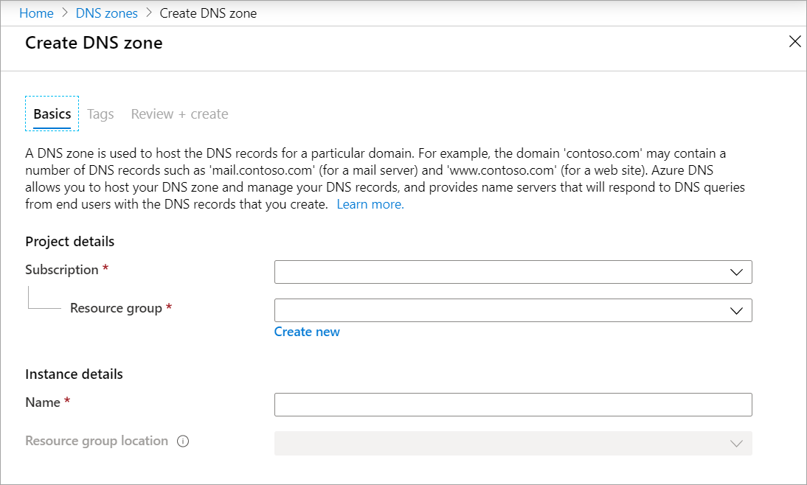
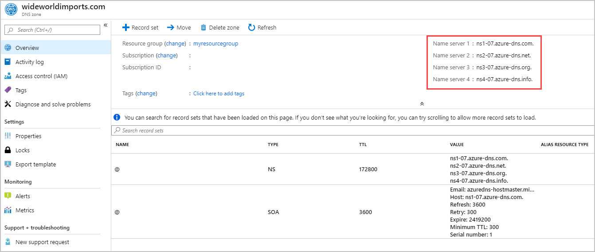
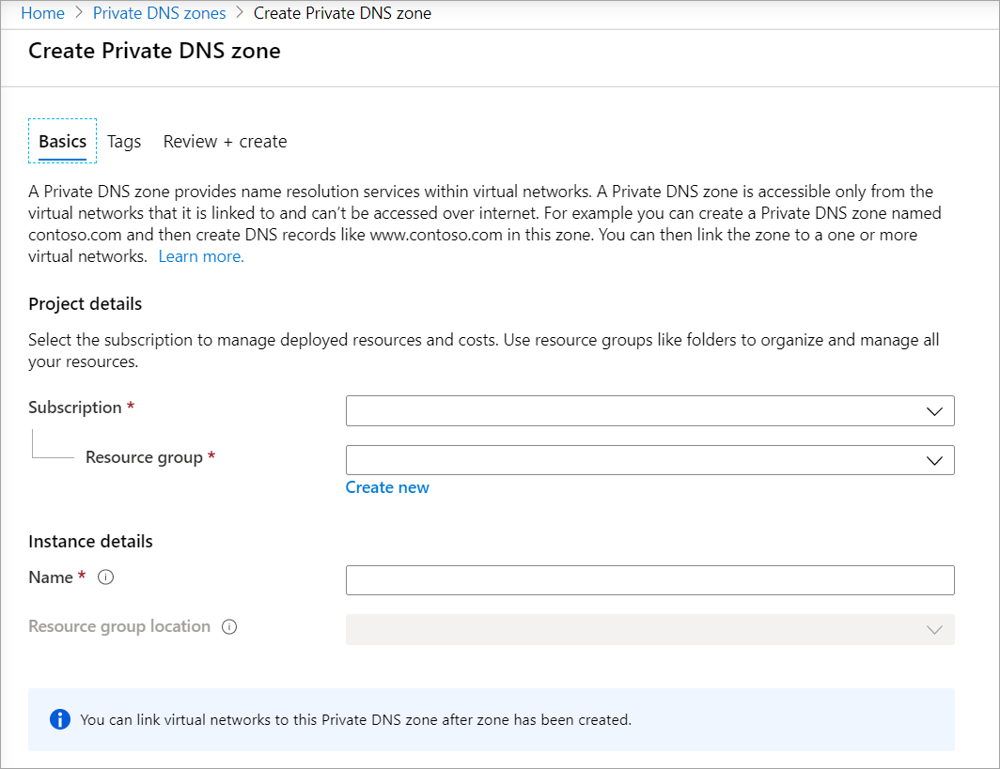
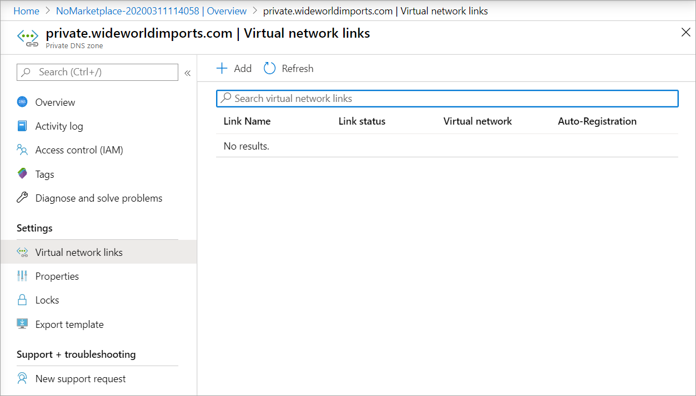
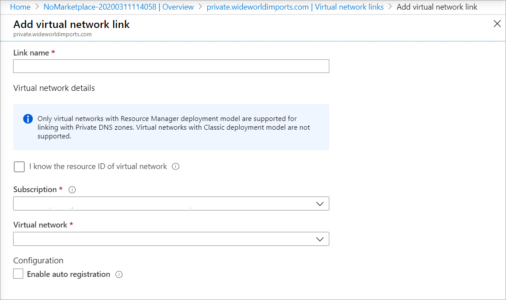

The new company website is in final testing. You're working on the plan to deploy the wideworldimports.com domain by using Azure DNS. You need to understand what steps are involved.

In this unit, you'll learn how to:

- Create and configure a DNS zone for your domain by using Azure DNS.
- Understand how to link your domain to an Azure DNS zone.
- Create and configure a private DNS zone.

## Configure a public DNS zone

You'll use a DNS zone to host the DNS records for a domain, such as wideworldimports.com. 

### Step 1: Create a DNS zone in Azure

You used a third-party domain-name registrar to register the wideworldimports.com domain. The domain doesn't point to your organization's website yet.

To host the domain name with Azure DNS, you first need to create a DNS zone for that domain. A DNS zone holds all the DNS entries for your domain.

When creating a DNS zone, you need to supply the following details:

- **Subscription:** The subscription to be used.
- **Resource group:** The name of the resource group to hold your domains. If one doesn't exist, create one to allow for better control and management.
- **Name:** The name of your domain, which in this case is wideworldimports.com.
- **Resource group location:** The location defaults to the location of the resource group.

    

### Step 2: Get your Azure DNS name servers

After you create a DNS zone for the domain, you need to get the name server details from the name servers (NS) record. You'll use these details to update your domain registrar's information and point to the Azure DNS zone.



### Step 3: Update the domain registrar setting

As the domain owner, you need to sign in to the domain-management application provided by your domain registrar. In the management application, edit the NS record, and change the NS details to match your Azure DNS name server details.

Changing the NS details is called *domain delegation*. When you delegate the domain, you must use all four name servers provided by Azure DNS.

### Step 4: Verify delegation of domain name services

The next step is to verify that the delegated domain now points to the Azure DNS zone you created for the domain. This can take as few as 10 minutes, but might take longer.

To verify the success of the domain delegation, query the start of authority (SOA) record. The SOA record was automatically created when the Azure DNS zone was set up. You can do this by using a third-party tool like nslookup.

The SOA record represents your domain and will become the reference point when other DNS servers are searching for your domain on the internet.

To verify the delegation, use nslookup like this:

```dos
nslookup -type=SOA wideworldimports.com
```

### Step 5: Configure your custom DNS settings

The domain name is wideworldimports.com. When it's used in a browser, the domain resolves to your website. But what if you want to add in web servers or load balancers? These resources need to have their own custom settings in the DNS zone, either as an A record or a CNAME.

#### A record

Each A record requires the following details:

- **Name:** The name of the custom domain, for example *webserver1*.
- **Type:** In this instance, it's A.
- **TTL:** Represents the "time-to-live" as a whole unit, where 1 is one second. This value indicates how long the A record lives in a DNS cache before it expires.
- **IP address:** The IP address of the server to which this A record should resolve.

#### CNAME record

The CNAME is the canonical name, or the alias for an A record. Use CNAME when you have different domain names that all access the same website. For example, you might need a CNAME in the *wideworldimports* zone, if you want both www\.wideworldimports.com and wideworldimports.com to resolve to the same IP address.

You would create the CNAME record in the *wideworldimports* zone with the following information:

- NAME: www
- TTL: 600 seconds
- Record type: CNAME

If you exposed a web function, you would create a CNAME record that resolves to the Azure function.

## Configure private DNS zone

To provide name resolution for virtual machines (VMs) within a virtual network and between virtual networks, create a private DNS zone.

### Step 1: Create private DNS zone

In the Azure portal, search for *private dns zones*. To create the private zone, you need enter a resource group and the name of the zone. For example, the name might be something like private.wideworldimports.com.



### Step 2: Identify virtual networks

Let's assume that your organization has already created your VMs and virtual networks in a production environment. Identify the virtual networks associated with VMs that need name resolution support. To link the virtual networks to the private zone, you need the virtual network names.

### Step 3: Link your virtual network to a private DNS zone

To link the private DNS zone to a virtual network, you'll create a virtual network link. In the Azure portal, go to the private zone, and select **Virtual network links**.



Select **Add** to pick the virtual network you want to link to the private zone.



You add a virtual network link record for each virtual network that needs private name resolution support.

In the next unit, you'll learn how to create a public DNS zone.
