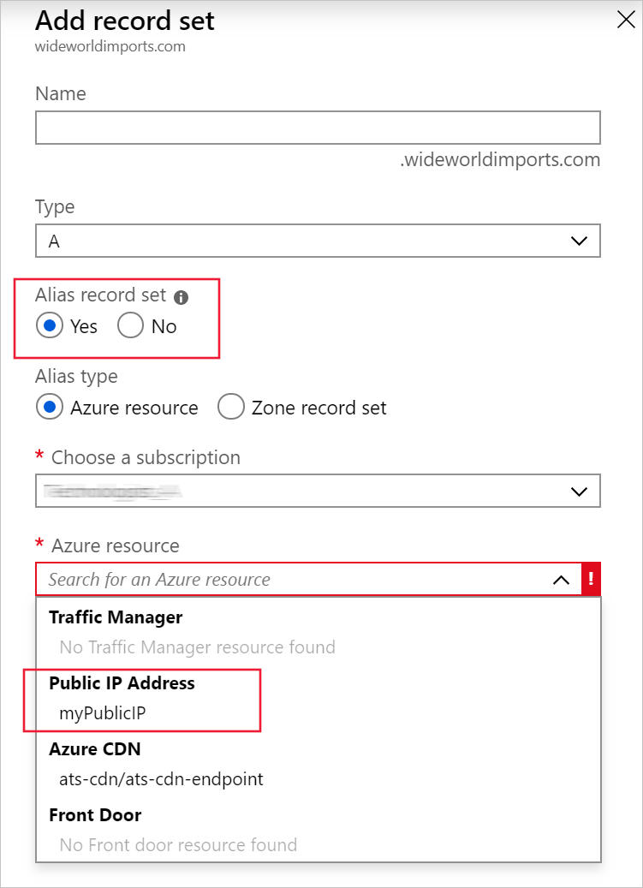

The deployment of your new website has been a huge success. Usage volumes are much higher than anticipated and the single web server it's running on is showing signs of strain. The solution is to increase the number of servers and distribute the load using a load balancer.

You now know you can use an Azure alias record to provide a dynamic, auto refreshing, link between the zone apex and the load balancer.

In this unit, you'll:
- set up a VNET with two VMs and a load balancer.
- learn how to configure an Azure alias at the zone apex to direct to the load balancer.
- verify the domain name resolves to one or either of the VMs on your VNET

## Prerequisites

To complete this exercise, you will need:

- A correctly configured DNS zone
- An Azure portal instance that allows the creation of custom resource groups

## Set up a VNET, Load balancer, and VMs in Azure

> [!NOTE]
> The associated script is designed to run in a sandbox. Since the sandbox only has one resource group this will be easy to find. However if you are running your own Azure instance, the setup script will select the first resource group in your resource group list. In most instances this will be a 'cloud shell storage ???' for your area, for example: cloud-shell-storage-westeurope.

Manually creating a VNET, load balancer, and two VMs will take some time. To improve set up time, you can use a Bash setup script, which is available on GitHub. Follow these instructions to create a test environment for your alias record.

1. Using the Bash Cloud Shell, clone the setup script.

    <!-- Replace with new repo - script.sh and cloud-init.txt in resources folder -->
   ```bash
   git clone https://github.com/GeekEffect/load-balancer-setup.git
   ```
   It will take a few moments to download the files.

1. To run the set-up script, type these two commands:

   ```bash
   cd load-balance-setup
   chmod +x setup.sh
   ./setup.sh
   ```

   The setup script is going to take a few minutes to run. The script will:

   - Create a temporary resource group for all the resources
   - Creates a network security group
   - Create two NIC's and two VMs
   - Create a VNET and assign the VMs
   - Create a public IP address and update the configuration of the VMs
   - Create a load balancer referencing the VMs, including load balancer rules.
   - Link the NICs to the load balancer

    Once the script is completed, it will show you the public IP address for the load balancer. Make a note since we will use it later.

1. Close the Bash CLI window as you no longer need it.

## Create an alias record in your zone apex

Now that you have created a suitable test environment, you are ready to set up the Azure alias record in your zone apex.

If you made a note of the public IP address for the load balancer earlier, then you can skip the next three steps, and start from selecting the **myResourceGroup**.

1. On the Azure portal, navigate the resource group. If this is running a sandbox, there will only be one.  If you are running a personal Azure instance, it will most likely be: cloud-shell-storage-westeurope, or something similar.
1. From the list of resources available in this resource group, select **myPublicIP**.
1. Find and make a note of the IP address.
   
1. Return to the resource groups list and select **myResourceGroup**.
1. Select the **wideworldimports.com** DNS zone.
1. Select **Add Record**.
1. Use the following settings to create an alias record:

    1. **Name** - Leave the name blank. By leaving it blank, this represents the DNS zone for wideworldimports.com.
    1. **Type** - Select **A**. Even though we are creating an alias, the base record type still needs to either: A, AAAA or CNAME.
    1. **Alias record set** - Select **Yes**.
    1. **Alias type** - You can select either Azure resource or Zone record set. In this case, select the **Azure resource**.
    1. **Azure Resource** - From the drop-down list of resource, select the **myPublicIP** resource.
    
1. Select **OK** to add the record to your zone.

When the new alias record is created, it should look something like this:


## Verify alias is resolving to the load balancer

Now you need to verify the alias record has been correctly set up.  In a real world scenario, you will have an actual domain and you would have completed the domain delegation to the Azure DNS.  In that instance, you would use the registered domain name.  Since this unit assumes there is no registered domain, you will use the public IP address:

1. From your web browser, Open a new page.
1. In the URL address line, type in the name of the public IP address for wideworldimports.com.
1. You will now see a basic web page, showing the name of the VM that is running. If you refresh the page a few times, it should switch between VM1 and VM2.

The aim of this test is to ensure that the alias record is correctly pointing to the load balancer.  Not that the load balancer is switching between VMs.

Keep this browser window open, as we will need to use later.

## Change the public IP address of your load balancer

Several months have gone by and you decide to upgrade the load balancer. If you did not use an alias record, after you made the change to the load balancer and obtained a new public ip address, you would also need to update the zone apex record too.

Using the Azure alias service it is no longer the case. The alias record maintains a link to the load balancer, so if the associated load balancer public IP address changes, the zone apex records change automatically.

To simulate a change in public IP address for your load balancer:

1. Log into your [Azure portal](https://portal.azure.com/learn.docs.microsoft.com?azure-portal=true).
1. Open a Cloud Shell instance.
1. Use the following code to change the public IP address.

   ```BASH
   az network public-ip update -g cloud-shell-storage-westeurope -n myPublicIP --allocation-method Static --set ipAddress="51.105.121.229" --force-string
   ```

   Note: change the cloud-shell-storage-westeurope to be the name of the resource group created by the setup scripts earlier.

    Which will force the public IP address to change to a new IP static IP address.

1. Return to the browser window you used to check the alias was working.
1. Refresh the web page. You will see the same lightweight message showing the name of the VM serving the page.

You have now successfully linked an Azure alias record to your load balancer. Any changes that occur to the load balancer resource will be reflected automatically in the alias record.

## NOTE

- Presently the setup link in this unit references a script hosted on a third-party GitHub site. To ensure future compatibility, the two files needed to run the setup for this unit have been included in the resource folder (setup.sh and cloud-init.txt). The script file has been amended to make it comply with this units needs. The current clone creates a folder for the files called load-balance-setup, which should be persisted, otherwise the instructions in this unit need to be updated.

- While developing this unit I have used a non-sandbox Azure profile, since the setup file needs to create two VMs and a load balancer. If the intent is to run this module in a sandbox, it will need provisioning to support:

  - Creation of network security group
  - Creation of max of two NICs
  - Creation of max of 2 VMs
  - Creation of a VNET
  - Creation of a public IP address
  - Creation of a load balancer
  - Allocation of all of the above to a resource group
