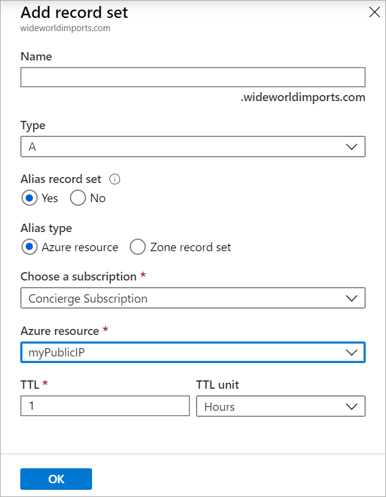
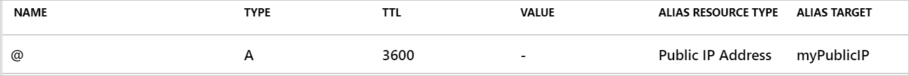
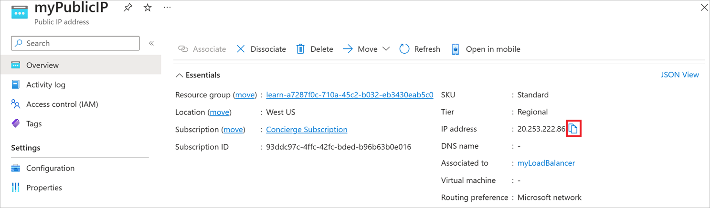

The deployment of your new website was a huge success. Usage volumes are much higher than anticipated. The single web server the website runs on is showing signs of strain. Your organization wants to increase the number of servers and distribute the load using a load balancer.

You now know you can use an Azure alias record to provide a dynamic, auto refreshing, link between the zone apex and the load balancer.

In this unit, you'll:

- Set up a virtual network with two VMs and a load balancer.
- Learn how to configure an Azure alias at the zone apex to direct to the load balancer.
- Verify the domain name resolves to one or either of the VMs on your virtual network

## Set up a virtual network, Load balancer, and VMs in Azure

Manually creating a virtual network, load balancer, and two VMs will take some time. To improve set up time, you can use a Bash setup script, which is available on GitHub. Follow these instructions to create a test environment for your alias record.

1. Using the Cloud Shell, run the following setup script.

    ```bash
    git clone https://github.com/MicrosoftDocs/mslearn-host-domain-azure-dns.git
    ```

1. To run the set-up script, run the following commands:

    ```bash
    cd mslearn-host-domain-azure-dns
    chmod +x setup.sh
    ./setup.sh
    ```

    The setup script is going to take a few minutes to run. The script will:

    - Creates a network security group
    - Create two NIC's and two VMs
    - Create a virtual network and assign the VMs
    - Create a public IP address and update the configuration of the VMs
    - Create a load balancer referencing the VMs, including load balancer rules.
    - Link the NICs to the load balancer

    After the script completes, it shows you the public IP address for the load balancer. Copy the IP address to use it later.

## Create an alias record in your zone apex

Now that you've created a  test environment, you're ready to set up the Azure alias record in your zone apex.

1. In the [Azure portal](https://portal.azure.com/learn.docs.microsoft.com?azure-portal=true), go to the <rgn>[Sandbox resource group]<rgn>.
1. Select the **wideworldimports.com** DNS zone.
1. Select **+ Record set**.
1. Use the following settings to create an alias record.

    | Field | Setting |
    | ---- | ---- |
    | Name | Leave the name blank. By leaving it blank, it indicates the DNS zone for wideworldimports.com |
    | Type | **A**. Even though we're creating an alias, the base record type still needs to either: A, AAAA or CNAME |
    | Alias record set | **Yes** |
    | Alias type | You can select either Azure resource or Zone record set. In this case, select the **Azure resource** |
    | Azure Resource | From the drop-down list of resource, select the **myPublicIP** resource |

    When you're done, it should look like this.

    

1. Select **OK** to add the record to your zone.

When the new alias record is created, it should look something like this:



## Verify alias is resolving to the load balancer

Now you need to verify the alias record is set up correctly. In a real world scenario, you'll have an actual domain and would have completed the domain delegation to the Azure DNS.  So you would use the registered domain name for this exercise.  Because this unit assumes there's no registered domain, you'll use the public IP address.


1. If you didn't copy the public IP address in a previous step, go to the resource group and select myPublicIP. The IP address is on the top right-hand side.

1. In a web browser, paste in the public IP address as the URL.
1. You'll see a basic web page that shows the name of the VM that the load balancer sent the request to.

The aim of this test is to check that the alias record is correctly pointing to the load balancer.
