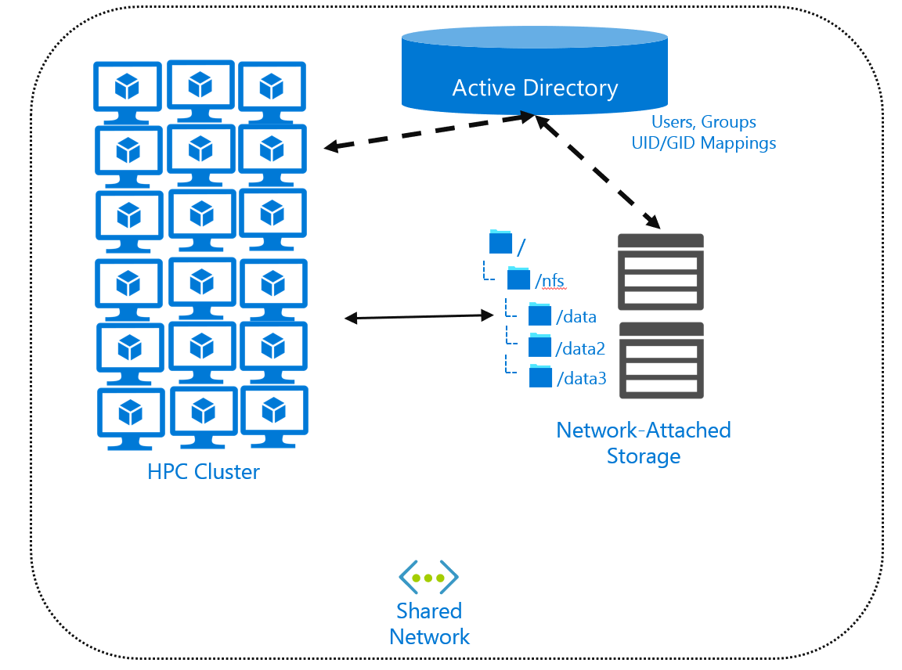

After you understand the overall performance and traffic characteristics of your workload, you'll need to consider security aspects. Your data might be sensitive, like patient radiological images. You might want to restrict access to data for many reasons. You might want to offer each of your researchers a "home directory" from which they can load data and conduct HPC analysis and simulations.

When you select your cloud HPC storage, be aware of how it integrates with your current security posture. Understand the methods by which your file system authenticates and authorizes access to files. Notice whether the enforcement is local or remote (or both), and where authentication and authorization are sourced. If you use a remote shared file system, you need to understand how to control access by using standard NAS practices. Finally, if you offer unique working spaces for users (home directories), understand how to allocate that space.

In this unit, we examine security considerations and how they affect your storage architecture.

## Overview of authentication and authorization

**Authentication**: When you provide access to file systems, you need to authenticate the requestor by using some trusted credential. Many client/server architectures issue challenges for such credentials, like user or computer accounts. Those credentials are then checked to ensure they're valid for the environment. After authentication, the requestor (the user or the computer/process) is then authorized. The required access protocols for your environment might limit the authentication for your solution. For example, if you have a Windows environment, you're most likely using Server Message Block (SMB) as the network file-access protocol. SMB authentication requirements aren't the same as NFS requirements.

**Authorization**: Allowing a user or computer access to an environment is one thing, but what *level* of access? For example, user A might be able to read files on a file system, and user B might be able to read and write files. Authorization can go deeper than reading and writing. For example, user C might be able to modify files but not create new ones in a given directory.

The level of authorization is often expressed as *permissions* for a given file. These include reading, writing, and execution. 

**Users and groups**: Granting access to a set of resources can become cumbersome when you have a large number of users. It also becomes complicated if you intend to grant different levels of access to multiple sets of users. The use of *groups* then becomes necessary. You can assign a user to a specific group or set of groups. You can then authorize access to resources based on that group identification.

Authentication and authorization taken together, represent the user-level, group-level, and computer-level access you intend to grant to resources, in our case, to files.

The Linux OS assigns a *user identifier* (UID) to individual user accounts. The UID is an integer. It's what the system uses to determine which system resources, including files and folders, a specific user can access.

Linux OS uses *group identifiers* (GIDs) for group assignments. A user is associated with a single primary group. Users can be associated with virtually any number of supplemental group assignments, as many as 65,536 on most modern Linux systems.

### Local and remote authentication and authorization 

Local authentication and authorization refer to the access of a local file system by a user/computer account that's also local to the computer. For example, I can create a user account that I then grant access to the /data directory located on my local file system. That user account is local, as is any grant of access to the directory. I can also use group assignment to control access. The combination of user and group authorization gives a user *effective* permissions over a file or folder.

If you look at a typical output of the `ls -al` directory command, you may see something like this:

```
drwxr-xr-x  4 root root 4096 Dec 31 19:43.
drwxr-xr-x 13 root root 4096 Dec 11 05:53 ..
drwxr-xr-x  6 root root 4096 Dec 31 19:43 microsoft
drwxr-xr-x  8 root root 4096 Dec 31 19:43 omi
-rw-r--r--  1 root root    0 Jan 21 15:10 test.txt
```

The `drwxr-xr-x` characters represent the level of authorized access that users and groups have to the file or directory. The `d` indicates that the entry is a directory. (If the first value is `-`, the entry is a file entry.) The remaining characters represent permission group authorization of read (r), write (w), and execute (x). The first three values indicate the "owner" of the file or directory. The second three values indicate the group permissions assigned to the file or directory. The final three values indicate permissions allowed to all other users on the system. 

Here's an example:

```-rw-r--r--  1 root root    0 Jan 21 15:10 test.txt```

- `-` indicates that this resource is a file.
- `rw-` indicates that the owner has read and write permissions.
- `r--` indicates that the assigned group has only read permissions.
- `r--` indicates that the remaining users have only read permissions.
- Note also that the owning user and assigned group are represented by the two `root` columns.

A UID and primary and supplemental GIDs represent an authenticated user on a local computer. Those values are local to the computer. What happens if you have five or even 50 computers? You'd have to replicate the UID and GID assignments on each of those computers. The level of complexity around user management grows, as does the possibility of accidentally granting file or folder access to the wrong user.

#### Remote file access via NFS

Local UID and GID assignment works fine if you're running everything as a single user/group assignment. What if multiple stakeholders are consuming the HPC cluster that you're running, and each stakeholder has sensitive data and multiple consumers of the data?

Locating data on a file server or NAS environment allows remote access of the data. This approach helps reduce the local disk cost, ensures the data is up to date for all users, and reduces overall user and group management. 



If you locate files centrally, you might need a *directory service* that contains the user and group configuration. Directory services, like Active Directory or Lightweight Directory Access Protocol (LDAP), allow you to create a user/group mapping that all remote systems can then use. You configure your remote computers and your NAS environment as clients of the directory service. You can also use Active Directory mappings between your Windows user accounts and a specific UID and GID combination.

The typical method for accessing files remotely is to use a network file system like NFS or SMB, or a parallel file system like Lustre. These protocols define the client-and-server API for accessing data. We discussed NFS operations in the "File-system performance considerations" unit. We'll discuss the use of NFS at length in the next unit.

> [!NOTE] 
> A directory service isn't required when you use NFS. But if you don't use one, UID and GID management will still be difficult if you have large numbers of users and systems. 

#### Home directories

Say you have an HPC environment that multiple researchers are using, but their unique data must be kept separate. Say those researchers are continually modifying and adding to their own data. Providing researchers with their own home directories is an efficient way to segregate their data.

Each researcher would handle permissions within the home directory, so they could collaborate if they wanted to.

One of the main challenges in this environment is storage space. Say you have a 500-TB NAS environment. What stops one researcher from using it all?

You can assign a *quota* to an individual directory. The quota reflects the maximum amount of data allowed. After the quota is reached, it can reject further data or warn admins that the researcher has exceeded the limit. For example, if you have a NAS system, you can assign a quota to each researcher. And if you isolate the researchers' access to the home directory, it becomes easy to configure and monitor their usage.