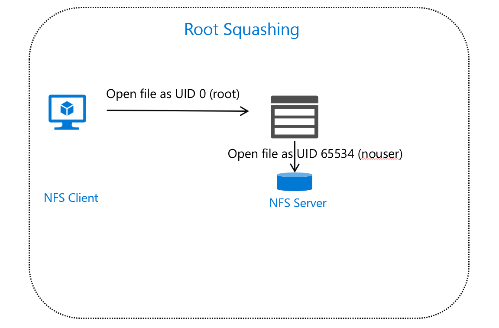

There are some key NFS concepts we want to discuss in the context of choosing your HPC storage solution. The main challenge when you use NFS is determining whether your target HPC storage environment requires configuration elements, network connectivity, or security features specific to a given version of NFS. If you gather some of these concepts into your selection criteria, it helps you assess the various available solutions. At a minimum, accounting for these items saves you time by eliminating anything that doesn't fit your NFS requirements.

## NFS considerations ##

There are two main versions of the NFS protocol: NFSv3 and NFSv4.*x* (v4.1 and v4.2). The full scope of the differences between these two versions is outside the goals of this module. But there are a handful of issues related to authentication and authorization that we identify here. We don't need to discuss the history of the two protocols or why there are two. It's enough to know that many users are still running NFSv3 in their environments.

Let's start with considerations that are specific to the use of NFSv3.

### NFSv3 and groups ###

NFSv3 is a simple file-system protocol that passes API requests to NFS clients and servers. We mentioned earlier that a UID represents a user and that users have a primary group GID association. We also mentioned that a user can be associated with a larger number of groups. For the purposes of NFS, these group assignments are known as *auxiliary groups*. The UID and GID information is passed with requests, which the NFS server uses to determine the appropriate level of access.

NFSv3 has a limit on the total number of GID values it passes. NFSv3 supports the passing of only 16 auxiliary groups for any given UID. If you're using more than 16 group assignments in meaningful ways (such as fine-grained access management), this limitation might affect you. NAS vendors like NetApp have added an extension to the NFS protocol that supports the communication of all group mappings. This extension is known as *extended group* support. If you're assessing HPC storage and are using large numbers of GID assignments, you should verify whether the proposed solution supports this capability.

### NFSv3 and network security ###

NFSv3 is also limited in terms of security. NFSv3 doesn't really have many security features. It doesn't support data encryption or Kerberos authentication, for example. The main mechanisms available in an NFSv3 environment involve the use of *export rules and policies* to limit network-level access to the NFS server. An *export* is the mechanism an NFS server uses to expose a specific directory to clients. Export rules are configured to allow or disallow clients based on their IP network address. You can define host entries in an export rule (for example, 1.1.1.1) or networks (for example, 1.1.1.0/24) and allow or deny access to the export. Export rules are gathered into an export policy, which is associated with a specific export on the NFS server.

### NFSv3 and network ports ###

One challenge with NFSv3 is that it doesn't use a standard TCP port for all communications. This port flexibility makes allowing NFSv3 access challenging over a WAN, given that although there are standard ports (111 for RPC and 2049 for NFS), other ports for mounting the export are randomly assigned ports.

NFSv3 networking in Azure becomes a challenge only if you need access beyond your virtual network and need security configuration that blocks TCP ports. But choosing a solution that provides export-policy configuration helps you lock down the NFS solution directly, no matter what's configured at the edge of your network.

### Squashing ###

*Squashing* refers to the NFS server's ability to force the use of a specific UID to access files or folders. For example, an administrator might want to control which UID is used for a specific exported folder. Linux NFS server environments support the ability to squash root access to a nonroot UID. NAS products support specific squashing based on the incoming client network/address and UID value. One of the key uses of squashing is to ensure nonroot access over remote connections.

If you plan to replicate your file system in Azure and expect this same behavior, keep in mind that not every solution supports squashing in exactly the same way.

### NFSv3 and encryption ###

NFSv3 doesn't support data encryption. It was originally designed for use in a trusted enterprise environment. Your network encryption solution must encrypt the traffic that leaves your trusted network.

### NFSv3 and file locking ###

*Locking* refers to a client's ability to prevent other clients from updating a specific file or section of a file. NFSv3 doesn't have its own locking mechanism. Network services called Network Lock Manager (NLM) and Network Status Monitor (NSM) perform the locking that does exist. These services run on clients and servers and manage all lock interaction. They run outside of the NFS service and generate their own network protocol traffic. These locks aren't mandatory. They're known as *advisory locks*. They're tracked but not enforced. Applications are expected to handle contention and locking issues.

## NFSv4.*x* ##

NFSv4.*x* introduces some key improvements to NFS. Let's focus on the main improvements.

### NFSv4 and Kerberos ###

NFSv4 introduced full support for the use of Kerberos for authentication of users and encryption of all NFS traffic. There was an attempt to integrate Kerberos with NFSv3, but because of the use of NLM/NSM and other external protocols, only data payloads are encrypted.

Unless explicitly blocked by export policies, all access in NFSv3 is trusted. By using Kerberos, you can now authenticate based on trusted machines.

Encryption of all NFS traffic is supported. You can encrypt all traffic from NFS client to NFS server (rather than just on specific network segments).

To use authentication and encryption via Kerberos, you need to deploy a Kerberos environment.

A key consideration is that not all NFSv4-compatible services support Kerberos. Without Kerberos, you can still use other features of NFSv4 but you can't authenticate or encrypt data. When you choose your solution, be sure to check whether you need this capability and whether the options support Kerberos.

### NFSv4 and network ports ###

One advantage of NFSv4 over NFSv3 is that NFSv4 uses a single TCP port (port 2049) for all traffic. If you have an NFSv4 environment in an Azure virtual network or located in your datacenter, it's easier to provide access between firewalls when you support NFSv4.

### NFSv4 and ACLs ###

Say you have a file or folder and you want to offer read/write access to group 1, read-only access to group 2, and append-data access to a specific machine account. NFSv3 permissions (mode bits) can't satisfy these requirements because v3 permissions don't have the level of granularity required.

NFSv4 introduces access control lists (ACLs). Each file/folder can have an ACL applied to it. Each ACL consists of one or more access control entries (ACEs). This approach is familiar to Windows NTFS administrators because NTFS follows the same model.

If your environment uses NFSv4 ACLs, you need to determine which storage solution best meets this requirement.

## Summary ##

We've scratched the surface of NFS protocol considerations. The items we discussed, represent the key factors to consider when you choose your storage solution.

You need to evaluate your current environment and your group management, network, and security requirements to determine the appropriate storage solution.

This table provides a comparison that's based on the previous discussion:

| Capability | NFSv3 | NFSv4 |
| :------------- | :---------- | :----------- |
| File/folder permissions | Mode bits | Mode bits and/or ACLs |
| Encryption | None | Kerberos |
| Network ports | TCP or UDP, portmapper required  | TCP port 2049|
| File locking | Advisory NLM | Active lock support |
