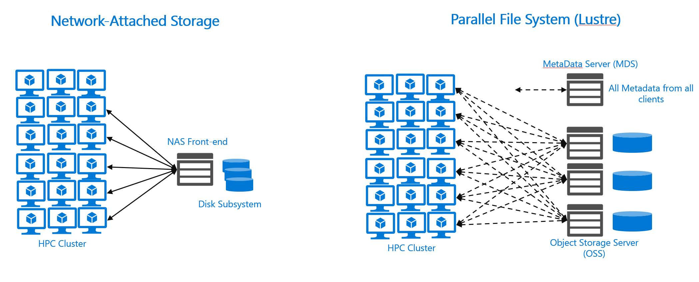

NFS evolved from the enterprise. It's designed to handle concurrent file access at growing scale. But there's an upper bound to the performance and scale that you can get with NFS solutions. There are also classes of workloads that require far greater parallel access to files, including the ability for multiple concurrent processes to write to some section of a file. 

The need to read and write at large scales has grown significantly during the past two decades. Parallel file system solutions are the main choice for accelerating the largest high-performance workloads. Parallel file systems originated in supercomputing centers. They're now widely deployed for various scenarios. For example, seismic processing and interpretation solutions used by major oil and gas companies, and the secondary/tertiary analysis of genomic data.

This unit presents a light treatment of parallel file systems. If you've been running such workloads, you're probably well acquainted with the drivers, need, and architecture of these solutions. There's a gray area between distributed NAS solutions that serve NFS and parallel file systems. The use of parallel file systems might better satisfy your requirements.

After you complete this unit, you'll be more familiar with the main features of parallel file systems.

Parallel file systems have historically been a full class of capability that requires in-depth knowledge of application I/O. This information is here to help build understanding, not expertise.

## Distributed NAS (NFS) vs. parallel file systems ##

Both Distributed NAS and parallel file systems are shared file systems. Multiple clients read files concurrently, files are written to and locked, metadata can be modified, and more.

You can scale both of these systems by adding or upgrading storage hardware technologies, adding front-end servers to scale client access, or improving network connectivity.

### Parallel I/O ###

Parallel file systems break files into discrete blocks or stripes and distribute these files across multiple storage servers. There are distributed file systems that stripe data. The difference is that parallel file systems then expose stripes directly to clients, via communication with the hosting storage servers themselves. Striping allows for significant parallel I/O over a standard distributed NAS system. NFS clients that run with the most common scale-out NAS environments must access a file via a single server. When clients access a single server, it causes problems when the number of *concurrent requests* grow beyond what the server can handle. And the parallel file systems approach to parallel access and striping makes them a great fit for workloads that need to access large files across large numbers of concurrent clients.

Here are three major parallel file systems: 
- IBM's GPFS, known as Spectrum Scale 
- Lustre, which is open source but has some commercial implementations 
- BeeGFS

These systems achieve parallel I/O in different ways. GPFS uses servers known as *network storage devices (NSDs)* that connect to a high-performance storage area network (SAN). So GPFS servers have raw disk I/O as their backing storage. BeeGFS has many of the same architectural components as Lustre, but it also has a robust distributed metadata architecture. BeeOND, short for *BeeGFS On Demand*, enables on-demand BeeGFS environments that use storage on each client. Such temporary file system environments can be used for burst buffering.

In both cases, however, parallel file systems can scale by adding more storage servers, which in turn offer more parallel I/O to clients. And total client count can be large, ranging into the tens of thousands.

#### Metadata ####

NFS clients interface directly with an NFS server, which provides metadata information and retrieves data for the clients. You need to size the server component according to the quantity of clients and the expected rate of traffic. This component can become a bottleneck. NAS vendors can implement some metadata optimizations, but most NFS implementations don't recognize a separate metadata service.

Parallel file systems, by contrast, typically implement strategies to better scale client data access. Lustre, for example, implements a separate metadata server (MDS). Clients retrieve all metadata from that system. And Lustre clients can directly access the storage server where a given file is located and can read/write multiple parallel threads. This approach allows the architecture to scale bandwidth based on the number of deployed storage servers.

### Block size ###

We discussed block size earlier, in the context of NFS. Parallel file system block sizes can be larger than NFS block sizes. The default rsize/wsize for NFS clients is usually 64,000. Lustre, for example, has block sizes in the MBs. This larger size has two effects. First, the reading/writing of large files is superior in a parallel file system. But parallel file systems offer little advantage when file sizes are small and the number of files is large.

### Complexity ###

Distributed file system solutions that run NFS are easy to set up and run for common use cases. Like any system, they can be tuned for performance, including manipulating client-server block sizes (rsize/wsize) based on workloads. 

Parallel file systems typically operate against complex workloads in scale environments. They're more likely to require configuration and tuning to ensure sufficient performance and scale.

## Deployment considerations ##

Azure offers several roll-your-own parallel file system offerings. You can go to the Azure Marketplace to see the options, which include BeeGFS and Lustre. (Search for *Whamcloud*.) You can also install Lustre on standard Linux virtual machines, or you can use the Azure Resource Manager (ARM) templates found on the [Azure Quickstart](https://azure.microsoft.com/resources/templates/?term=lustre) site. 
