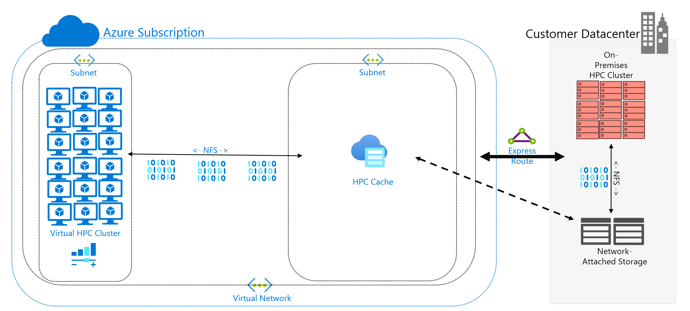

The previous units were largely focused on *what* your storage solution is doing. This unit focuses on *where* your data is located. Specifically, hybrid file access considerations and how to approach them.

## Overview of hybrid file access ##

You've decided to run an HPC workload in Azure that's currently running in your datacenter. Your compute environment accesses data on your NAS, which is serving NFSv3 operations to your workload. It's been running there for years, but maybe your NAS environment is reaching the end of its cycle. Rather than replace it, you're considering a long-term migration to the cloud.

After you make this decision but before full cloud deployment of your HPC workload, you determine your Azure strategy and establish your baseline account/subscription/security setup. Now the hard part: moving your HPC workloads!

The buildout of your HPC cluster and its management plane are outside the scope of this module. We assume that you've determined which virtual machine types and quantities you want to run in your cluster.

For now, we also assume that your goal is to run the workload as is. That is, you don't want to modify the logic or access methods currently deployed on-premises. The implication is that your code expects data to be at directory paths in the cluster members' local file systems.

The first goal is to understand what data is required and where it's sourced from. Your data might be in a single directory in a single NAS environment, or it might be spread out across various environments.

The next goal is to determine how much data is required to run the workload. Is the source data a couple of gigabytes, or is it hundreds of terabytes?

Finally, you have to determine how the data is presented in Azure compute. Is it served locally to each HPC cluster machine, or shared by a cloud-based NAS solution?

## Remote data access considerations ##

You have a genomics workload that you want to run in Azure. Your data is generated on-premises by gene sequencers and sent to a local NAS environment. On-premises researchers consume the data for various uses. The researchers might also want to consume the results of the HPC workload you intend to run in Azure. But some of them use on-premises workstations to do so. Let's also assume fresh genomic data is generated regularly. So you have a limited interval to run the current workload before the data needs to be replaced/refreshed.

The challenge is to present the data to Azure compute in a cost-effective, timely way but still preserve on-premises access to it.

Here are some of the main questions to ask when you're trying to run HPC workloads in Azure:

- Can we move source data to Azure without keeping a copy on-premises?
- Can we save results data in Azure storage without keeping a copy on-premises?
- Do on-premises users need concurrent access to the source or results data?
- If they do, are they able to operate on the data in Azure, or do they need the data to be stored on-premises?

If the data needs to be kept on-premises, how much data must be copied to Azure for the workload? How long do you have after data is processed before you need to process a new set of data? Will your workload run in that timeframe?

You also need to consider network connectivity to Azure. Do you have only internet access to Azure? That limitation might be OK, depending on the size of the data to be copied/transferred and the amount of time between refreshes. Maybe you have a large amount of data to copy each time. You might need a wide-area network (WAN) connection to Azure that uses Azure ExpressRoute, which would provide more bandwidth to copy/transfer the data.

If you already have an ExpressRoute connection to Azure, here's the next consideration: how much of the connection is available to your data-copy operation? If the link is heavily saturated, you might need to consider the  time of day when you transfer data. Or you might want to configure a larger ExpressRoute connection to accommodate large data transfers.

If you move the data to Azure, you might need to consider how you secure it. For example, you might have an on-premises NFS environment that uses a directory service that helps to extend permissions to your users. If you plan to copy this security to Azure, you need to decide whether you need a directory service as part of the Azure buildout. But if your workload is restricted to the HPC cluster and the results would be transferred back to your local environment, you might be able to omit these requirements.

Next, we consider the methods for accessing data: caching, copying, and synchronizing.

## Caching vs. copying vs. sync ##

Let's discuss the general approaches you can use to add data to Azure. The focus of this data transfer discussion is active data, not data archive and backup.

Assume the data transferred in our discussion is the *working set* of an HPC workload. In a life sciences HPC environment, data might include source data like raw genomic data, binaries used to process that data, or supplemental data like reference genomes. It needs to be processed immediately upon arrival or not long after. The data must also be stored on media that has the appropriate performance profile for IOPS, latency, throughput, and cost. By contrast, archive/backup data is most often transferred to the least expensive storage solution possible, which isn't intended for high-performance access.

The main methods of transferring active data are *caching*, *copying*, and *synchronizing*. Let's discuss the pros and cons of each approach, beginning with copying.

**Copying** data is the most common approach for moving data. The data is copied in various ways, depending on the tool you use.

Consider these factors:

- The size of the files. 
- The number of files.
- The amount of available throughput for transferring the data.
- The amount of time you have to do the transfer. 

A basic copy tool like `cp` is all you need if you're transferring a handful of reasonably sized files to a remote destination. You'll probably want to use `scp` instead of `cp` if you're transferring data over networks that aren't secure: `scp` provides encryption over a Secure Shell (SSH) connection.

There are many approaches to optimizing copy operations, depending on where you intend to copy the data. If you're copying files directly to each HPC machine, you could schedule individual copy operations on each node, for example. 

One consideration when you're copying data across WAN links is the quantity of files and folders being copied. If you're copying many small files, you want to combine the use of copy with an archive like `tar` to remove the metadata overhead from the WAN link. Copy the .tar file to Azure and then copy the data to the machines.

Another problem with copying involves the risk of interruption. For example, if you're trying to copy a large file and there are transmit errors, using `cp` doesn't work because it can't restart the copy from where it left off.

A final concern with copying data is that your copy can become stale. For example, you might copy a dataset to Azure. In the meantime, an on-premises user might have updated one or more of the source files. You need to determine a process for ensuring you're using the correct data.

**Synchronizing** data is a form of copying, but it's more sophisticated. Tools like `rsync` add the ability to synchronize data between the source and destination in addition to copying it from the source. `rsync` ensures files are up to date based on the file size and modification dates. Synchronization allows you to minimize the possibility of using stale files.

`rsync` has recovery capability. For example, if you're copying a large file and have transmit problems, `rsync` can resume from where it left off.

`rsync` is free and easy to implement. It has capabilities beyond the ones we describe here. It allows you to establish a synchronized file system in Azure based on your on-premises data.

`rsync` also has limitations that we should mention. First, the tool is *single threaded*. It can run only one operation at a time and can't parallelize data access. The copy utility `cp` is also single threaded. So these tools aren't optimized for large-scale copy/sync operations that involve large amounts of data and a short window of time. Also, you need to run the tool to sync data. Running the tool adds complexity to your environment because you need to ensure that it's running according to your time-frame requirements. You might want to schedule a script that includes `rsync`, for example. This approach requires you to add logging of your script, in case there are problems. It also means you need to watch for the problems. The level of complexity can grow quickly.

If you're running a commercial NAS solution, there are server-level synchronization tools you can buy which are more sophisticated and offer multi-threaded performance. After they're enabled and configured, these tools are always operating, synchronizing data between one or more sources and destinations.

Copying and synchronizing transmit full copies of source data. Full file transmission might be fine for smaller datasets or file sizes. It can introduce significant delays if the source data consists of many large files. The more data you transfer, the longer the transfer takes. Synchronization ensures that you're adding only new files to the cloud. But those files still need to be transmitted in their entirety. In some cases, your HPC workload might not require the entirety of a given set of files. It might require access to only specific areas of files.

**Caching** data is a third approach to adding data to Azure. *Caching* refers to the retrieval and presentation of file data via a cache. The cache can be located on individual local clients, or it can be a distributed cache that serves all HPC machines. Caches are normally used to minimize latency, so placing a cache at a latency boundary is an optimal approach to serving data. For example, you can cache data requests across a WAN connection by placing a distributed cache in Azure compute that's connected to on-premises storage across the WAN link.

In this module, we're referring specifically to *file caching*, where the cache itself fields requests from machines. It retrieves the data from a back-end storage environment (like an NFS NAS environment) and presents that data to the clients.

The power of caching is twofold. First, caches don't retrieve whole files. A cache retrieves a requested subset, or byte range, of files, rather than entire files. The retrieval is based on client requests for those byte ranges. This approach to retrieval minimizes performance penalties for retrieving the entirety of a large file when only a small section of the file is needed.

Second, caches optimize repeat access of frequently requested data. After a byte range is in the cache, later requests for that data are fast. The only slow retrieval is the first retrieval. You can realize significant benefits when you're running a large number of HPC clients/threads that are accessing a common set of files. 

Caching offers another advantage for hybrid scenarios. The data is stored in Azure (in the cache) only transiently. And it's stored only during the operation of the HPC workload. So you can reduce the logistical overhead involved in more concrete data movement to Azure. You can isolate concerns of data privacy and security to the cache and the HPC machines themselves. 

Finally, certain caching solutions offer what's called an *attribute check*. Like synchronization, the cache periodically checks the attributes of the file at the source and retrieves byte ranges when the file modification is greater at the source. This architecture ensures that your HPC environment is always operating with the freshest data.

