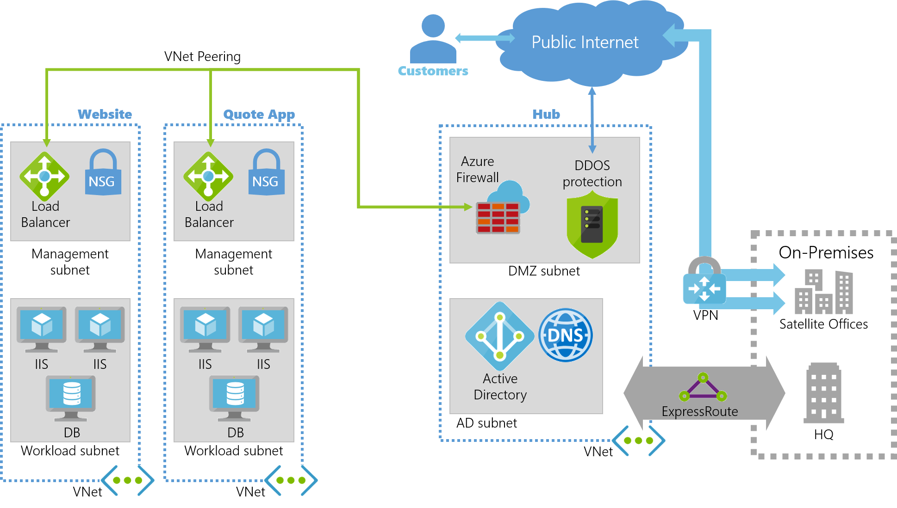

Your company is planning a migration of on-premises resources to Azure, as part of this migration there's a central datacenter based in your headquarters that will remain on-premises and will need connectivity to Azure. Your smaller branch offices need to integrate with the headquarters, with central dependencies such as Azure Active Directory and Azure DNS. The ultimate goal for the migration is to implement a virtual data center in Azure. The chosen topology for the migration is hub and spoke, so you need to understand how to plan the networking design.

As a lead architect on the project you are managing the production of a virtual networking design using ExpressRoute for your headquarters connectivity. You also need to make a decision on how to connect your companies satellite offices to the new hub and spoke network.

In this unit, you'll explore virtual networking in the Azure platform, the design considerations needed and how to implement Azure ExpressRoute for connectivity to on-premises networks.

## Environment setup for the next exercise

<!-- Activate the sandbox -->
[!INCLUDE [azure-sandbox-activate](../../../includes/azure-sandbox-activate.md)]

Deploy the resources in the portal in the below Resource Manager template. This will create an Azure Resources to use in the next exercise.

1. Copy the ARM and parameter json templates that create hub and spoke resources.
    ```bash
    curl https://raw.githubusercontent.com/... > deploy.json
    curl https://raw.githubusercontent.com/... > parameters.json
    ```

    <!-- TODO replace with live github repo -->

1. Deploy the template.

    ```azurecli
    az group deployment create \
      --resource-group <rgn>[sandbox resource group name]</rgn> \
      --template-file deploy.json \
      --parameters @parameters.json winVmDnsPrefix=mslearn$RANDOM
      --no-wait
    ```

    > [!NOTE]
    > The VPN gateway can take up to 10 minutes to complete, continue with this unit while the infrastructure is created.

## Overview of virtual networks on Azure



VNets provide networking services in Azure and can act as an extension of your existing on-premises infrastructure. Azure VNets act as a virtual communication channel, there are no physical wires between resources. VNets enable external connections to the internet, communication between your different internal Azure resources, isolation of those resources, connections to on-premises computers, and network traffic management.

## Introduction to Azure virtual networking

An Azure Virtual Network can represent your own IT network within the cloud, logically isolating dedicated organizational resources in your subscriptions. Using Azure VNets enables most Azure resources to securely communicate with each other, your on-premises networks, and the internet.

Azure VNets are component based, two components are **Azure Subnets (subnets)** and **Network Security Groups (NSGs)**:


- **Azure Subnet**: Each VNet can include a number of subnets. Each subnet can be given its own unique properties. For example, imagine you have three virtual machines (VM) within a VNet. Each VM can be in its own subnet with distinct properties. One subnet is configured to allow public facing traffic, while the other two are isolated for private IP restricted traffic only.
- **Network Security Groups**: An NSG is essentially a firewall, NSGs allow you to filter the inbound and outbound traffic through your VNet or subnet. NSGs allow you to filter traffic by source and destination IP address, port, or protocol. Using the previous example, the public facing subnet will have an NSG but the rules for allowing traffic are open to all internet traffic. The two private VMs have strict organizational policies set in the NSG only allowing traffic coming from on-premises machines at the companies head office.

VNets are connected together through a concept called **VNet peering**.

## Planning and design considerations for virtual networks

Any network, whether on-premises or in the cloud, requires a method for managing the flow, direction, and type of traffic through it. There are several considerations for VNets:

- **Naming conventions**: The name must be unique within a scope. For example, the name of a virtual network must be unique within a resource group, but can be duplicated within a subscription, or Azure region. It's important to decide on a naming convention for VNets before creating the network to ensure you don't end up with duplicates.
- **Segmentation**: It's important to consider potential isolation of traffic into different subnets, virtual networks, or into separate subscriptions.
- **Security**: Network traffic can be filtered to and from resources in a VNet using network security groups and network virtual appliances.
- **Connectivity**: You can connect a virtual network to other virtual networks using VNet peering, or to your on-premises network, using ExpressRoute or an VPN gateway.
- **Routing**: Azure VNets automatically create routing tables within each subnet and add default system routes to the tables. Custom routes allow you to override these default system routes.

## Peering with Azure Virtual networks

VNets in Azure can be connected to each other directly using a method known as peering. VNets can be peered across subscriptions and Azure regions. Once peered, resources in these networks communicate with each other as if they reside in the same network, traffic that gets routed between resources in a peered VNet uses only private IP address ranges. Therefore, they don't require a gateway. The VNet does this by routing traffic through the Azure network always keeping the connection private.

## Connecting your on-premise network

When working towards integrating your on-premises network with Azure, you need to bridge between the two networks. A VPN gateway is one of the services in Azure that provide this functionality. A VPN gateway is a special type of VNet gateway that can send encrypted traffic between the two networks over the internet. Gateways support multiple connections which route the VPN tunnels through the available bandwidth, although a VNet can only have one gateway assigned. It's also possible to use a VPN gateway for VNet to VNet connections in Azure.

The best way to bridge your on-premises network with a hub and spoke network hosted in Azure is to use Azure ExpressRoute.

## Overview of Azure ExpressRoute

Azure ExpressRoute allows you to extend your on-premises networks over a private connection, to Azure. This connection is facilitated by a connectivity or cloud exchange provider. ExpressRoute extends wider than just Azure resources, and allows you to establish connections to other Microsoft cloud services like Office 365.

It takes sometime to order, and then have an Azure ExpressRoute set up and configured. A common solution is to initially use Site-to-Site VPN to add a connection between your on-premises resources, and then migrate to your new ExpressRoute connection when service provider confirms the set up is complete.

In the example architecture at the top of this unit, Site-to-Site VPNs are still being used to connect to satellite offices.

## Summary of Azure ExpressRoute


ExpressRoute connections don't go over the public internet giving your company greater network resilience, faster speeds, higher security, and lower latency. The connections can be from:

- **any-to-any connection**: This method allows you to integrate your WAN with Azure using an IPVPN provider. These providers offer connectivity between branch offices and datacenters. Once enabled the connection to Azure will be similar to any other branch office connected via the WAN.
- **point-to-point ethernet connection**: This method connects on-premises datacenters and offices to Azure through a point-to-point ethernet link.
- **virtual cross-connection**: For companies colocated inside a cloud exchange, you'll be connected to Azure through the colocation providers ethernet exchange.

## Using Azure ExpressRoute in a hub-spoke topology

Using Azure ExpressRoute in a hub and spoke topology is in essence no different to other architectural patterns. ExpressRoute underpins the connectivity between the hub and the on-premises network and works best when there's high data ingress and egress.

Traffic management and routing are configured using circuits. ExpressRoute can be linked into a virtual network in Azure, each VNet allows up to four ExpressRoute circuits. The circuits to be connected to the VNet can be in different regions or subscriptions. Up to 10 VNets can be associated to an ExpressRoute circuit.

You can use Microsoft Peering when it comes to peering ExpressRoute connections in a hub and spoke with shared services. Microsoft peering allows connectivity to all Microsoft online services (Office 365, Dynamics 365, and Azure PaaS services) with bi-directional connectivity between the Microsoft Cloud and your WAN through a Microsoft routing domain. This model requires you have a public IP address owned by your company or your connectivity provider, adhering to a set of pre-defined rules.