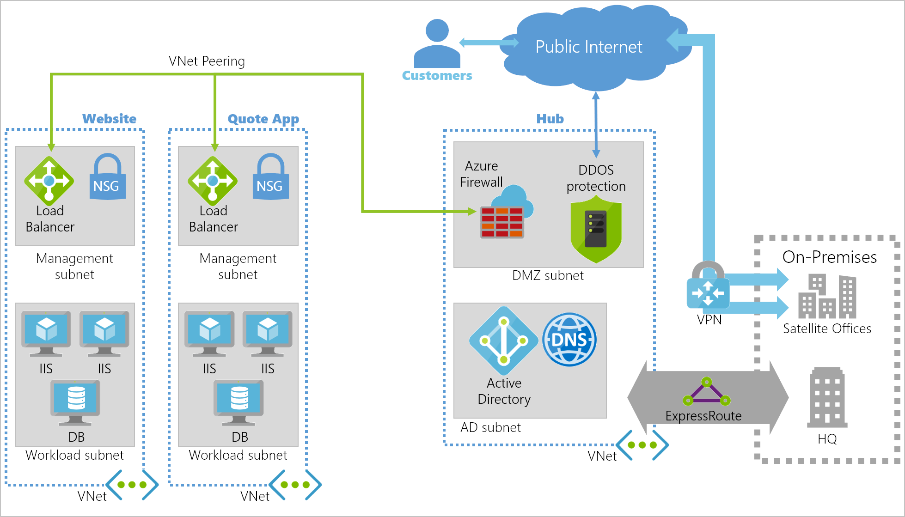

The chosen topology to support your companies move to Azure is to implement a hub and spoke approach.

As a lead architect on the project, you're managing the production of a virtual networking design using ExpressRoute for your headquarters' connectivity. You also need to decide how to connect your company's satellite offices to the new hub and spoke network.

In this unit, you'll explore virtual networking in the Azure platform, the design considerations needed, and how to implement Azure ExpressRoute for connectivity via on-premises networks.

## Introduction to Azure virtual networking

Virtual Networks provide networking services in Azure and enable you to extend your existing on-premises infrastructure. Virtual Networks enable external connections to the internet, communication between different internal Azure resources, isolation of those resources, connections via on-premises computers, and network traffic management.

An Azure virtual network can represent your private IT infrastructure within the cloud, logically isolating dedicated resources in your subscriptions. Using Azure Virtual Networks enables Azure resources to securely communicate with each other, your on-premises networks, and the internet.

Azure Virtual Networks are component-based – two components you'll need to use are **Azure Subnets (subnets)** and **Network Security Groups (NSGs)**:

- **Azure Subnet**: Each Virtual Network can include a number of subnets. Each subnet is given its own unique properties.
- **Network Security Groups**: NSGs allow you to filter the inbound and outbound traffic through your Virtual Network or subnet. You can also use NSGs to filter traffic by source and destination IP address, port, or protocol.

## Planning and design considerations for virtual networks

Any network, whether on-premises or in the cloud, requires a method for managing the flow, direction, and type of traffic through it. There are several considerations for VNets:

- **Naming conventions**: The name must be unique within a scope. For example, the name of a virtual network must be unique within a resource group, but can be duplicated within a subscription, or Azure region. It's important to decide on a naming convention for Virtual Networks before creating the network – to ensure you don't end up with duplicates.
- **Segmentation**: It's important to consider potential isolation of traffic into different subnets, virtual networks, or into separate subscriptions.
- **Security**: Network traffic is filtered to and from resources in a Virtual Network using network security groups and network virtual appliances.
- **Connectivity**: You can connect a virtual network to other virtual networks using Virtual Network peering – or to your on-premises network – using ExpressRoute or a VPN gateway.
- **Routing**: Azure Virtual Networks automatically create routing tables within each subnet and add default system routes to the tables. Custom routes allow you to override these default system routes.

## Connecting your Azure resources with virtual networks

There are three ways your deployed resources can communicate with each other.

- **Inside a single virtual network** – you can deploy your virtual machines, databases, containers, and logic apps using a virtual network. These resources will be able to communicate with each other.

- **Through a network service endpoint** – you can extended the virtual networks private address space, and allow traffic between Azure resources to remain on the Azure backbone network. This can provide your resources with direct access to storage, Azure databases, and key vaults.

- **Through peering** – Virtual Networks can be peered across subscriptions and Azure regions. After peering, resources in these networks communicate with each other as if they're in the same network. Traffic that gets routed between resources in a peered Virtual Network uses only private IP address ranges – they don't require a gateway. The Virtual Network routes traffic through the Azure network, keeping the connection private.

## Connecting your on-premises network

When working towards integrating your on-premises network with Azure, you need to bridge between the two networks. A VPN gateway is one of the services in Azure that provide this functionality. A VPN gateway sends encrypted traffic between the two networks over the internet. Gateways support multiple connections that route the VPN tunnels through the available bandwidth, although a Virtual Network can only have one gateway assigned. You can also use a VPN gateway for Virtual Network to Virtual Network connections in Azure.

Another way to bridge your on-premises network with a hub and spoke network hosted in Azure, is to use Azure ExpressRoute.

## Overview of Azure ExpressRoute

Azure ExpressRoute allows you to extend your on-premises networks over a private connection to Azure. This connection is facilitated by a connectivity or cloud exchange provider. ExpressRoute extends wider than just Azure resources, and allows you to establish connections to other Microsoft cloud services like Office 365.

It takes some time to order, and then have an Azure ExpressRoute set up and configured. Initially, a common solution is to use Site-to-Site VPN to add a connection between your on-premises resources. You then migrate to your new ExpressRoute connection when the service provider confirms the setup is complete.

In the example architecture at the top of this unit, Site-to-Site VPNs are being used to connect to satellite offices.

## Using Azure ExpressRoute in a hub-spoke topology

Using Azure ExpressRoute in a hub and spoke topology is no different to other architectural patterns. ExpressRoute, which underpins the connectivity between the hub and the on-premises network, works best when there's high data ingress and egress.

Traffic management and routing are configured using circuits. ExpressRoute can be linked into a virtual network in Azure – each Virtual Network allows up to four ExpressRoute circuits. The circuits to be connected to the Virtual Network might be in different regions or subscriptions. There are limits to the number of virtual networks per ExpressRoute circuit, for the standard tier the limit is currently 10 networks. If you use the premium add-on, the limit is increased based on the circuit size. The lowest number is 20 virtual networks on a 50-Mbps circuit, up to 100 for circuits that are 10-Gbps or bigger.

When you want to peer ExpressRoute connections in a hub and spoke with shared services, you use Private peering. Private peering allows connectivity to all Microsoft online services (Office 365, Dynamics 365, and Azure PaaS services). There's bi-directional connectivity between the Microsoft Cloud and your WAN, through a Microsoft routing domain.