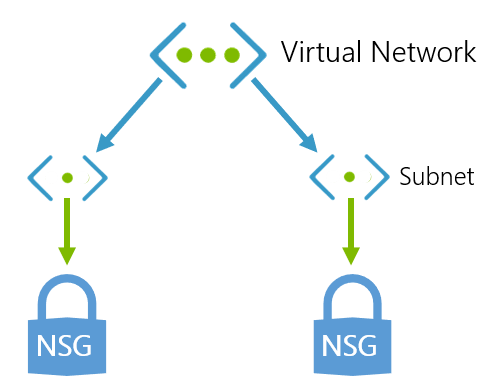

Your company is planning a migration of on-premises resources to Azure, as part of this migration there's a central datacenter that will remain on-premises initially but will need connectivity to Azure. You'll integrate multiple locations into this datacenter with central dependencies such as Active Directory. The ultimate goal for the migration is to implement a virtual data center in Azure. The chosen topology for the migration is hub and spoke, so you need to understand how to plan the networking design.

Your IT manager has requested you produce a virtual networking design using ExpressRoute for on-premises connectivity that aligns to the chosen topology.

In this unit, you'll explore virtual networking in the Azure platform, the design considerations needed and how to implement Azure ExpressRoute for connectivity to on-premises networks.

## Environment setup for the next exercise

<!-- Activate the sandbox -->
[!INCLUDE [azure-sandbox-activate](../../../includes/azure-sandbox-activate.md)]

Run the following commands in the Cloud Shell. This will create an Azure Resources to use in the next exercise.

1. Run the following commands to save environment variables that will be used in the az cli calls later.

    ```bash
    export RESOURCEGROUP=<rgn>[sandbox resource group name]</rgn>
    export LOCATION=$(az group show --name $RESOURCEGROUP | jq -r '.location')
    export SERVERNAME=server$RANDOM
    ```

1. Copy the ARM and parameter json templates that create hub and spoke resources.

    ```bash
    curl https://raw.githubusercontent.com/... > onprem.json
    curl https://raw.githubusercontent.com/... > hub-vnet.json
    curl https://raw.githubusercontent.com/... > hub-adds.json
    curl https://raw.githubusercontent.com/... > spoke1.json
    curl https://raw.githubusercontent.com/... > spoke2.json
    curl https://raw.githubusercontent.com/... > hub-peering.json
    curl https://raw.githubusercontent.com/... > hub-nva.json
    ```

    <!-- TODO replace with live github repo -->

1. Run the following commands to create the resources.

    ```azurecli
    azbb -s <subscription_id> -g $RESOURCEGROUP -l $LOCATION -p onprem.json --deploy
    azbb -s <subscription_id> -g $RESOURCEGROUP -l $LOCATION -p hub-vnet.json --deploy
    azbb -s <subscription_id> -g $RESOURCEGROUP -l $LOCATION -p hub-adds.json --deploy
    azbb -s <subscription_id> -g $RESOURCEGROUP -l $LOCATION -p spoke1.json --deploy
    azbb -s <subscription_id> -g $RESOURCEGROUP -l $LOCATION -p spoke2.json --deploy
    azbb -s <subscription_id> -g $RESOURCEGROUP -l $LOCATION -p hub-vnet-peering.json --deploy
    azbb -s <subscription_id> -g $RESOURCEGROUP -l $LOCATION -p hub-nva.json --deploy
    ```

    > [!NOTE]
    > This can take several to complete, continue with this unit while the resources are created.

## Overview of virtual networks on Azure

Whichever architectural path you take in Azure or whichever service model you use, it's likely you will need to work with Azure Virtual Networks (Vnets). Vnets provide networking services in the cloud as an extension of your existing on-premises network. Azure vnets act as a virtual communication channel (no physical wires) for resources that provide a rich set of capabilities through secure network communication for key use cases including connections to the internet, communication between Azure resources, isolation of Azure resources, connections to on-premises computers and, network traffic management.

Azure vnets can also be used to connect your organizations Azure resources hosted in different Azure datacenters and regions.

## Introduction to Azure virtual networking

An Azure Virtual Network is effectively a representation of your own IT network but contained within the cloud, logically isolating dedicated organizational resources in your subscription(s). Using Azure vnets enables most Azure resources to securely communicate with each other, your on-premises networks and the internet.

Azure vnets are composed of several components, the component model gives the ability for vnets to be configured to varying degrees from the simplistic to the highly sophisticated. Two such components that form the core of the vnet component model are **Azure Subnets (subnets)** and **Network Security Groups (NSGs)**:



- Azure Subnet: Each Azure vnet can be split into several subparts, these subparts are known as subnets. Each subnet can be given it's own unique properties. For example imagine you have 3 virtual machines (VM) within a vnet, each VM can be in its own subnet with distinct properties. One subnet is configured to allow public facing traffic whilst the other two remain isolated for private IP restricted traffic only.
- Network Security Groups: An NSG is essentially like a firewall, NSGs allow you to filter the inbound and outbound traffic through your vnet or subnet. NSGs allow you to filter traffic by source and destination IP address, port or protocol. Using the previous example, the public facing subnet will have an NSG but the rules for allowing traffic are open to all internet traffic. The other two have strict organizational policies set in the NSG only allowing traffic coming from on-premises machines at the companies head office.

Azure vnets are an essential service when considering a hub and spoke hybrid cloud approach, they provide your organization with the functionality to connect and isolate the spokes to the hub. Vnets are connected together through a concept called **vnet peering**, you will learn more about peering later in this unit.

## Planning and design considerations for virtual networks

Any network, whether on-premises or in the cloud, requires a method for managing the flow, direction and type of traffic through it. Network traffic for the IT estate is crucial, traffic flow must be properly routed, the direction and type of network traffic properly configured. There are several key considerations for vnets:

- Naming conventions: Naming conventions in Azure are super important this is no different for vnets. The name must be unique within a scope. For example, the name of a virtual network must be unique within a resource group, but can be duplicated within a subscription or Azure region. It's important to decide on a naming convention for vnets before creating the network.
- Segmentation: A virtual network is a virtual, isolated portion of the Azure public network. Therefore it's important to consider potential isolation of traffic into different subnets, virtual networks or into separate subscriptions.
- Security: Traffic filtering is very important in a hub and spoke model. Not only do you need to consider segmenting the traffic but also filtering it. Network traffic can be filtered to and from resources in a vnet using network security groups and network virtual appliances.
- Connectivity: You can connect a virtual network to other virtual networks using virtual network peering, or to your on-premises network, using ExpressRoute or an VPN gateway.
- Routing: Azure vnets automatically create routing tables within each subnet and add default system routes to the tables. Custom routes allow you to override the default system routes.

## Peering with Azure Virtual networks

Vnets in Azure can be connected to each other directly using a method known as peering. Vnets can be peered across subscriptions and Azure regions. Once peered resources in these networks communicate with each other as if they were in the same network, traffic that gets routed between resources in a peered vnet uses only private IP addresses therefore, not requiring a gateway, the connection to be encrypted or a connection to the internet. It does this by routing traffic through the Azure network and always keeping the connection private as part of the Azure backbone network. The backbone network provides low latency and high bandwidth network connections.

## Deploying Azure Virtual networks connecting to an on-premise network

When working towards a integrating your on-premises network with Azure there needs to be a bridge between the two networks. VPN gateway is one of the services in Azure that provide this functionality. A VPN gateway is a special type of vnet gateway that can send encrypted traffic between the two networks over the internet. Gateways support multiple connections which route the VPN tunnels through the available bandwidth, although a vnet can only have one gateway assigned. It is also possible to use a VPN gateway for vnet to vnet connections in Azure.

The best method with a hub and spoke network is to use Azure ExpressRoute.

## Overview of Azure ExpressRoute

Azure ExpressRoute is a service in Azure that allows you to extend your on-premises networks over a private connection. This connection is facilitated by a connectivity or cloud exchange provider. ExpressRoute extends further than Azure and allows you to establish connections to other Microsoft cloud services like Office 365.

## Summary of Azure ExpressRoute

ExpressRoute connections do not go over the public internet thus giving greater resilience, faster speeds, higher security and lower latency. The connections can be from:

- an any-to-any network: This method allows you to integrate your WAN with Azure using an IPVPN provider. These providers offer connectivity between branch offices and datacenters. Once enabled the connection to Azure will be similar to any other branch office connected via the WAN.
- a point-to-point ethernet network: This method connects on-premises datacenters and offices to Azure through a point-to-point ethernet link.
- a virtual cross-connection via a co-located facility (CloudExchange)

## Using Azure ExpressRoute in a hub-spoke topology

Using Azure ExpressRoute in a hub and spoke topology is in essence no different to other architectural patterns. ExpressRoute underpins the connectivity between the hub and the on-premises network over a private connection thus giving greater resilience, faster speeds, higher security and lower latency. ExpressRoute is best used when there is high data ingress and egress.

Traffic management and routing is configured using circuits. ExpressRoute can be linked into a virtual network in Azure, each vnet allows up to four ExpressRoute circuits. The circuits to be connected to the vnet can be in different regions or subscriptions. Up to 10 vnets can be associated to an ExpressRoute circuit.

When it comes to peering ExpressRoute connections in hub and spoke with shared services it's logical to use Microsoft Peering. Microsoft peering is essentially connectivity to all Microsoft online services (Office 365, Dynamics 365, and Azure PaaS services) with bi-directional connectivity between the Microsoft Cloud and your WAN through a Microsoft routing domain. This model requires a public IP address owned by you or your connectivity provider, adhering to a set of pre-defined rules, to connect into the Microsoft Cloud.

In this unit you have learned about virtual networking in Azure, what to consider as part of their design and an overview of using ExpressRoute to extend on-premises networks.