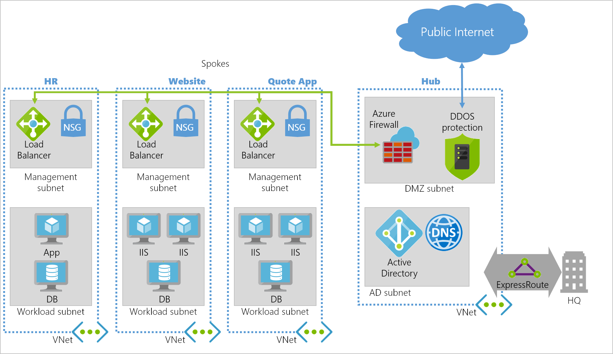

In the previous unit, you set up a hub and spoke virtual data center in Azure for your company. Those commands created a hub and spoke network topology, and connected the components. 

Your internal HR department wants to host a new internal HR system that shouldn't be accessible from the internet. The system should be accessible to everyone in the company, whether they work at headquarters or in a satellite office.

In this exercise, you'll create a new virtual network to host the servers for your company's new HR system.



## Environment setup for the next exercise

This deployment will create the Azure network resources matching the above diagram, ready for you to add the new HR virtual network.

1. Deploy the template.

    ```azurecli
    az group deployment create \
      --resource-group <rgn>[sandbox resource group name]</rgn> \
      --template-url https://raw.githubusercontent.com/MicrosoftDocs/mslearn-hub-and-spoke-network-architecture/master/azuredeploy.json
    ```

## Create a new spoke in your virtual network

You create a virtual network with the Azure portal, Azure CLI, Azure PowerShell – in your code or alongside creating other resources, such as a VM. The easiest approach is to use the portal as you'll be walked through the required properties – and be given hints and help messages – during the creation of the Virtual Network.

1. Sign in to the [Azure portal](https://portal.azure.com/learn.docs.microsoft.com?azure-portal=true) using the same account you used to activate the sandbox.

1. Select **Create a Resource** in the upper left of the Azure portal.

1. In the search box, enter **Virtual Network**, and then select the link with the same title in the list.

1. Select **Create** to start configuring the Virtual Network.

## Configure the virtual network settings

The resource creation experience on the portal is a wizard that walks you through the initial configuration for the Virtual Network.


1. Use the values below to create the virtual network:

    |Property Name | Field Property  |
    |---------|---------|
    |Name                   | **HRappVnet**     |
    |Address Space          | **10.10.0.0/16**  |
    |Subscription           | **Concierge Subscription (default)**         |
    |Resource Group         | **<rgn>[sandbox resource group name]</rgn>** |
    |Subnet – Name          | **HRworkload**   |
    |Subnet – Address Range | **10.10.0.0/16** |
    |DDoS Protection        | **Basic**        |
    |Service Endpoints      | **Disabled**     |
    |Firewall               | **Disabled**     |

1. Select **Create** to start provisioning the Virtual Network.

## Configure the hub virtual network peering

Now you've created the third spoke, you need to configure the Virtual Network peering between the hub and spokes.

1. In the resources menu on the left, select **Virtual Networks**. You should see the **hubVNet**, **webVNet**, **quoteVNet**, and **HRappVnet** VNets.

1. Select **hubVNet**.

1. Select the **Peerings** blade in the left settings menu.

1. On the Peerings blade, select **Add**, and fill in the fields using the following properties:

    |Property Name | Field Property  |
    |---------|---------|
    |Name of the peering from hubVnet to HRappVnet     | **gwPeering_hubVNet_HRappVnet**      |
    |Peer Details     | **Resource Manager**        |
    |Subscription     | **Concierge Subscription (default)**        |
    |Virtual Network     |  **HRappVnet**       |
    |Name of the peering from HRappVnet to hubVnet     | **gwPeering_HRappVnet_hubVNet**      |
    |Allow virtual network access from hubVnet to HRappVnet  |   **Enabled**  |
    |Allow virtual network access from HRappVnet to hubVnet  |   **Enabled**  |
    |Allow forwarded traffic from HRappVnet to hubVnet  |   **Disabled**     |
    |Allow forwarded traffic from hubVnet to HRappVnet  |   **Disabled**     |
    |Configure gateways transit settings         |   **False**    |
    
1. Select **OK** to create the peering.

1. Close the hubVirtual Network blade.

You've now peered the hub virtual network to the spoke virtual network. You've allowed traffic to be forwarded from the hub to the spoke using a VPN gateway in the configuration.

## Create a network security group (NSG) for the virtual network

You'll create a network security group to configure traffic flow.

1. Select **Create a Resource** in the upper left corner of the Azure portal.

1. In the search box, enter **Network security group**, and then select the link with the same title in the list.

1. Select **Create** to start configuring the Virtual Network.

1. Enter **hr-nsg** for the name, then select the existing resource group and location.

1. Select **Create** to provision the NSG.

You've created an NSG that can be assigned to each of the Virtual Networks – though they aren't associated.

## Associate the NSG to the new HR virtual network

Now you associate the NSG to the Virtual Network.

1. Select **All services** in the upper left corner of the Azure portal.

1. In the search box, type **Network security group**, then select the **star** to the right of the service to add to the toolbar. Select **Network security groups**.

1. In the **Network security groups** blade, you should see the NSGs you created.

1. Select the NSG you created for the spoke, **hr-nsg**.

1. Select the **Subnets** side menu.

1. On the Subnets blade, select **Associate**.

1. Select the **HRappVnet** virtual network.

1. Select the **HRworkload** subnet.

1. Select **OK** to associate the NSG.

## Configure the NSG rule to stop inbound internet traffic

You have a security requirement to meet for HR application to be hosted on the **HRappVnet**. There shouldn't be any inbound internet traffic from the spoke because only internal employees need access. You'll now configure the NSG rule to meet this requirement.

1. In the left resources menu, select **Network security groups**.

1. Select the **hr-nsg**.

1. Select the **Inbound security rules** side menu.

1. In the **Inbound security rules** blade, select **Add**.

    |Property Name | Field Property  |
    |---------|---------|
    |Source             | Any  |
    |Source port ranges | 80,443   |
    |Destination        | VirtualNetwork     |
    |Destination port ranges |  *  |
    |Protocol  | Any      |
    |Action    | Deny     |
    |Priority  | 100      |
    |Name      | Block_Inbound_80 |
    
1. Select **Add** to add the rule.

You have now blocked outbound internet access from the spoke on port 80.

In this scenario, you created a spoke Azure Virtual Network, and then peered it with an existing hub virtual network. You then secured the traffic from this spoke by blocking inbound internet access on port 80 while ensuring it can connect via the hub.