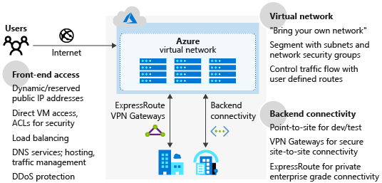
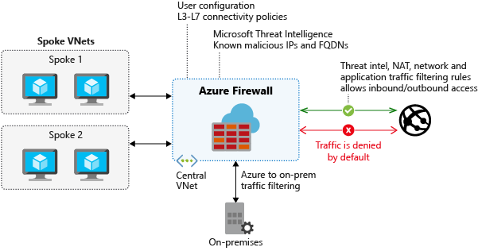

Azure provides many services to help enable an organization to secure and protect its cloud infrastructure. Your organization needs to understand how to secure its new network, and what other Azure services are available.

In this unit, you explore secure networking in the Azure platform and see an overview of Azure Firewall. Also, you learn how to secure virtual networks by using network security groups.

## Secure network design on Azure

The preceding diagram shows the Azure network infrastructure, and the methods that enable you to connect more securely to your on-premises environment, Azure hosted resources, and the public internet.

There are several features to consider as part of securing a network design:

- **Azure Virtual Network**: Provides a base layer of security by logically isolating your environments in Azure, to prevent unauthorized or unwanted access.
- **Azure DNS**: A hosting service for your domain names. Azure DNS is a secure service that manages and resolves domain names in your virtual network.
- **Azure Application Gateway**: A dedicated virtual appliance that provides an application delivery controller as a service, including a web application firewall (WAF).
- **Azure Traffic Manager**: A service to control the distribution of user traffic in Azure.
- **Azure Load Balancer**: Provides high availability and network performance to your Azure applications.
- **Perimeter network**: Segments assets between your Azure virtual network and the internet.

Additionally, consider incorporating some of the following elements into your network architecture to improve network security:

- Network access controls. These controls make sure that your Azure services are accessible to only the users and devices you want.
- Network security groups as a packet filtering firewall, to control virtual network traffic.
- Route control, and forced tunneling, to define custom routes through your infrastructure, and ensure services can't connect to an internet device.
- Enabling a virtual network security appliance through Azure Marketplace.
- Use Azure ExpressRoute for a dedicated WAN link to securely extend your on-premises networks to Azure.
- Microsoft Defender for Cloud to prevent, detect, and respond to threats against your Azure services.
- Azure Firewall as a network security service.

There's a wide variety of security solutions for your organization, many of which complement each other to provide more layers of security. Your organization should align with Microsoft's recommended best practices. You then implement any features needed to meet your organization's internal security requirements.

## Base components of Azure security for hub-spoke topologies

You want to ensure that your resources are protected from unauthorized access, or attack, by controlling your network traffic. In the hub-spoke model, there are several components you need to implement:

**Network security group**

Each subnet within the topology has a network security group configured. The network security groups implement security rules to allow or deny network traffic to and from each resource in the topology.

**Perimeter network**

Configure a perimeter network in its own subnet in the hub virtual network for routing external traffic. The perimeter network is designed to host network virtual appliances to provide security functionality, such as firewalls and packet inspection. You can route the outbound traffic from the perimeter network through virtual appliances. The traffic is then monitored, secured, and audited.

**Network virtual appliance**

Network virtual appliances (NVAs) provide a secure network boundary by checking all inbound and outbound network traffic. Then the NVA passes only the traffic that meets network security rules, essentially acting as a firewall.

Azure Firewall can replace some components discussed in this article, to control access to Azure network resources. For more information, see the **Azure Firewall** section.

**Azure ExpressRoute**

ExpressRoute creates a dedicated private WAN link between on-premises resources and an Azure gateway subnet in the hub virtual network. You add a network security appliance between the on-premises network and the ExpressRoute provider edge routers. This appliance restricts the flow of unauthorized traffic from the virtual network.  

## Azure Firewall

Microsoft manages this network security service. It protects Azure virtual networks and their resources by letting you manage and enforce connectivity policies centrally. Azure Firewall uses a static, public IP address for virtual network resources, allowing outside firewalls to identify your virtual network traffic.

Azure Firewall is a fully stateful network firewall that tracks the operating state, and the characteristics of network connections traversing it. Azure Firewall enables central control of all network communications through policy enforcement. These policies can be enforced across virtual networks, regions, and Azure subscriptions. In a hub-spoke topology, Azure Firewall is typically provisioned in the hub for complete control of traffic through the network.

The monitoring of Azure Firewall consists of reviewing the firewall and activity logs. Because Azure Firewall is integrated with Azure Monitor Logs, you can view the full logs there. Some logs are also available to view in the Azure portal.

The logs can be stored in an Azure Storage Account, streamed to Azure Event Hubs, or sent to Azure Monitor Logs.

## Network security with network security groups

Network security groups (NSGs) enforce and control network traffic rules. Access is controlled by permitting or denying communication between workloads in a virtual network. NSGs are rules-based, and evaluate traffic using a five-tuple method. To determine if traffic is allowed or denied, NSGs evaluate traffic using the:

- Source IP
- Source port
- Destination IP
- Destination port
- Protocol

### Define security rules

Security rules in an NSG provide the mechanism that defines the control of traffic flow. An NSG has a set of rules by default. These rules can't be deleted, but you can override them with your own custom rules. The default rules are:

- Traffic originating from, and ending in, a virtual network is allowed.
- Outbound traffic to the internet is allowed, but inbound traffic is blocked.
- Azure Load Balancer is allowed to probe the health of virtual machines, or role instances.

## Other security considerations

The ability to control how traffic is routed through your resources is an important security measure to take. Azure helps you improve the security of your overall infrastructure by offering other services:

- **Application security groups**: Provides central policy and security management for your applications. Use application security groups to define detailed network security policies by using a moniker. You can then use a zero-trust approach, where only specified flows are permitted.
- **Azure Network Watcher**: Enables insights into your network logging and diagnostics. Network Watcher allows you to understand the health and performance of your Azure networks.
- **Virtual network service endpoints**: Extends your virtual network private address space to make it available to Azure services. The endpoints allow you to restrict access to Azure resources.
- **Azure DDoS Protection**: Allows you to mitigate volumetric, protocol, and resource layer attacks.
