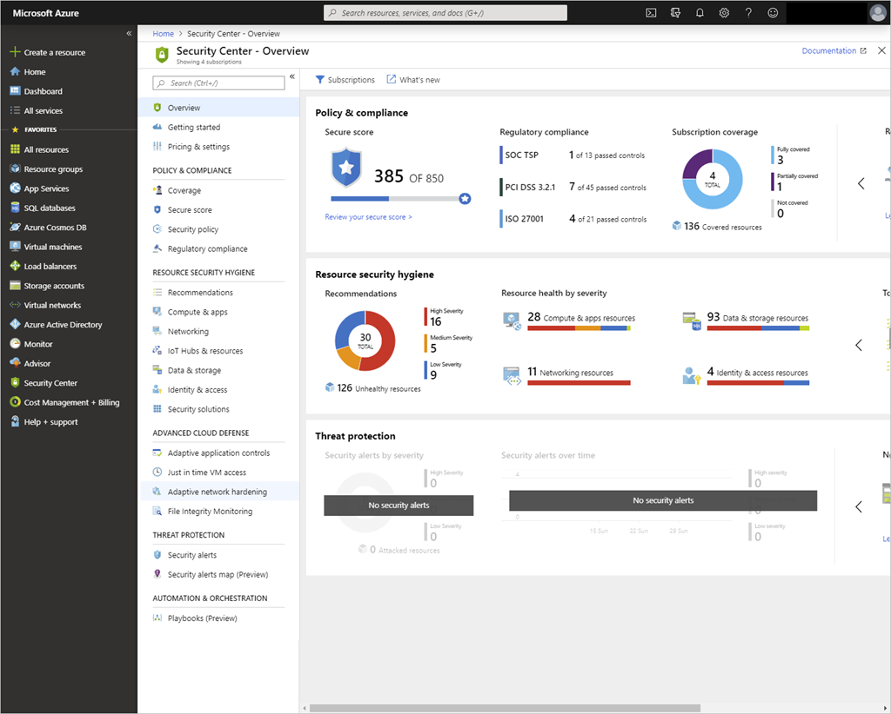

Keeping your cloud data and resources safe is a shared responsibility between you and Azure. Keeping track of created resources across the organization and ensuring they comply with your security policies is a full-time job for security operations (SecOps). A single misconfigured option can expose customer data or provide access to internal systems to attackers trying to penetrate your network. Luckily, Azure offers several tools to help identify security issues, secure your services, and harden your exposed network.

Azure Security Center is one of the primary tools in Azure used to detect threats. Security Center allows organizations to control and monitor the security of all of their running resources using intelligent threat detection to protect them from cyberattacks. As part of that threat detection, Security Center provides recommendations to close potential security holes and ensure compliance with your corporate policy and security guidelines.

Security Center provides an easy-to-read dashboard which shows compliance, security health, and security alerts. This is available right off the main Azure portal dashboard, or through the search window.

> [!TIP]
> Azure Security Center pulls data from all your created resources. The level of detail presented will vary based on the running workloads in your subscription(s). This is particularly true in the Azure Sandbox which doesn't have any data.

## Learning objectives

In this module, you'll:

- Configure Azure Security Center to monitor your Azure resources
- Use the Azure Security Center dashboard to identify potential security issues
- Analyze the recommendations made by Security Center

## Prerequisites

- Basic familiarity with Azure services
