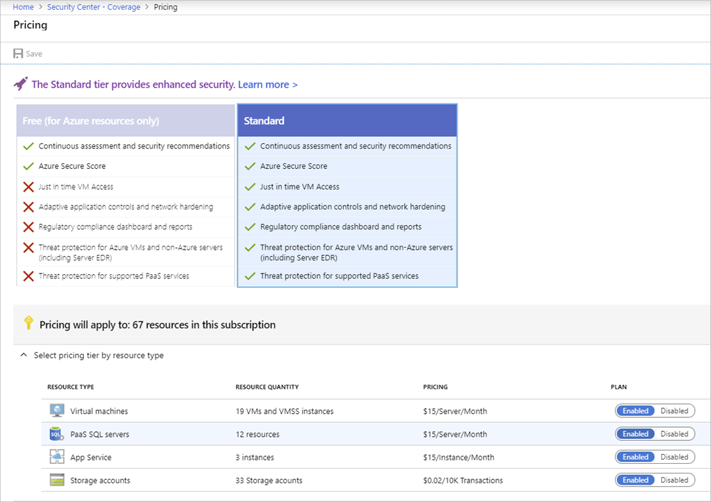

Azure Security Center has two available tiers: free and standard. Both provide security policy, assessment, and recommendations and connection with partner solutions.

## Free tier

The free tier is automatically enabled on all Azure subscriptions and provides security policy, continuous security assessment, and actionable security recommendations to help you protect your Azure resources. It monitors the most common app resources in Azure including:

- Compute resources such as VMs, Azure Functions and App Service
- Network access and endpoint security
- Data storage including Azure Storage, Redis cache for Azure, and Azure SQL
- Identity and access including Azure Key Vault
- IoT Hubs and resources

## Standard tier

The standard tier extends the capabilities of the free tier to workloads running in private and other public clouds to provide unified security management and threat protection across all your hybrid cloud workloads.

The Standard tier adds advanced threat detection capabilities, using analytics and machine learning to identify attacks and zero-day exploits, access and application controls to reduce exposure to network attacks and malware, and more.

Migrating your Security Center subscription from the free tier to the standard tier enables the following features:

- **Security event collection**. Security Center collects logs in a central place so you can search and analyze them to identify important security events that may require your attention.
- **Network Map**. This feature allows you to visualize the topology of your Azure network infrastructure and the traffic to your Azure VMs. It also allows you to create filters by the severity level and recommendations.
- **Just-in-time VM access**. This allows admins to grant access to a VM for a defined period of time. Limiting access helps reduce exposure to outside attacks. This feature is especially useful if you’re working with an outside agency that needs to access your VM.
- **Adaptive application controls (application whitelisting)**. Adaptive application controls uses artificial intelligence to recommend applications to allow. This helps protect VMs by preventing malware and unauthorized software from being installed.
- **Regulatory compliance reports**. In the Regulatory compliance dashboard, you have a clear view of the status of all standard regulatory assessments within your environment.
- **File integrity monitoring**. This feature examines files and registries of operating system, application software, and others in Windows and Linux (computers and VMs) for changes that might indicate an attack.
- **Adaptive Network Hardening**. Adaptive Network Hardening provides recommendations to harden applied NSG rules. It uses machine learning algorithms that factors in actual traffic, known trusted configuration, threat intelligence, and other indicators of compromise, and then provides recommendations to allow traffic only from specific IP/port tuples.
- **Security alerts**. Security Center supports a variety of security alerts such as detection of potential distributed denial-of-service (DDOS) attacks. Just-in-time alerts gives you the chance to investigate evolving issues before they result in a service failure.
- **Threat intelligence**. This feature can help determine the nature of an attack, the attack point of origin, and more.
- **Workflow Automation**. Workflow automation is a collection of procedures that can be executed from Security Center once a certain playbook is triggered from selected alert. Workflow automation can help to automate and orchestrate your response to a specific security alert detected by Security Center.

## Switch to the Standard tier

You can try the Standard tier for free for 30 days. This allows you to evaluate the additional features, see how your current environment will benefit from them, and decide whether they’re worth the investment.

You can enable Security Center on a per-subscription basis. Each subscription can choose what elements you want to enroll. Selecting the **Coverage** item under **POLICY & COMPLIANCE** will list all your available subscriptions (Not covered, Partially covered through the Free tier or partial plan, and Fully covered on the Standard tier).

Selecting a subscription allows you to control what areas you want Security Center to monitor as shown in the following screenshot.

