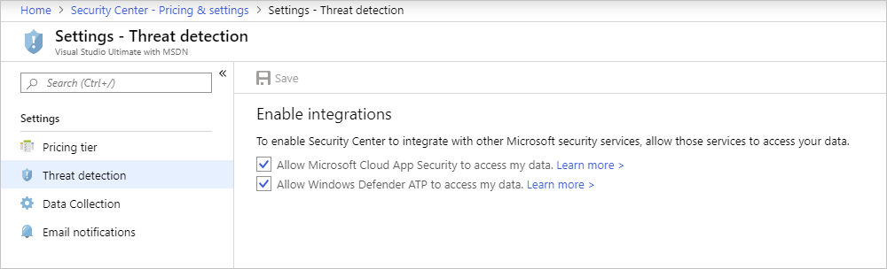
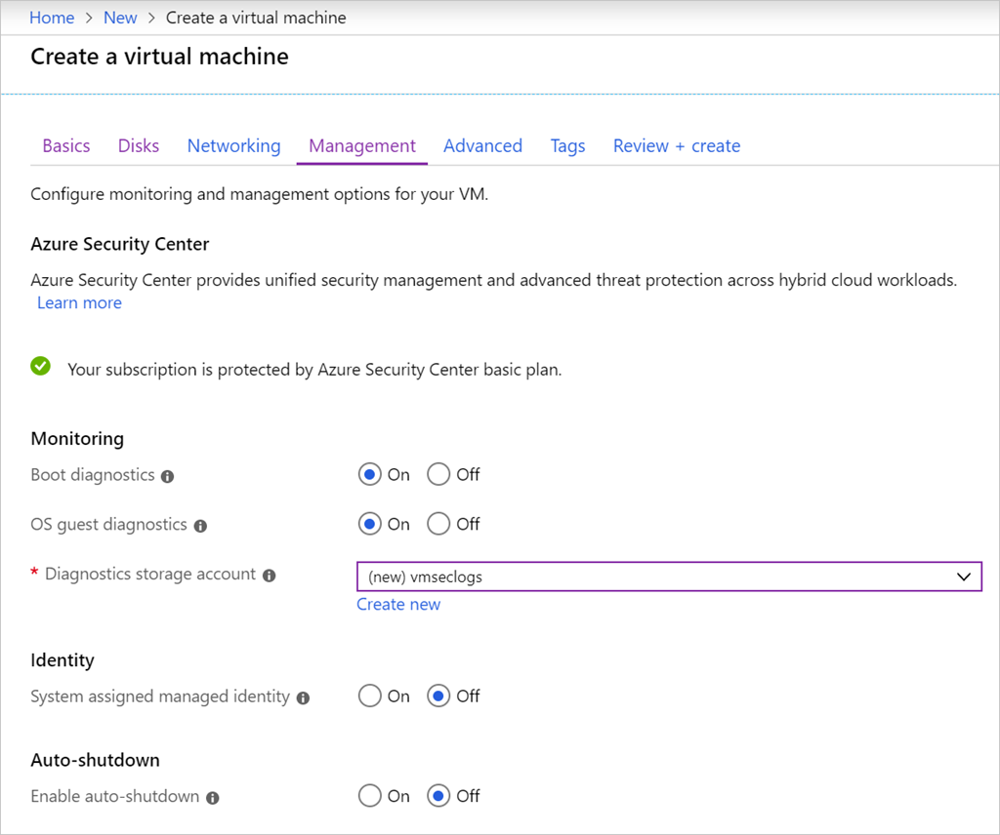

You can customize various global Azure Security Center settings by using the **Pricing & settings** option on the Security Center menu. These settings are established on a per-subscription basis so you have complete control over what is monitored, what data is collected, and where it's stored.

There are four areas you can influence.

- **Pricing tier**. Information about the available pricing tiers. This is the same information found on the **Coverage** pane.
- **Threat detection**. This lets you control how Security Center integrates with other Microsoft security services, such as Windows Defender.
- **Data Collection**. You can enable _auto-provisioning_ to install a monitoring agent on all VMs in your subscription so Security Center can collect security information from Windows and Linux VMs.
- **Email notifications**. Security contact details and email notifications for high security alerts.

Here's an image of the **Pricing & settings** screen with the **Threat detection** area selected.

**Data Collection** is particularly interesting. Each VM can store audit logs based on configured settings established during the VM creation process. You can collect two log sources from every VM in the subscription:

1. **Boot-time diagnostics**. This includes console output and screenshots of the virtual machine running on a host to help diagnose startup issues.
1. **OS guest diagnostics**. Get metrics every minute for your virtual machine. You can use them to create alerts and stay informed on your applications.

You can also activate these options when you create new VMs. Here's an image of the **Management** tab while creating a new Windows-based VM with the Azure portal that shows the Azure Security Center options being set.

By default, a storage account will be selected (or created) to hold the logs, but you can customize that on a per-VM basis as needed.

With this collected data, Azure Security Center can start making observations about how each of your configured workloads match up to your security policy.
