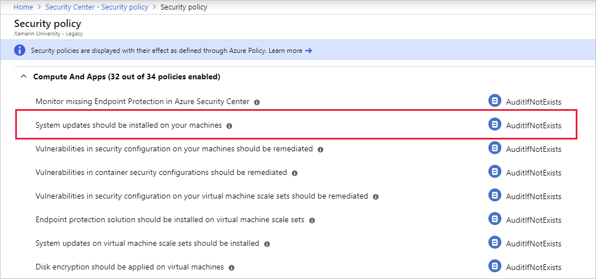
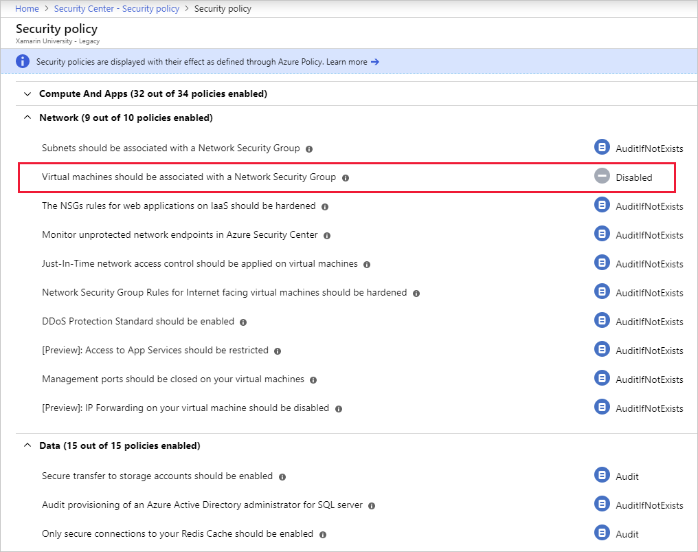

Policy-based management can streamline IT operations, and help to protect the organization by enforcing well-designed policies. Azure Policy lets you define requirements for your Azure subscriptions and tailor them to your type of workload or the sensitivity of your data.

Azure Security Center is fully integrated with Azure Policy. Security Center can monitor policy compliance across all of your subscriptions using a default set of _security policies_. A security policy defines the set of controls that are recommended for resources within the specified subscription or resource group. These security policies define the _desired_ configuration of your workloads, and help to ensure compliance with company or regulatory security requirements. These defaults can be customized and defined to match your specific organizational needs.

Here are several of the built-in security policies that Security Center monitors:

- Secure transfer to storage accounts should be enabled.
- Azure Active Directory (Azure AD) administrator for SQL server should be provisioned.
- Client authentication should use Azure Active Directory.
- Diagnostics logs in Key Vault should be enabled.
- System updates should be installed on your machines.
- Audit missing blob encryption for storage accounts.
- Just-In-Time network access control should be applied on virtual machines.

By default, all security policies are turned on for each monitored subscription. Security policies and recommendations are tied to each other. If you enable a security policy, such as OS vulnerabilities, that enables recommendations for that policy. In Security Center, you define policies for your Azure subscriptions or resource groups according to your company’s security needs, and the types of applications or sensitivity of data in each subscription.

For example, resources used for development or testing might have different security requirements than resources used for production applications. Likewise, applications that use regulated data, like personally identifiable information (PII), might require a higher level of security. Security policies that are enabled in Azure Security Center drive security recommendations and monitoring to help you identify potential vulnerabilities and mitigate threats.

Policies are inherited from the subscription down to the resource groups. However, you can control the security policies individually at the resource group level.

> [!NOTE]
> To modify a security policy at the subscription level or resource group level, you need to be an Owner or Contributor for that subscription.

## Work with security policies

You can view the active security policies through the Security Center dashboard and the Security policy view.

Two organizational groups are shown in the previous image: management groups and subscriptions. These are taken directly from Azure Policy. Selecting one of these elements enables you to drill into the details for that group or subscription.

In the previous image, you can see that **System updates** is set to **AuditIfNotExists**. In this subscription, under the free tier, that means all virtual machines (VMs) will be audited to ensure they have the latest security updates applied. Any VMs that fail this check will generate an audit event.

You can collapse each group to see other policy areas.

In the previous image, you can see that the security policy **Virtual machines should be associated with a Network Security Group** is **Disabled**.

### Change Azure policy

Owners and security administrators can edit the default security policy for each of the shown Azure subscriptions and management groups through Azure Policy. The Azure portal is the easiest way to make changes to policy, but you can also leverage a command-line interface (Azure CLI or Azure PowerShell) or the programmatic REST API.

Let's examine some of the recommendations Azure Security Center makes about your resources using these policy definitions.
