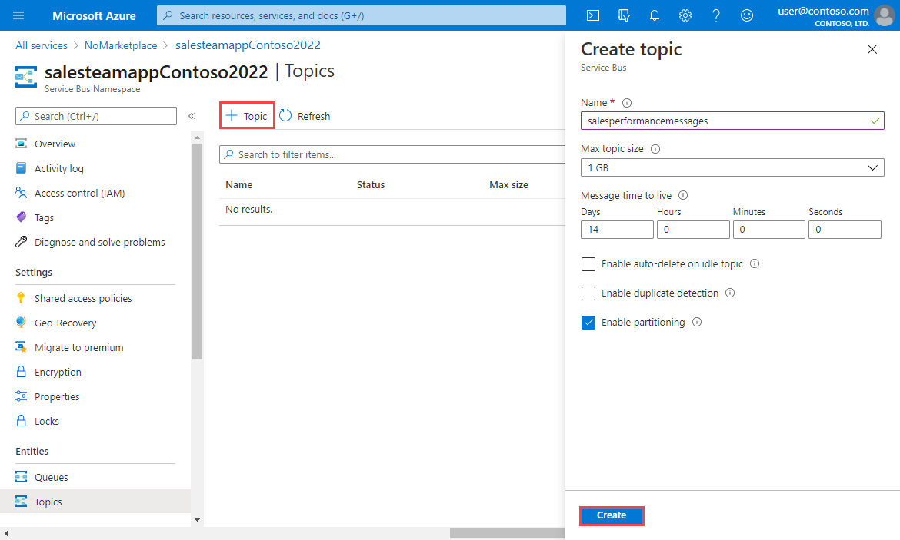

Suppose you have an application for the sales team in your global company. Each team member has a mobile phone and will install your app to use for sales. A web service hosted in Azure implements the business logic for your application and stores information in an Azure SQL Database. Each  geographical region has its own instance of the web service.

You've identified the following scenarios for message exchange between the mobile app and the web service:

- Messages that relate to individual sales must be sent to the web service instance in the user's region.
- Messages that relate to sales performance must be sent to all instances of the web service.

You've decided to implement a Service Bus queue for the first use case, and the Service Bus topic for the second use case.

In this exercise, you'll create a Service Bus namespace, which will contain both a queue and a topic with subscriptions.

## Create a Service Bus namespace

Start by creating the namespace. In Azure Service Bus, a namespace is a container for queues, topics, and relays. Each namespace has a unique, fully-qualified domain name, with primary and secondary shared access signature (SAS) encryption keys. A sending or receiving component must provide a SAS key to gain access to objects in a namespace.

To create a Service Bus namespace using the Azure portal, follow these steps:

1. Sign in to the [Azure portal](https://portal.azure.com/learn.docs.microsoft.com?azure-portal=true) with the same login you used to activate the sandbox.

1. Under **Azure services**, select **Create a resource**. The **Create a resource** pane appears.

1. Enter **Service Bus** in the search box, on **Service Bus** published by Microsoft for Azure, select **Create**. The **Create namespace** pane appears.

1. On the **Basics** tab, enter or select the following values for each setting.

    | Setting | Value | Description |
    | ------- | --- | ---- |
    | **Project Details** |
    | Subscription | Concierge subscription | The subscription under which this new function app is created. |
    | Resource group | <rgn>[sandbox resource group name]</rgn> | Name of the resource group in which to create your Service Bus namespace. In this exercise, we'll create the namespace in the resource group that was assigned when we activated the sandbox. |
    | **Instance Details** |
    | Namespace name | [Globally unique name] | Enter a name that is unique within Azure, for example, _salesteamapp_ + _your initials_ + _current date_. |
    | Location | Select from the dropdown list | Choose the region closest to you that is also one of the allowed *Sandbox regions* listed below. |
    | Pricing tier | Standard | The recommended pricing tier for this exercise. |

    [!INCLUDE[Sandbox Regions](../../../includes/azure-sandbox-regions-first-mention-note-friendly.md)]

1. Select **Review + create**.

    :::image type="content" source="../media/3-create-namespace-2.png" alt-text="Screenshot of the Service bus Create namespace pane with the Review + create button highlighted.":::

1. Review the details, and after validation succeeds, select **Create** to create the Service Bus namespace.

    :::image type="content" source="../media/3-create-namespace-3.png" alt-text="Screenshot of the Service bus Review namespace pane with the Create button highlighted.":::

## Create a Service Bus queue

When your namespace had been created, you can create a queue for messages about individual sales.

To create a Service Bus queue:

1. After deployment completes, select **Go to resource**. The Service Bus Namespace you created appears.

1. In the command bar, select **Queue**. The **Create queue** pane appears.

1. In the **Name** text box, enter **salesmessages**, and then select **Create**. The Service Bus Namespace pane reappears with **salesmessages** queue listed at the bottom of the pane.

    :::image type="content" source="../media/3-create-queue.png" alt-text="Screenshot of the Create queue pane with the Create button highlighted.":::

## Create a Service Bus topic and subscriptions

You also want to create a topic that will be used for messages that relate to sales performance. Multiple instances of the business logic web service will subscribe to this topic from different geographical regions. Each message will be delivered to multiple instances.

To create a Service Bus topic and subscriptions:

1. In the command bar of the **Service Bus Namespace** pane, select **Topic**. The **Create topic** pane appears.

1. In the **Name** text box, enter *salesperformancemessages*, and then select **Create**. Azure creates the topic in your namespace.

    

1. When the topic has been created, at the bottom of the **Service Bus Namespace** pane, select the **Topics** tab.

1. In the left menu, under **Entities**, select **Topics**, and in the list of topics, select **salesperformancemessages**. The sales performance messages Service Bus Topic appears. 

1. In the command bar, select **Subscription**. The **Create subscription** pane appears. This is where you add subscriptions for each region.

1. For your first subscription, enter **Americas** for the **Name**, then enter **100** for the **Max delivery count**, and then select **Create**. The sales performance messages Service Bus Topic for your app appears with the subscription you created at the bottom of the page.

1. Let's add a second subscription. In the command bar, select **Subscription**. The **Create subscription** pane appears.

1. Enter **EuropeAndAfrica** for the **Name**, and then enter **100** for the **Max delivery count**, and then select **Create**. The sales performance messages Service Bus Topc of your sales team app now has two subscriptions.

You have built the infrastructure required to use Service Bus to increase the resilience of your sales force distributed application. You have created a queue for messages about individual sales, and a topic for messages about sales performance. The topic includes multiple subscriptions because messages sent to that topic can be delivered to multiple recipient web services around the world.
